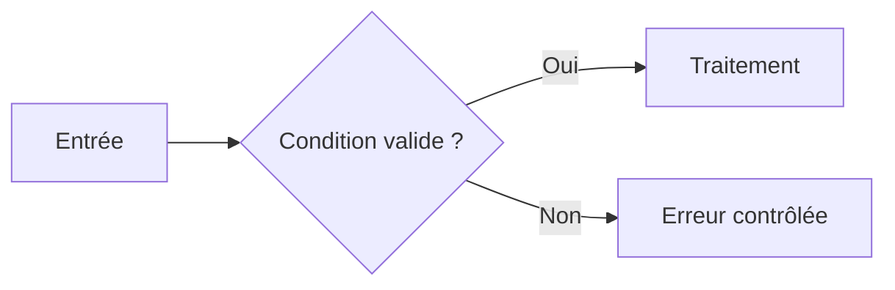

# 🌸 CONTRIBUER AU RÉFÉRENTIEL

## 🌺 Structure minimale d’un chapitre

Chaque chapitre doit répondre aux questions suivantes :

1. Qu’est-ce que c’est ?
2. Dans quel cas l’utiliser ?
3. Comment le mettre en œuvre ?
4. Comment vérifier le résultat ?
5. Quelles erreurs éviter ?
6. Quel squelette peut être réutilisé ?

Les sections suivantes sont attendues lorsqu’elles sont pertinentes :

```markdown
# 🌸 TITRE

## 🌺 OBJECTIFS
## 🌺 DÉFINITION OU PRINCIPE
## 🌺 CAS D’USAGE
## 🌺 PROCÉDURE PAS À PAS
## 🌺 EXEMPLE COMPLET
## 🌺 VÉRIFICATION
## 🌺 ERREURS FRÉQUENTES
## 🌺 SNIPPET À RÉUTILISER
## 🌺 TERMES DU LEXIQUE
## 🌺 À RETENIR
## 🌺 RÉFÉRENCES OFFICIELLES SAP
```

## 🌺 Règles de procédure

- Utiliser des étapes numérotées.
- Donner le code de transaction exact.
- Indiquer le système attendu : développement, test ou production.
- Préciser les prérequis et autorisations lorsque nécessaires.
- Utiliser des objets `Z*` ou `$TMP` uniquement pour les démonstrations autorisées.
- Décrire le résultat attendu et la méthode de vérification.
- Signaler les différences possibles selon la release.
- Ne jamais proposer une écriture directe dans une table applicative standard SAP.

## 🌺 Règles de code

- Fournir du code complet lorsque le chapitre porte sur une mise en œuvre.
- Utiliser des noms explicites.
- Traiter erreurs, valeurs initiales et résultats absents.
- Signaler les syntaxes dépendantes de la release.
- Vérifier le code dans la documentation `F1` du système cible.

## 🌺 Règles Mermaid

Tous les libellés doivent être entre guillemets :



## 🌺 Sources et images SAP

Les informations doivent provenir de `help.sap.com`, `learning.sap.com` ou d’une documentation officielle fournie par SAP. Les captures ou illustrations SAP ne doivent pas être copiées dans le repository sans vérifier leur droit de réutilisation. Préférer :

- un diagramme Mermaid original ;
- un lien vers la procédure officielle SAP ;
- une capture produite sur un système de démonstration, anonymisée et dont la diffusion est autorisée.
