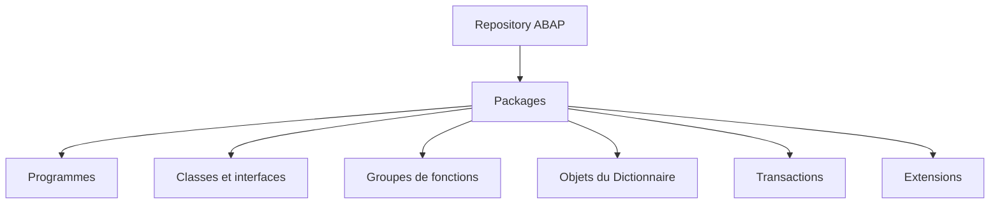
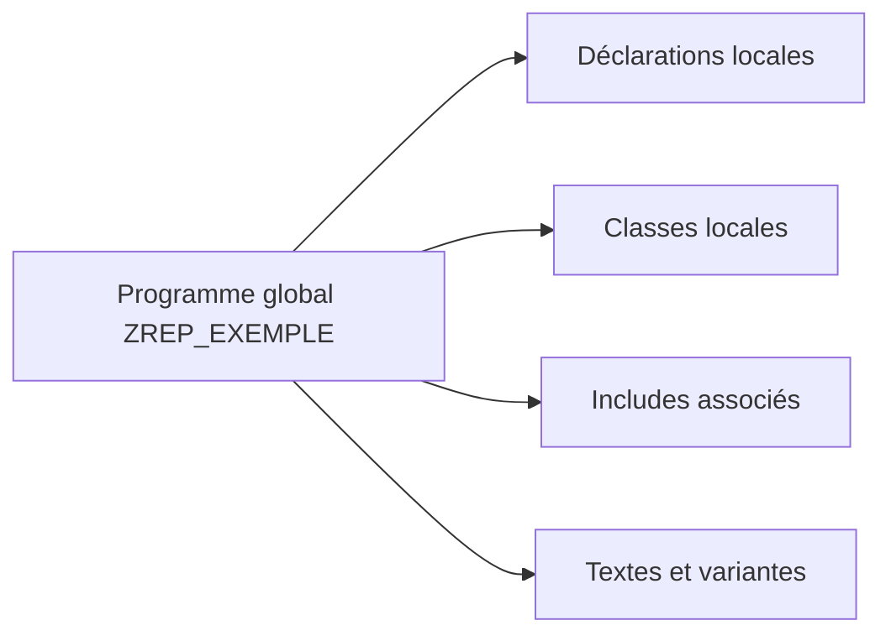
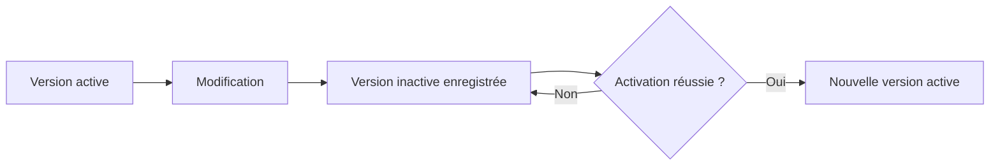

# 🌸 OBJETS DU REPOSITORY ABAP

## 🌺 OBJECTIFS

- Comprendre le rôle du Repository ABAP
- Identifier les principales familles d’objets de développement
- Distinguer objet global, sous-objet et objet local à un programme
- Comprendre les versions active et inactive
- Retrouver les dépendances d’un objet dans SAP GUI

## 🌺 VUE D’ENSEMBLE



## 🌺 DÉFINITION

Le **Repository ABAP** contient les objets de développement d’un système ABAP. Ces objets sont enregistrés dans la base de données du système et sont utilisés par l’environnement d’exécution ABAP.

Le Repository ne correspond pas à un répertoire local du poste de travail. Le code et les métadonnées restent dans le système SAP.

> [!IMPORTANT]
> En environnement classique SAP GUI, plusieurs développeurs travaillent sur le même Repository central. Les verrous, les versions inactives et les ordres de transport servent à maîtriser les modifications concurrentes.

## 🌺 PRINCIPALES FAMILLES D’OBJETS

| Famille               | Exemples                                                                | Transactions courantes         |
| --------------------- | ----------------------------------------------------------------------- | ------------------------------ |
| Programmes            | programmes exécutables, includes, pools de modules                      | `SE38`, `SE80`                 |
| ABAP Objects          | classes globales, interfaces                                            | `SE24`, `SE80`                 |
| Fonctions             | groupes de fonctions, modules fonction                                  | `SE37`, `SE80`                 |
| Dictionnaire ABAP     | domaines, éléments de données, structures, tables, aides à la recherche | `SE11`                         |
| Interfaces classiques | écrans, menus GUI, statuts GUI                                          | `SE80`, `SE41`, Screen Painter |
| Messages              | classes de messages                                                     | `SE91`                         |
| Transactions          | codes de transaction                                                    | `SE93`                         |
| Extensions            | enhancements, BAdI, exits selon la technologie                          | transactions dédiées, `SE80`   |

Cette liste n’est pas exhaustive. Un objet peut également posséder des sous-objets qui ne sont pas gérés comme des objets indépendants.

## 🌺 OBJET GLOBAL ET ÉLÉMENT LOCAL

Un objet global du Repository possède un nom unique dans son espace de noms et peut être référencé depuis d’autres objets lorsque les règles techniques l’autorisent.

Exemples :

- programme `Z...` ;
- classe globale `ZCL_...` ;
- table `Z...` ;
- module fonction `Z_...` ;
- classe de messages `Z...`.

À l’inverse, une classe locale, une méthode locale ou une déclaration interne à un programme n’est pas nécessairement un objet de Repository autonome.



## 🌺 ANNUAIRE DES OBJETS

L’annuaire des objets du Repository gère notamment :

- le type technique de l’objet ;
- son nom ;
- son package ;
- son système d’origine ;
- les informations nécessaires au transport.

La table technique `TADIR` est fréquemment utilisée pour analyser les entrées de l’annuaire des objets. Tous les éléments visibles dans un outil ne correspondent toutefois pas obligatoirement à une entrée indépendante dans `TADIR`.

> [!CAUTION]
> Ne jamais modifier directement les tables techniques du Repository. Utiliser les outils SAP prévus à cet effet.

## 🌺 ESPACES DE NOMS

Les développements client utilisent généralement :

- les préfixes `Z` ou `Y` ;
- un espace de noms enregistré de la forme `/NAMESPACE/` lorsque l’organisation en possède un.

Les objets SAP standard ne doivent pas être modifiés directement sans mécanisme d’extension ou procédure explicitement validée.

## 🌺 VERSION ACTIVE ET VERSION INACTIVE

Lorsqu’un objet est modifié puis enregistré, une version inactive peut coexister avec la version active.

| Version  | Utilisation                                                                 |
| -------- | --------------------------------------------------------------------------- |
| Active   | Version disponible pour l’exécution normale et les consommateurs de l’objet |
| Inactive | État de travail enregistré mais pas encore activé                           |

L’activation vérifie l’objet et publie une nouvelle version active si les contrôles requis réussissent.



## 🌺 VERROUS DE MODIFICATION

Lorsqu’un utilisateur modifie un objet, SAP peut poser un verrou afin d’empêcher une modification concurrente incompatible.

Un objet verrouillé doit être traité avec prudence :

- identifier le propriétaire du verrou ;
- vérifier si une modification est réellement en cours ;
- ne pas supprimer un verrou sans validation ;
- coordonner les changements portant sur le même objet.

## 🌺 RECHERCHE ET NAVIGATION

### 🍧 SE80

L’Object Navigator permet de naviguer par :

- package ;
- programme ;
- classe ;
- groupe de fonctions ;
- objet local ;
- type d’objet disponible dans le Repository Browser.

### 🍧 SYSTÈME D’INFORMATION DU REPOSITORY

Le Repository Information System permet de rechercher des objets selon plusieurs critères techniques.

### 🍧 LISTE D’UTILISATIONS

La liste d’utilisations permet d’identifier les consommateurs d’un objet. Elle doit être consultée avant :

- un changement de signature ;
- une suppression ;
- un renommage ;
- une modification de type ou de structure ;
- une correction susceptible d’avoir un impact transversal.

> [!IMPORTANT]
> Une liste d’utilisations ne garantit pas toujours l’identification des appels dynamiques construits à l’exécution.

## 🌺 PROCÉDURE PAS À PAS

1. Saisir `/nSE80`.
2. Choisir le type d’objet connu : programme, classe, groupe de fonctions, package ou autre objet Repository.
3. Entrer le nom technique puis valider.
4. Commencer en mode **Afficher**.
5. Identifier le programme principal, les includes, les sous-objets et le package.
6. Utiliser la liste d’utilisation pour repérer les appelants ou dépendances.
7. Ouvrir l’entrée de répertoire pour relever responsable, package et couche de transport.
8. Ne passer en modification qu’après avoir confirmé l’objet et l’environnement.

## 🌺 VÉRIFICATION

- Le lecteur peut expliquer la différence entre cette notion et les concepts proches.
- Le choix technique est justifié par un besoin concret, pas uniquement par habitude.
- Les limites liées à la release, aux autorisations et au contexte d’exécution sont identifiées.

## 🌺 ERREURS FRÉQUENTES

- Intervenir dans le mauvais système ou mandant.
- Confondre sauvegarde et activation.

## 🌺 FICHE DE CONTRÔLE À COPIER

```text
Système / SID       :
Mandant             :
Utilisateur         :
Transaction / outil :
Objet technique     :
Jeu de données      :
Résultat attendu    :
Résultat observé    :
Horodatage          :
Ordre de transport  :
```

## 🌺 TERMES DU LEXIQUE

- [Repository ABAP](<../└─ 🧩 00 - LEXIQUE SAP ET ABAP/03 - 🍧 REPOSITORY PACKAGES ET TRANSPORTS.md#repository-abap>)
- [ABAP](<../└─ 🧩 00 - LEXIQUE SAP ET ABAP/10 - 🍧 ACRONYMES SAP.md#acro-abap>)
- [Système SAP](<../└─ 🧩 00 - LEXIQUE SAP ET ABAP/01 - 🍧 SYSTEMES ENVIRONNEMENTS ET MANDANTS.md#systeme-sap>)
- [Mandant](<../└─ 🧩 00 - LEXIQUE SAP ET ABAP/01 - 🍧 SYSTEMES ENVIRONNEMENTS ET MANDANTS.md#mandant>)
- [SAP GUI](<../└─ 🧩 00 - LEXIQUE SAP ET ABAP/02 - 🍧 SAP GUI NAVIGATION ET TRANSACTIONS.md#sap-gui>)
- [Transaction](<../└─ 🧩 00 - LEXIQUE SAP ET ABAP/02 - 🍧 SAP GUI NAVIGATION ET TRANSACTIONS.md#transaction>)

## 🌺 RÉFÉRENCES OFFICIELLES SAP

- [Overview of the ABAP Workbench](https://help.sap.com/docs/ABAP_PLATFORM_BW4HANA/bd833c8355f34e96a6e83096b38bf192/d18018d1454211d189710000e8322d00.html)
- [Object Directory](https://help.sap.com/docs/ABAP_PLATFORM_NEW/4a368c163b08418890a406d413933ba7/5738e06c4eb711d182bf0000e829fbfe.html)
- [Object Navigator](https://help.sap.com/docs/ABAP_PLATFORM_NEW/bd833c8355f34e96a6e83096b38bf192/efd94b7bebf811d295b100a0c94260a5.html)
- [Repository Browser](https://help.sap.com/docs/ABAP_PLATFORM_NEW/bd833c8355f34e96a6e83096b38bf192/d180194b454211d189710000e8322d00.html)


---

➡️ [Chapitre suivant — PACKAGES ET ORDRES DE TRANSPORT](<./03 - 🍧 PACKAGES ET ORDRES DE TRANSPORT.md>)
