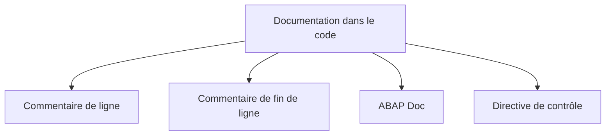

# 🌸 COMMENTAIRES ET CONVENTIONS

## 🌺 OBJECTIFS

- Utiliser les différentes formes de commentaires ABAP
- Distinguer commentaire, ABAP Doc, pseudo-commentaire et pragma
- Documenter l’intention sans paraphraser le code
- Appliquer des conventions cohérentes sans les confondre avec la syntaxe ABAP
- Éviter les cartouches et commentaires devenus faux

## 🌺 VUE D’ENSEMBLE



## 🌺 COMMENTAIRE DE LIGNE

Un astérisque placé en première position transforme la ligne en commentaire.

```abap
* Ce commentaire occupe toute la ligne.
WRITE / 'Exemple'.
```

Cette forme existe dans les programmes classiques, mais elle est moins flexible pour l’indentation.

## 🌺 COMMENTAIRE AVEC GUILLEMET

Le guillemet double commence un commentaire jusqu’à la fin de la ligne.

```abap
" Commentaire de ligne indenté
DATA gv_count TYPE i. " Commentaire de fin de ligne
```

Cette forme permet d’aligner le commentaire avec le bloc concerné.

## 🌺 ABAP DOC

Une ligne commençant par `"!` est un commentaire ABAP Doc lorsqu’elle est placée devant un élément déclaratif compatible.

Exemple :

```abap
CLASS lcl_calculator DEFINITION.
  PUBLIC SECTION.
    "! Additionne deux nombres entiers.
    "! @parameter iv_left  | Première valeur
    "! @parameter iv_right | Deuxième valeur
    "! @parameter rv_sum   | Résultat
    METHODS add
      IMPORTING
        iv_left       TYPE i
        iv_right      TYPE i
      RETURNING
        VALUE(rv_sum) TYPE i.
ENDCLASS.
```

ABAP Doc est destiné à documenter des éléments d’API ou de déclaration. Il ne remplace pas une documentation fonctionnelle ou d’architecture.

## 🌺 PSEUDO-COMMENTAIRES ET PRAGMAS

Certains commentaires spéciaux ou pragmas influencent les contrôles statiques.

Exemples de formes :

```abap
"#EC ...
##...
```

Ils ne doivent être utilisés que lorsque :

- le contrôle est compris ;
- le cas est justifié ;
- une correction réelle n’est pas possible ou pertinente ;
- la règle du projet autorise cette suppression ;
- la justification reste traçable.

> [!CAUTION]
> Ne jamais ajouter une directive uniquement pour faire disparaître un avertissement sans analyser sa cause.

## 🌺 QUOI COMMENTER

Un commentaire utile explique principalement :

- une contrainte métier non évidente ;
- une raison technique ;
- une incompatibilité de version ;
- un contournement validé ;
- une hypothèse importante ;
- un effet de bord ;
- la raison d’un choix non intuitif.

Exemple utile :

```abap
" La date de fin est exclusive dans l’API appelée.
gv_end_date = gv_requested_end_date + 1.
```

Exemple inutile :

```abap
" Ajoute 1 à la date.
gv_end_date = gv_requested_end_date + 1.
```

## 🌺 COMMENTAIRE OBSOLÈTE

Un commentaire faux est plus dangereux qu’une absence de commentaire.

Lors d’une modification :

- mettre à jour le commentaire concerné ;
- supprimer les explications devenues inutiles ;
- ne pas conserver du code mort commenté ;
- utiliser la gestion de versions pour retrouver l’ancien code.

## 🌺 CONVENTIONS DE NOMMAGE

ABAP n’impose pas une convention universelle telle que `lv_`, `gv_`, `lt_` ou `ls_`.

Ces préfixes sont des conventions de projet fréquemment rencontrées :

| Préfixe fréquent    | Signification conventionnelle              |
| ------------------- | ------------------------------------------ |
| `lv_`               | variable locale                            |
| `gv_`               | variable globale                           |
| `ls_`               | structure locale                           |
| `lt_`               | table interne locale                       |
| `lo_`               | référence d’objet locale                   |
| `lc_`               | constante locale                           |
| `iv_`, `ev_`, `rv_` | paramètres de méthode selon leur direction |

> [!IMPORTANT]
> Ces préfixes ne font pas partie du langage. Appliquer la convention réellement retenue par le projet et éviter de mélanger plusieurs systèmes de nommage dans un même objet.

## 🌺 CARTOUCHE DE PROGRAMME

Un cartouche en début de programme est une convention documentaire, pas une exigence ABAP.

Un cartouche peut contenir :

- objectif du programme ;
- application ou domaine ;
- restrictions majeures ;
- référence documentaire stable.

Éviter d’y dupliquer des informations déjà fiables dans :

- le Repository ;
- l’ordre de transport ;
- l’outil de suivi ;
- l’historique de versions.

Exemple minimal :

```abap
************************************************************************
* Objet       : Extraction des données de démonstration
* Périmètre   : Développement interne
* Remarque    : Programme exécutable sans mise à jour de données
************************************************************************
REPORT zdemo_comments.
```

## 🌺 PRINCIPES DE LISIBILITÉ

- choisir des noms qui décrivent le rôle métier ou technique ;
- limiter les abréviations ambiguës ;
- utiliser une indentation constante ;
- limiter la profondeur des blocs ;
- séparer les responsabilités ;
- commenter la raison, pas la syntaxe ;
- retirer le code commenté ;
- conserver les messages et textes destinés aux utilisateurs dans les mécanismes adaptés.

## 🌺 RÉFÉRENCES OFFICIELLES SAP

- [Comments — SAP Help Portal](https://help.sap.com/docs/abap-cloud/abap-concepts/comments)
- [Adding ABAP Doc Comments](https://help.sap.com/doc/c238d694b825421f940829321ffa326a/7.40.25/en-US/17e98e1c1ff545cea3f95b85a0539322.html)
- [Clean ABAP — SAP Style Guides](https://github.com/SAP/styleguides/blob/main/clean-abap/CleanABAP.md)

---

➡️ [Chapitre suivant — ACTIVATION EXECUTION ET VERIFICATION](<./09 - 🍧 ACTIVATION EXECUTION ET VERIFICATION.md>)
