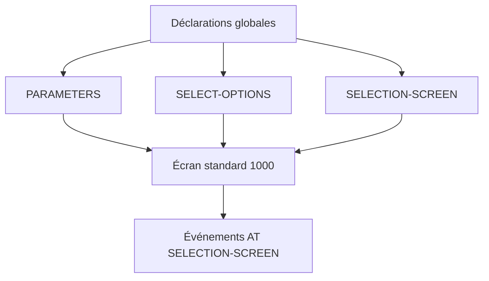

# 🌸 ÉCRAN DE SÉLECTION SIMPLE

## 🌺 OBJECTIFS

- Définir l’écran de sélection standard d’un programme exécutable
- Utiliser `PARAMETERS`, `SELECT-OPTIONS` et `SELECTION-SCREEN`
- Comprendre la structure technique d’un critère de sélection
- Maintenir les textes affichés à l’utilisateur
- Valider les saisies avant le traitement principal

## 🌺 VUE D’ENSEMBLE



## 🌺 ÉCRAN STANDARD

Un programme exécutable possède un écran de sélection standard généré automatiquement lorsqu’il contient des instructions de sélection.

Les éléments sont définis dans la partie déclarative globale avec :

- `PARAMETERS` ;
- `SELECT-OPTIONS` ;
- `SELECTION-SCREEN`.

Le numéro technique de l’écran standard est généralement `1000`.

## 🌺 `PARAMETERS`

`PARAMETERS` crée un objet de données global et un champ de saisie associé.

```abap
PARAMETERS p_name TYPE c LENGTH 30.
```

### 🍧 OPTIONS COURANTES

```abap
PARAMETERS p_name   TYPE c LENGTH 30 LOWER CASE OBLIGATORY.
PARAMETERS p_count  TYPE i DEFAULT 10.
PARAMETERS p_test   AS CHECKBOX DEFAULT 'X'.
PARAMETERS p_mode_a RADIOBUTTON GROUP mod DEFAULT 'X'.
PARAMETERS p_mode_b RADIOBUTTON GROUP mod.
```

| Addition            | Effet                                                                      |
| ------------------- | -------------------------------------------------------------------------- |
| `DEFAULT`           | Valeur proposée initialement                                               |
| `OBLIGATORY`        | Saisie obligatoire                                                         |
| `LOWER CASE`        | Autorise la conservation des minuscules pour un champ caractère compatible |
| `AS CHECKBOX`       | Affiche une case à cocher                                                  |
| `RADIOBUTTON GROUP` | Crée un groupe de boutons radio                                            |

## 🌺 `SELECT-OPTIONS`

`SELECT-OPTIONS` crée un critère de sélection et une table interne de sélection.

```abap
DATA gv_date TYPE sy-datum.
SELECT-OPTIONS s_date FOR gv_date.
```

La table `s_date` contient les composantes :

| Composante | Rôle                                    |
| ---------- | --------------------------------------- |
| `SIGN`     | Inclusion `I` ou exclusion `E`          |
| `OPTION`   | Opérateur, par exemple `EQ`, `BT`, `CP` |
| `LOW`      | Valeur basse ou valeur unique           |
| `HIGH`     | Valeur haute pour les intervalles       |

Exemple de contenu :

| SIGN | OPTION | LOW        | HIGH       |
| ---- | ------ | ---------- | ---------- |
| `I`  | `BT`   | `20260101` | `20261231` |
| `E`  | `EQ`   | `20260714` |            |

> [!IMPORTANT]
> Un `SELECT-OPTIONS` ne contient pas simplement deux valeurs. Il représente un ensemble de conditions d’inclusion et d’exclusion.

## 🌺 ORGANISATION AVEC `SELECTION-SCREEN`

### 🍧 BLOC AVEC CADRE

```abap
SELECTION-SCREEN BEGIN OF BLOCK b_main WITH FRAME TITLE text-001.
  PARAMETERS p_name TYPE c LENGTH 30.
  SELECT-OPTIONS s_date FOR sy-datum.
SELECTION-SCREEN END OF BLOCK b_main.
```

### 🍧 LIGNE ET COMMENTAIRE

```abap
SELECTION-SCREEN BEGIN OF LINE.
  SELECTION-SCREEN COMMENT 1(20) text-002.
  PARAMETERS p_test AS CHECKBOX.
SELECTION-SCREEN END OF LINE.
```

Les constructions complexes doivent rester justifiées. Un écran surchargé augmente le risque de saisie incohérente.

## 🌺 TEXTES DE SÉLECTION

Sans texte maintenu, l’écran peut afficher le nom technique du paramètre.

Les textes se maintiennent dans les éléments de texte du programme :

- textes de sélection ;
- symboles de texte ;
- titres de liste.

Exemples :

| Élément    | Texte               |
| ---------- | ------------------- |
| `P_NAME`   | Nom                 |
| `S_DATE`   | Période             |
| `TEXT-001` | Critères principaux |

> [!IMPORTANT]
> Les textes utilisateur ne doivent pas être codés en dur lorsqu’ils doivent être traduits ou maintenus comme éléments de texte.

## 🌺 INITIALISATION

```abap
PARAMETERS p_date TYPE sy-datum.

INITIALIZATION.
  p_date = sy-datum.
```

Pour une plage de dates :

```abap
SELECT-OPTIONS s_date FOR sy-datum.

INITIALIZATION.
  APPEND VALUE #(
    sign   = 'I'
    option = 'EQ'
    low    = sy-datum ) TO s_date.
```

La syntaxe `VALUE #( )` nécessite une version ABAP compatible. Sur un système plus ancien, remplir une ligne puis utiliser `APPEND`.

## 🌺 VALIDATION

### 🍧 CHAMP UNIQUE

```abap
AT SELECTION-SCREEN ON p_count.
  IF p_count <= 0.
    MESSAGE 'Le nombre doit être supérieur à zéro' TYPE 'E'.
  ENDIF.
```

### 🍧 COHÉRENCE ENTRE CHAMPS

```abap
AT SELECTION-SCREEN.
  IF p_date_from > p_date_to.
    MESSAGE 'La date de début dépasse la date de fin' TYPE 'E'.
  ENDIF.
```

Les contrôles doivent être placés avant le traitement principal afin de ne pas lancer un traitement avec des critères invalides.

## 🌺 EXEMPLE COMPLET

```abap
REPORT zdemo_selection_screen.

SELECTION-SCREEN BEGIN OF BLOCK b_main WITH FRAME TITLE text-001.
  PARAMETERS p_name  TYPE c LENGTH 30 LOWER CASE OBLIGATORY.
  PARAMETERS p_count TYPE i DEFAULT 10.
  SELECT-OPTIONS s_date FOR sy-datum.
SELECTION-SCREEN END OF BLOCK b_main.

INITIALIZATION.
  APPEND VALUE #(
    sign   = 'I'
    option = 'EQ'
    low    = sy-datum ) TO s_date.

AT SELECTION-SCREEN ON p_count.
  IF p_count < 1 OR p_count > 1000.
    MESSAGE 'Saisir un nombre compris entre 1 et 1000' TYPE 'E'.
  ENDIF.

START-OF-SELECTION.
  WRITE: / 'Nom :', p_name,
         / 'Nombre :', p_count.
```

Élément de texte :

```text
TEXT-001 = Critères principaux
```

## 🌺 POINTS DE VIGILANCE

- utiliser des types cohérents avec les données métier ;
- maintenir les textes de sélection ;
- limiter les valeurs par défaut trompeuses ;
- valider les combinaisons de critères ;
- traiter explicitement les sélections vides ;
- ne pas construire une clause SQL dynamique non maîtrisée à partir des saisies ;
- tester les inclusions, exclusions et intervalles d’un `SELECT-OPTIONS`.

## 🌺 PROCÉDURE PAS À PAS

1. Créer un report Z dans `SE38`.
2. Déclarer un `PARAMETERS` et un `SELECT-OPTIONS` en utilisant des types DDIC adaptés.
3. Ajouter des valeurs par défaut uniquement lorsqu’elles sont sûres et explicites.
4. Activer puis exécuter le report avec `F8`.
5. Tester une valeur unique, un intervalle, une exclusion et une sélection vide.
6. Sauvegarder une variante de test puis relancer le report avec cette variante.
7. Vérifier que les critères reçus correspondent exactement à l’écran.

## 🌺 VÉRIFICATION

- Le contrôle syntaxique réussit.
- La version active correspond au code sauvegardé.
- L’exécution produit le résultat décrit dans le chapitre.
- Les cas vide, limite et erreur sont testés séparément lorsque la syntaxe le permet.

## 🌺 ERREURS FRÉQUENTES

- Copier un exemple sans adapter les types, noms d’objets et données disponibles dans le système.
- Tester uniquement le cas nominal et ignorer les valeurs initiales, absentes ou invalides.
- Intervenir dans le mauvais système ou mandant.
- Confondre sauvegarde et activation.

## 🌺 SNIPPET À RÉUTILISER

> [!NOTE]
> Adapter les noms `Z*`, les types DDIC, les données et les autorisations au système cible. Effectuer un contrôle syntaxique avant activation.

```abap
REPORT zdemo_selection_screen.

SELECTION-SCREEN BEGIN OF BLOCK b_main WITH FRAME TITLE text-001.
  PARAMETERS p_name  TYPE c LENGTH 30 LOWER CASE OBLIGATORY.
  PARAMETERS p_count TYPE i DEFAULT 10.
  SELECT-OPTIONS s_date FOR sy-datum.
SELECTION-SCREEN END OF BLOCK b_main.

INITIALIZATION.
  APPEND VALUE #(
    sign   = 'I'
    option = 'EQ'
    low    = sy-datum ) TO s_date.

AT SELECTION-SCREEN ON p_count.
  IF p_count < 1 OR p_count > 1000.
    MESSAGE 'Saisir un nombre compris entre 1 et 1000' TYPE 'E'.
  ENDIF.

START-OF-SELECTION.
  WRITE: / 'Nom :', p_name,
         / 'Nombre :', p_count.
```

## 🌺 TERMES DU LEXIQUE

- [Système SAP](<../└─ 🧩 00 - LEXIQUE SAP ET ABAP/01 - 🍧 SYSTEMES ENVIRONNEMENTS ET MANDANTS.md#systeme-sap>)
- [Mandant](<../└─ 🧩 00 - LEXIQUE SAP ET ABAP/01 - 🍧 SYSTEMES ENVIRONNEMENTS ET MANDANTS.md#mandant>)
- [SAP GUI](<../└─ 🧩 00 - LEXIQUE SAP ET ABAP/02 - 🍧 SAP GUI NAVIGATION ET TRANSACTIONS.md#sap-gui>)
- [Transaction](<../└─ 🧩 00 - LEXIQUE SAP ET ABAP/02 - 🍧 SAP GUI NAVIGATION ET TRANSACTIONS.md#transaction>)
- [Repository ABAP](<../└─ 🧩 00 - LEXIQUE SAP ET ABAP/03 - 🍧 REPOSITORY PACKAGES ET TRANSPORTS.md#repository-abap>)
- [Package](<../└─ 🧩 00 - LEXIQUE SAP ET ABAP/03 - 🍧 REPOSITORY PACKAGES ET TRANSPORTS.md#package>)

## 🌺 RÉFÉRENCES OFFICIELLES SAP

- [Selection Screens — Overview](https://help.sap.com/doc/abapdocu_latest_index_htm/latest/en-US/ABENSELECTION_SCREEN_OVERVIEW.html)
- [Selection Screens — Create](https://help.sap.com/doc/abapdocu_latest_index_htm/latest/en-US/ABENSELECTION_SCREEN_CREATE.html)
- [SELECT-OPTIONS — ABAP Keyword Documentation](https://help.sap.com/doc/abapdocu_latest_index_htm/latest/en-US/ABAPSELECT-OPTIONS_SHORTREF.html)
- [SELECTION-SCREEN, BEGIN OF](https://help.sap.com/doc/abapdocu_latest_index_htm/latest/en-US/ABAPSELECTION-SCREEN_DEFINITION.html)


---

➡️ [Chapitre suivant — PREMIERS OUTILS DE DEBUG](<./12 - 🍧 PREMIERS OUTILS DE DEBUG.md>)
