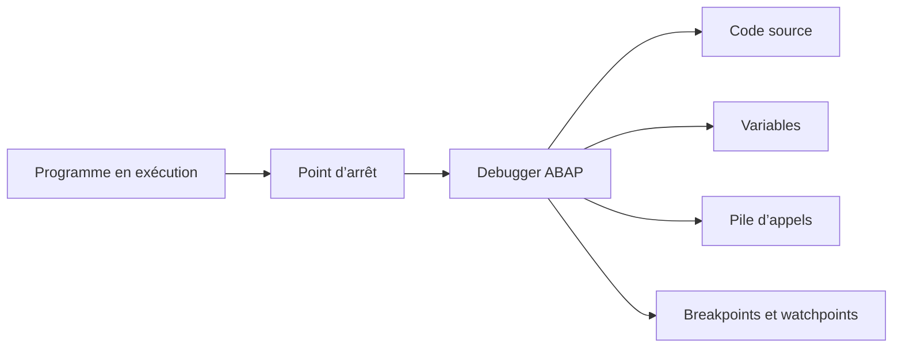
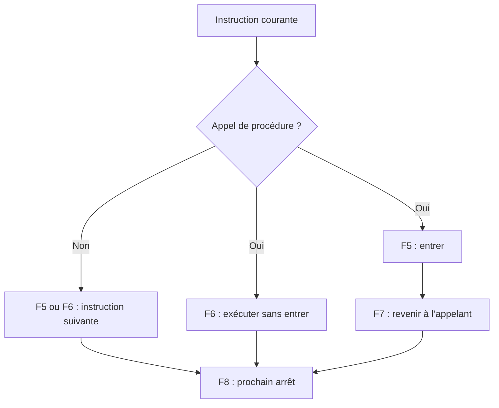

# 🌸 PREMIERS OUTILS DE DEBUG

## 🌺 OBJECTIFS

- Démarrer le Debugger ABAP depuis SAP GUI
- Distinguer point d’arrêt de session et point d’arrêt externe
- Avancer avec `F5`, `F6`, `F7` et `F8`
- Inspecter les variables et la pile d’appels
- Utiliser un watchpoint pour arrêter le programme sur une condition
- Déboguer sans modifier involontairement les données

## 🌺 VUE D’ENSEMBLE



## 🌺 RÔLE DU DEBUGGER

Le Debugger ABAP est un outil intégré au Workbench. Il permet d’arrêter un programme en cours d’exécution puis de :

- suivre son flux ;
- exécuter le code étape par étape ;
- inspecter les objets de données ;
- consulter la pile d’appels ;
- poser des points d’arrêt ;
- définir des watchpoints ;
- analyser une erreur au plus près de son origine.

Le débogage nécessite des autorisations spécifiques.

## 🌺 DÉMARRAGE

### 🍧 DEPUIS `SE38` OU `SE80`

Pour un programme exécutable :

- ouvrir le programme ;
- sélectionner l’exécution en mode Debugging dans le menu de test ;
- le Debugger prend le contrôle dès le début du traitement prévu.

### 🍧 AVEC UN POINT D’ARRÊT

Dans l’éditeur :

1. placer le curseur sur une instruction exécutable ;
2. poser un breakpoint ;
3. lancer le scénario ;
4. le Debugger s’ouvre lorsque l’instruction est atteinte.

### 🍧 AVEC `/h`

Dans le champ de commande SAP GUI :

```text
/h
```

Après validation, exécuter l’action à analyser. Le programme s’arrête à la première instruction pertinente du traitement de dynpro suivant.

> [!NOTE]
> `/h` est adapté à un flux déclenché dans la session SAP GUI courante. Il ne remplace pas les points d’arrêt externes pour les appels HTTP ou RFC.

## 🌺 TYPES DE POINTS D’ARRÊT

### 🍧 POINT D’ARRÊT DE SESSION

Il concerne les traitements exécutés dans la session utilisateur SAP GUI correspondante.

Usage :

- programme lancé depuis `SE38` ;
- transaction exécutée dans la même session utilisateur ;
- analyse locale classique.

### 🍧 POINT D’ARRÊT EXTERNE

Il permet d’intercepter des traitements exécutés dans une nouvelle session utilisateur, notamment certains appels :

- HTTP ;
- RFC ;
- services exécutés pour un utilisateur déterminé.

Son efficacité dépend de l’utilisateur, de la durée de validité, du serveur et de la configuration du système.

> [!IMPORTANT]
> Un breakpoint externe doit être posé pour l’utilisateur qui exécutera réellement la requête.

## 🌺 NAVIGATION DANS LE CODE

| Touche | Fonction    | Effet                                                                |
| ------ | ----------- | -------------------------------------------------------------------- |
| `F5`   | Single Step | Exécute l’instruction suivante et entre dans une procédure appelée   |
| `F6`   | Execute     | Exécute l’instruction suivante sans entrer dans la procédure appelée |
| `F7`   | Return      | Exécute jusqu’au retour de la procédure courante                     |
| `F8`   | Continue    | Continue jusqu’au prochain breakpoint ou jusqu’à la fin              |



> [!CAUTION]
> `F8` peut terminer le programme si aucun autre point d’arrêt n’est rencontré.

## 🌺 INSPECTION DES DONNÉES

Le Debugger permet d’afficher :

- variables locales ;
- variables globales ;
- paramètres ;
- structures ;
- tables internes ;
- références ;
- champs système ;
- objets et attributs.

Contrôles essentiels :

- valeur courante ;
- type ;
- état initial ;
- longueur et contenu réel ;
- nombre de lignes d’une table ;
- référence liée ou initiale ;
- valeur de `sy-subrc` après une instruction qui la renseigne.

## 🌺 PILE D’APPELS

La pile d’appels indique le chemin suivi jusqu’au point courant.

Exemple :

```text
Programme principal
└── Méthode A
    └── Module fonction B
        └── Méthode C  ← position actuelle
```

Elle permet de déterminer :

- qui a appelé la procédure courante ;
- avec quels paramètres ;
- dans quel programme se trouve chaque niveau ;
- où reprendre l’analyse lorsque l’erreur est déclenchée loin de sa cause.

## 🌺 WATCHPOINT

Un watchpoint arrête le programme lorsque la valeur d’un objet de données change ou lorsqu’une condition devient vraie.

Exemples d’usage :

- arrêter lorsque `gv_status = 'E'` ;
- identifier où une quantité devient négative ;
- repérer la modification d’un champ précis ;
- ignorer les premières itérations d’une boucle jusqu’à une valeur ciblée.

```text
Condition de watchpoint : gv_count > 100
```

Le watchpoint est souvent plus efficace qu’un breakpoint dans une boucle très volumineuse.

## 🌺 MODIFICATION DE VALEURS

Le Debugger peut autoriser la modification de certaines valeurs selon le contexte et les autorisations.

Cette fonction sert à :

- tester une branche ;
- confirmer une hypothèse ;
- reproduire un état difficile à atteindre.

> [!CAUTION]
> Modifier une valeur dans le Debugger change le comportement réel de l’exécution en cours. Sur un traitement mettant à jour des données, cela peut produire des résultats incohérents ou irréversibles.

## 🌺 MÉTHODE D’ANALYSE

1. reproduire le problème avec un cas minimal ;
2. identifier le point d’entrée ;
3. poser un breakpoint avant la divergence ;
4. contrôler les paramètres entrants ;
5. avancer avec `F5` ou `F6` ;
6. suivre les changements de valeur ;
7. consulter la pile d’appels ;
8. poser un watchpoint si la valeur est modifiée loin du point courant ;
9. identifier la première instruction où l’état devient incorrect ;
10. corriger la cause, puis reproduire le scénario sans modification manuelle de valeurs.

## 🌺 LIMITES ET PRÉCAUTIONS

- un breakpoint dans une branche non exécutée ne sera jamais atteint ;
- un breakpoint de session ne capture pas automatiquement un appel externe ;
- le traitement peut s’exécuter sous un autre utilisateur ;
- le debugging peut modifier la temporisation d’un traitement concurrent ;
- certaines zones système peuvent être exclues du pas-à-pas ;
- ne pas déboguer un traitement productif sensible sans procédure validée ;
- supprimer les breakpoints devenus inutiles.

## 🌺 CAS D’USAGE

Dans un contexte où une intervention de correction doit être réalisée dans le bon système et sur le bon objet sans affecter un environnement non autorisé, le besoin consiste à **arrêter l’exécution au bon endroit et observer les données utiles**. Cette notion est pertinente lorsque le lecteur doit pouvoir relier la syntaxe ou l’outil à une situation professionnelle concrète.

## 🌺 PROCÉDURE PAS À PAS

1. Ouvrir un report Z de démonstration dans `SE38`.
2. Placer un breakpoint sur une instruction exécutable.
3. Activer puis exécuter avec `F8`.
4. Dans le débogueur, utiliser `F5` pour entrer dans un appel, `F6` pour l’exécuter sans entrer, `F7` pour revenir et `F8` pour continuer.
5. Observer une variable, une structure et une table interne dans les outils de données.
6. Créer un watchpoint sur une valeur modifiée par le programme.
7. Terminer proprement l’exécution et retirer les breakpoints devenus inutiles.

## 🌺 VÉRIFICATION

- Le lecteur peut expliquer la différence entre cette notion et les concepts proches.
- Le choix technique est justifié par un besoin concret, pas uniquement par habitude.
- Les limites liées à la release, aux autorisations et au contexte d’exécution sont identifiées.

## 🌺 ERREURS FRÉQUENTES

- Intervenir dans le mauvais système ou mandant.
- Confondre sauvegarde et activation.

## 🌺 FICHE DE CONTRÔLE À COPIER

```text
Système / SID       :
Mandant             :
Utilisateur         :
Transaction / outil :
Objet technique     :
Jeu de données      :
Résultat attendu    :
Résultat observé    :
Horodatage          :
Ordre de transport  :
```

## 🌺 TERMES DU LEXIQUE

- [Système SAP](<../└─ 🧩 00 - LEXIQUE SAP ET ABAP/01 - 🍧 SYSTEMES ENVIRONNEMENTS ET MANDANTS.md#systeme-sap>)
- [Mandant](<../└─ 🧩 00 - LEXIQUE SAP ET ABAP/01 - 🍧 SYSTEMES ENVIRONNEMENTS ET MANDANTS.md#mandant>)
- [SAP GUI](<../└─ 🧩 00 - LEXIQUE SAP ET ABAP/02 - 🍧 SAP GUI NAVIGATION ET TRANSACTIONS.md#sap-gui>)
- [Transaction](<../└─ 🧩 00 - LEXIQUE SAP ET ABAP/02 - 🍧 SAP GUI NAVIGATION ET TRANSACTIONS.md#transaction>)
- [Repository ABAP](<../└─ 🧩 00 - LEXIQUE SAP ET ABAP/03 - 🍧 REPOSITORY PACKAGES ET TRANSPORTS.md#repository-abap>)
- [Package](<../└─ 🧩 00 - LEXIQUE SAP ET ABAP/03 - 🍧 REPOSITORY PACKAGES ET TRANSPORTS.md#package>)

## 🌺 À RETENIR

- À l’issue du chapitre, le lecteur sait **arrêter l’exécution au bon endroit et observer les données utiles**.
- Toujours tester sur un objet Z ou un jeu de données sans impact avant d’intervenir sur un traitement réel.
- La documentation `F1` du système reste la référence pour la syntaxe disponible dans sa release.

## 🌺 RÉFÉRENCES OFFICIELLES SAP

- [ABAP Debugger](https://help.sap.com/docs/ABAP_PLATFORM_NEW/ba879a6e2ea04d9bb94c7ccd7cdac446/492170194ab514cde10000000a42189b.html)
- [Starting ABAP Debugger](https://help.sap.com/docs/ABAP_PLATFORM_NEW/ba879a6e2ea04d9bb94c7ccd7cdac446/a419aa9c58c2473bb4e3ae3c2a00b7b8.html)
- [Starting and Directly Debugging ABAP Programs](https://help.sap.com/docs/ABAP_PLATFORM_NEW/ba879a6e2ea04d9bb94c7ccd7cdac446/a95208086a6e448aa35f08357d958af5.html)
- [Going Through the Source Code](https://help.sap.com/docs/ABAP_PLATFORM_NEW/ba879a6e2ea04d9bb94c7ccd7cdac446/491eb0c6f3ee6492e10000000a42189b.html)
- [Switching Directly to the ABAP Debugger While Executing a Program](https://help.sap.com/docs/ABAP_PLATFORM_NEW/ba879a6e2ea04d9bb94c7ccd7cdac446/e4fc840c8c09403c87501c68f80fa716.html)
