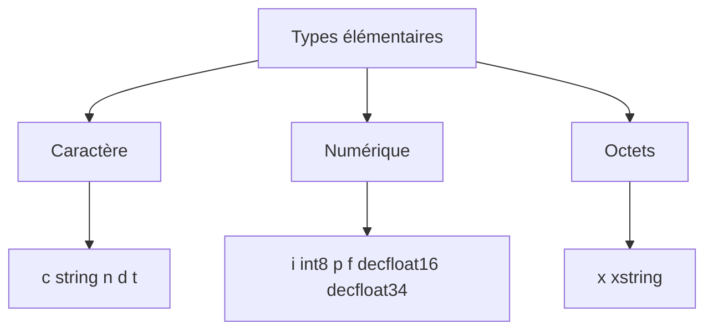

# 🌸 TYPES ÉLÉMENTAIRES INTÉGRÉS

## 🌺 OBJECTIFS

- Identifier les types élémentaires ABAP les plus courants
- Distinguer les types caractère, numériques et octets
- Comprendre les différences entre longueur fixe et variable
- Déclarer correctement une longueur et un nombre de décimales
- Éviter les choix de types incompatibles avec la donnée métier

## 🌺 CATÉGORIES PRINCIPALES



Les types disponibles dépendent de la version du serveur ABAP. Les types présentés ci-dessous couvrent les types usuels des systèmes ABAP classiques récents.

## 🌺 TYPES CARACTÈRE

| Type     | Longueur           | Usage principal                                                 |
| -------- | ------------------ | --------------------------------------------------------------- |
| `c`      | Fixe               | Texte court, code ou zone caractère                             |
| `string` | Variable           | Texte de longueur variable                                      |
| `n`      | Fixe               | Suite de caractères numériques, sans calcul arithmétique métier |
| `d`      | Fixe, 8 caractères | Date interne au format `YYYYMMDD`                               |
| `t`      | Fixe, 6 caractères | Heure interne au format `HHMMSS`                                |

### 🍧 TYPE `c`

```abap
DATA lv_code TYPE c LENGTH 10 VALUE 'ABAP'.
```

La zone conserve une longueur fixe. Les positions non utilisées sont complétées par des espaces.

### 🍧 TYPE `string`

```abap
DATA lv_description TYPE string VALUE `Description de longueur variable`.
```

`string` convient aux textes dont la longueur varie. Il ne faut pas l’utiliser automatiquement pour chaque champ métier : un type du Dictionnaire ABAP peut porter une sémantique et une longueur attendues par les interfaces SAP.

### 🍧 TYPE `n`

```abap
DATA lv_sequence TYPE n LENGTH 6 VALUE '123'.
```

La valeur est représentée comme une suite de chiffres et complétée avec des zéros à gauche :

```text
000123
```

`n` n’est pas un type destiné aux calculs arithmétiques. Il est adapté à certains identifiants ou compteurs textuels lorsque la représentation avec zéros initiaux est significative.

### 🍧 TYPES `d` ET `t`

```abap
DATA lv_date TYPE d VALUE '20260731'.
DATA lv_time TYPE t VALUE '113000'.
```

L’affichage externe dépend des paramètres utilisateur et des instructions de formatage. La représentation interne reste compacte.

## 🌺 TYPES NUMÉRIQUES

| Type         | Caractéristique                    | Usage typique                                     |
| ------------ | ---------------------------------- | ------------------------------------------------- |
| `i`          | Entier signé sur 4 octets          | Compteurs et calculs entiers courants             |
| `int8`       | Entier signé sur 8 octets          | Valeurs entières dépassant la capacité de `i`     |
| `p`          | Nombre décimal compacté            | Quantités, montants et calculs décimaux contrôlés |
| `f`          | Nombre à virgule flottante binaire | Calculs scientifiques avec approximation acceptée |
| `decfloat16` | Virgule flottante décimale         | Calcul décimal à précision décimale               |
| `decfloat34` | Virgule flottante décimale étendue | Calcul décimal nécessitant davantage de précision |

### 🍧 ENTIER

```abap
DATA lv_counter TYPE i VALUE 5.
```

Utiliser `i` lorsqu’aucune partie décimale n’est nécessaire et que la plage du type est suffisante.

### 🍧 NOMBRE COMPACTÉ `p`

```abap
DATA lv_amount TYPE p LENGTH 8 DECIMALS 2 VALUE '1250.75'.
```

- `LENGTH` indique le nombre d’octets occupés ;
- `DECIMALS` indique le nombre de décimales ;
- la capacité en chiffres est liée à la longueur technique.

Pour les montants et quantités SAP, préférer un type métier du Dictionnaire lorsque le contexte fournit une devise ou une unité de référence.

### 🍧 NOMBRES FLOTTANTS

```abap
DATA lv_measure TYPE decfloat34 VALUE '12.3456789'.
```

`f` utilise une représentation binaire et peut produire des approximations décimales. Il ne constitue donc pas le choix par défaut pour les montants financiers.

## 🌺 TYPES OCTETS

| Type      | Longueur | Usage principal                       |
| --------- | -------- | ------------------------------------- |
| `x`       | Fixe     | Suite d’octets de longueur déterminée |
| `xstring` | Variable | Contenu binaire de longueur variable  |

```abap
DATA lv_flag   TYPE x LENGTH 1 VALUE 'FF'.
DATA lv_binary TYPE xstring.
```

Ces types sont utilisés pour des contenus binaires, des identifiants techniques ou certaines interfaces. Ils ne représentent pas du texte.

## 🌺 VALEURS INITIALES USUELLES

| Type ou catégorie | Valeur initiale  |
| ----------------- | ---------------- |
| `c`               | Espaces          |
| `string`          | Chaîne vide      |
| `n`               | Zéros caractères |
| `d`               | `00000000`       |
| `t`               | `000000`         |
| Types numériques  | Zéro             |
| `x`               | Octets à zéro    |
| `xstring`         | Séquence vide    |

## 🌺 EXEMPLE COMPARATIF

```abap
REPORT zdemo_types_elementaires.

DATA lv_id_text TYPE n LENGTH 6 VALUE '42'.
DATA lv_count   TYPE i          VALUE 42.
DATA lv_amount  TYPE p LENGTH 6 DECIMALS 2 VALUE '42.50'.
DATA lv_label   TYPE string     VALUE `Article`.

WRITE: / 'Identifiant :', lv_id_text,
       / 'Compteur    :', lv_count,
       / 'Montant     :', lv_amount,
       / 'Libellé     :', lv_label.
```

Même si `lv_id_text` et `lv_count` affichent des chiffres, leurs usages sont différents : le premier représente une chaîne numérique formatée, le second une valeur entière calculable.

## 🌺 ERREURS FRÉQUENTES

| Erreur                                               | Conséquence                                   |
| ---------------------------------------------------- | --------------------------------------------- |
| Utiliser `i` pour un identifiant avec zéros initiaux | Perte de la représentation attendue           |
| Utiliser `f` pour un montant sans justification      | Résultat décimal potentiellement approximatif |
| Utiliser `c` pour un texte très variable             | Troncature ou surdimensionnement              |
| Choisir une longueur `p` insuffisante                | Débordement arithmétique                      |
| Confondre `xstring` et `string`                      | Mauvaise interprétation du contenu            |

## 🌺 CAS D’USAGE

Dans un contexte où un programme de contrôle manipule des identifiants, montants, dates, statuts et structures dont le typage doit rester explicite, le besoin consiste à **déclarer et utiliser types élémentaires intégrés avec un typage explicite dans un programme ABAP**. Cette notion est pertinente lorsque le lecteur doit pouvoir relier la syntaxe ou l’outil à une situation professionnelle concrète.

## 🌺 PROCÉDURE PAS À PAS

1. Saisir `/nSE38` dans le champ de commande.
2. Entrer le nom d’un programme Z de test, par exemple `ZREF_DEMO`, puis choisir **Créer** ou **Modifier** selon le cas.
3. Pour un exercice local uniquement, affecter `$TMP` ; pour un développement livrable, utiliser le package et l’ordre fournis par le projet.
4. Coller ou adapter le snippet du chapitre.
5. Exécuter le contrôle syntaxique avec `Ctrl+F2`.
6. Activer avec `Ctrl+F3`.
7. Exécuter avec `F8` et comparer le résultat avec la section **Vérification**.

## 🌺 VÉRIFICATION

- Le contrôle syntaxique réussit.
- La version active correspond au code sauvegardé.
- L’exécution produit le résultat décrit dans le chapitre.
- Les cas vide, limite et erreur sont testés séparément lorsque la syntaxe le permet.

## 🌺 SNIPPET À RÉUTILISER

> [!NOTE]
> Adapter les noms `Z*`, les types DDIC, les données et les autorisations au système cible. Effectuer un contrôle syntaxique avant activation.

```abap
REPORT zdemo_types_elementaires.

DATA lv_id_text TYPE n LENGTH 6 VALUE '42'.
DATA lv_count   TYPE i          VALUE 42.
DATA lv_amount  TYPE p LENGTH 6 DECIMALS 2 VALUE '42.50'.
DATA lv_label   TYPE string     VALUE `Article`.

WRITE: / 'Identifiant :', lv_id_text,
       / 'Compteur    :', lv_count,
       / 'Montant     :', lv_amount,
       / 'Libellé     :', lv_label.
```

## 🌺 TERMES DU LEXIQUE

- [Type de données](<../└─ 🧩 00 - LEXIQUE SAP ET ABAP/04 - 🍧 LANGAGE ET DEVELOPPEMENT ABAP.md#type-donnees>)
- [Objet de données](<../└─ 🧩 00 - LEXIQUE SAP ET ABAP/04 - 🍧 LANGAGE ET DEVELOPPEMENT ABAP.md#objet-donnees>)
- [Structure](<../└─ 🧩 00 - LEXIQUE SAP ET ABAP/04 - 🍧 LANGAGE ET DEVELOPPEMENT ABAP.md#structure-abap>)
- [Table interne](<../└─ 🧩 00 - LEXIQUE SAP ET ABAP/04 - 🍧 LANGAGE ET DEVELOPPEMENT ABAP.md#table-interne>)
- [Field-symbol](<../└─ 🧩 00 - LEXIQUE SAP ET ABAP/04 - 🍧 LANGAGE ET DEVELOPPEMENT ABAP.md#field-symbol>)
- [Référence](<../└─ 🧩 00 - LEXIQUE SAP ET ABAP/04 - 🍧 LANGAGE ET DEVELOPPEMENT ABAP.md#reference>)

## 🌺 À RETENIR

- À l’issue du chapitre, le lecteur sait **déclarer et utiliser types élémentaires intégrés avec un typage explicite dans un programme ABAP**.
- Toujours tester sur un objet Z ou un jeu de données sans impact avant d’intervenir sur un traitement réel.
- La documentation `F1` du système reste la référence pour la syntaxe disponible dans sa release.

## 🌺 RÉFÉRENCES OFFICIELLES SAP

- [Predefined ABAP Types — ABAP Keyword Documentation](https://help.sap.com/doc/abapdocu_latest_index_htm/latest/en-US/ABENBUILT_IN_TYPES_COMPLETE.html)
- [Predefined Numeric ABAP Types — ABAP Keyword Documentation](https://help.sap.com/doc/abapdocu_latest_index_htm/latest/en-US/ABENBUILT_IN_TYPES_NUMERIC.html)
- [Predefined Character-Like ABAP Types — ABAP Keyword Documentation](https://help.sap.com/doc/abapdocu_latest_index_htm/latest/en-US/ABENBUILT_IN_TYPES_CHARACTER.html)


---

➡️ [Chapitre suivant — OBJETS DE DONNÉES ET VALEURS INITIALES](<./03 - 🍧 OBJETS DE DONNEES ET VALEURS INITIALES.md>)
