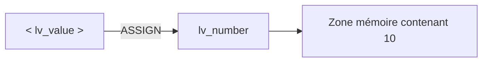

# 🌸 SYMBOLES DE CHAMP

## 🌺 OBJECTIFS

- Comprendre le rôle d’un field-symbol
- Déclarer et affecter un field-symbol
- Modifier une donnée par alias
- Contrôler l’état avec `IS ASSIGNED`
- Distinguer field-symbol, variable et référence de données

## 🌺 PRINCIPE

Un field-symbol ne possède pas sa propre zone de données. Il agit comme un alias vers une zone de mémoire affectée au moment de l’exécution.



Toute modification via le field-symbol modifie l’objet cible.

## 🌺 DÉCLARATION

```abap
FIELD-SYMBOLS <lv_value> TYPE i.
```

Les chevrons font partie du nom du field-symbol.

La déclaration ne réalise aucune affectation. À ce stade, `<lv_value>` est **non affecté**.

## 🌺 AFFECTATION AVEC `ASSIGN`

```abap
DATA lv_number TYPE i VALUE 10.
FIELD-SYMBOLS <lv_value> TYPE i.

ASSIGN lv_number TO <lv_value>.
```

Après l’affectation :

```abap
<lv_value> = 25.
```

`lv_number` vaut également `25`.

## 🌺 CONTRÔLE AVANT UTILISATION

```abap
IF <lv_value> IS ASSIGNED.
  WRITE / <lv_value>.
ENDIF.
```

L’accès à un field-symbol non affecté peut provoquer une erreur d’exécution, notamment `GETWA_NOT_ASSIGNED`.

> [!IMPORTANT]
> Contrôler le succès de l’affectation dès que l’instruction `ASSIGN` peut échouer.

## 🌺 LIBÉRATION AVEC `UNASSIGN`

```abap
UNASSIGN <lv_value>.
```

Après cette instruction, le field-symbol ne pointe plus vers la zone précédemment affectée. La variable cible continue d’exister.

## 🌺 TYPAGE SPÉCIFIQUE

```abap
FIELD-SYMBOLS <lv_value> TYPE i.
```

Un typage spécifique permet au contrôle syntaxique de vérifier les opérations autorisées.

Pour un type local :

```abap
TYPES ty_amount TYPE p LENGTH 8 DECIMALS 2.
FIELD-SYMBOLS <lv_amount> TYPE ty_amount.
```

## 🌺 TYPAGE GÉNÉRIQUE

```abap
FIELD-SYMBOLS <lv_any> TYPE any.
```

`TYPE any` accepte des zones de types variés, mais limite les contrôles statiques. Il doit être réservé aux traitements réellement génériques.

```abap
ASSIGN lv_number TO <lv_any>.
```

Pour exploiter dynamiquement la nature exacte d’une donnée, des contrôles supplémentaires ou les services RTTI peuvent être nécessaires. Ces traitements seront abordés plus tard.

## 🌺 AFFECTATION DYNAMIQUE D’UN COMPOSANT

```abap
TYPES:
  BEGIN OF ty_person,
    name TYPE c LENGTH 40,
    city TYPE c LENGTH 40,
  END OF ty_person.

DATA ls_person TYPE ty_person.
FIELD-SYMBOLS <lv_component> TYPE any.

ASSIGN COMPONENT 'CITY' OF STRUCTURE ls_person TO <lv_component>.

IF sy-subrc = 0 AND <lv_component> IS ASSIGNED.
  <lv_component> = 'Paris'.
ENDIF.
```

Le nom du composant est déterminé à l’exécution. Cette souplesse augmente le besoin de contrôles.

## 🌺 FIELD-SYMBOL INLINE

Sur les versions compatibles :

```abap
ASSIGN lv_number TO FIELD-SYMBOL(<lv_inline>).

IF <lv_inline> IS ASSIGNED.
  <lv_inline> = 30.
ENDIF.
```

La déclaration inline ne change pas le fonctionnement de l’alias.

## 🌺 FIELD-SYMBOL OU VARIABLE

| Besoin                                              | Choix                                |
| --------------------------------------------------- | ------------------------------------ |
| Stocker une valeur indépendante                     | Variable `DATA`                      |
| Accéder directement à une zone existante            | Field-symbol                         |
| Traiter dynamiquement un composant                  | Field-symbol générique contrôlé      |
| Conserver un accès au-delà d’une affectation locale | Référence de données selon le besoin |

## 🌺 EXEMPLE COMPLET

```abap
REPORT zdemo_field_symbols.

DATA lv_quantity TYPE i VALUE 10.
FIELD-SYMBOLS <lv_quantity> TYPE i.

ASSIGN lv_quantity TO <lv_quantity>.

IF <lv_quantity> IS ASSIGNED.
  <lv_quantity> = <lv_quantity> + 5.
ENDIF.

WRITE / lv_quantity.

UNASSIGN <lv_quantity>.
```

La sortie vaut `15` car le field-symbol modifie directement `lv_quantity`.

## 🌺 ERREURS FRÉQUENTES

| Erreur                                                  | Conséquence                                      |
| ------------------------------------------------------- | ------------------------------------------------ |
| Lire un field-symbol non affecté                        | Erreur d’exécution                               |
| Utiliser `TYPE any` sans nécessité                      | Perte de contrôles syntaxiques                   |
| Oublier que l’alias modifie la cible                    | Effet de bord involontaire                       |
| Ne pas contrôler `sy-subrc` après un `ASSIGN` dynamique | Utilisation d’une affectation échouée            |
| Confondre `UNASSIGN` et `CLEAR`                         | `UNASSIGN` retire l’alias, sans effacer la cible |

## 🌺 CAS D’USAGE

Dans un contexte où un programme de contrôle manipule des identifiants, montants, dates, statuts et structures dont le typage doit rester explicite, le besoin consiste à **déclarer et utiliser symboles de champ avec un typage explicite dans un programme ABAP**. Cette notion est pertinente lorsque le lecteur doit pouvoir relier la syntaxe ou l’outil à une situation professionnelle concrète.

## 🌺 PROCÉDURE PAS À PAS

1. Saisir `/nSE38` dans le champ de commande.
2. Entrer le nom d’un programme Z de test, par exemple `ZREF_DEMO`, puis choisir **Créer** ou **Modifier** selon le cas.
3. Pour un exercice local uniquement, affecter `$TMP` ; pour un développement livrable, utiliser le package et l’ordre fournis par le projet.
4. Coller ou adapter le snippet du chapitre.
5. Exécuter le contrôle syntaxique avec `Ctrl+F2`.
6. Activer avec `Ctrl+F3`.
7. Exécuter avec `F8` et comparer le résultat avec la section **Vérification**.

## 🌺 VÉRIFICATION

- Le contrôle syntaxique réussit.
- La version active correspond au code sauvegardé.
- L’exécution produit le résultat décrit dans le chapitre.
- Les cas vide, limite et erreur sont testés séparément lorsque la syntaxe le permet.

## 🌺 SNIPPET À RÉUTILISER

> [!NOTE]
> Adapter les noms `Z*`, les types DDIC, les données et les autorisations au système cible. Effectuer un contrôle syntaxique avant activation.

```abap
REPORT zdemo_field_symbols.

DATA lv_quantity TYPE i VALUE 10.
FIELD-SYMBOLS <lv_quantity> TYPE i.

ASSIGN lv_quantity TO <lv_quantity>.

IF <lv_quantity> IS ASSIGNED.
  <lv_quantity> = <lv_quantity> + 5.
ENDIF.

WRITE / lv_quantity.

UNASSIGN <lv_quantity>.
```

## 🌺 TERMES DU LEXIQUE

- [Type de données](<../└─ 🧩 00 - LEXIQUE SAP ET ABAP/04 - 🍧 LANGAGE ET DEVELOPPEMENT ABAP.md#type-donnees>)
- [Objet de données](<../└─ 🧩 00 - LEXIQUE SAP ET ABAP/04 - 🍧 LANGAGE ET DEVELOPPEMENT ABAP.md#objet-donnees>)
- [Structure](<../└─ 🧩 00 - LEXIQUE SAP ET ABAP/04 - 🍧 LANGAGE ET DEVELOPPEMENT ABAP.md#structure-abap>)
- [Table interne](<../└─ 🧩 00 - LEXIQUE SAP ET ABAP/04 - 🍧 LANGAGE ET DEVELOPPEMENT ABAP.md#table-interne>)
- [Field-symbol](<../└─ 🧩 00 - LEXIQUE SAP ET ABAP/04 - 🍧 LANGAGE ET DEVELOPPEMENT ABAP.md#field-symbol>)
- [Référence](<../└─ 🧩 00 - LEXIQUE SAP ET ABAP/04 - 🍧 LANGAGE ET DEVELOPPEMENT ABAP.md#reference>)

## 🌺 À RETENIR

- À l’issue du chapitre, le lecteur sait **déclarer et utiliser symboles de champ avec un typage explicite dans un programme ABAP**.
- Toujours tester sur un objet Z ou un jeu de données sans impact avant d’intervenir sur un traitement réel.
- La documentation `F1` du système reste la référence pour la syntaxe disponible dans sa release.

## 🌺 RÉFÉRENCES OFFICIELLES SAP

- [FIELD-SYMBOLS — ABAP Keyword Documentation](https://help.sap.com/doc/abapdocu_latest_index_htm/latest/en-US/ABAPFIELD-SYMBOLS.html)
- [ASSIGN — ABAP Keyword Documentation](https://help.sap.com/doc/abapdocu_latest_index_htm/latest/en-US/ABAPASSIGN.html)
- [UNASSIGN — ABAP Keyword Documentation](https://help.sap.com/doc/abapdocu_latest_index_htm/latest/en-US/ABAPUNASSIGN.html)


---

➡️ [Chapitre suivant — RÉFÉRENCES DE DONNÉES](<./11 - 🍧 REFERENCES DE DONNEES.md>)
