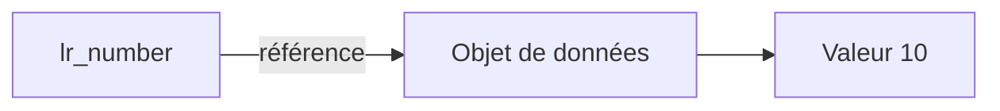

# 🌸 RÉFÉRENCES DE DONNÉES

## 🌺 OBJECTIFS

- Déclarer une référence de données typée
- Référencer un objet existant
- Créer un objet de données anonyme
- Déréférencer avec `->*`
- Contrôler une référence avec `IS BOUND`
- Distinguer référence et field-symbol

## 🌺 PRINCIPE

Une variable de référence contient une référence vers un objet de données. Elle ne contient pas directement la valeur métier de cet objet.



## 🌺 DÉCLARATION

```abap
DATA lr_number TYPE REF TO i.
```

Après la déclaration, `lr_number` est initiale et ne référence aucun objet.

## 🌺 RÉFÉRENCER UN OBJET EXISTANT

```abap
DATA lv_number TYPE i VALUE 10.
DATA lr_number TYPE REF TO i.

GET REFERENCE OF lv_number INTO lr_number.
```

Accès à la valeur référencée :

```abap
WRITE / lr_number->*.
```

Modification :

```abap
lr_number->* = 25.
```

`lv_number` vaut alors `25`.

## 🌺 CRÉER UN OBJET ANONYME

```abap
DATA lr_number TYPE REF TO i.

CREATE DATA lr_number.
lr_number->* = 10.
```

`CREATE DATA` crée un objet de données anonyme du type référencé. La référence constitue le moyen d’accès à cet objet.

## 🌺 CONTRÔLE AVEC `IS BOUND`

```abap
IF lr_number IS BOUND.
  WRITE / lr_number->*.
ENDIF.
```

Déréférencer une référence initiale ou non valide peut provoquer une erreur d’exécution.

> [!IMPORTANT]
> Tester `IS BOUND` lorsque le flux du programme ne garantit pas que la référence a été initialisée correctement.

## 🌺 OPÉRATEUR `REF`

Sur les versions ABAP compatibles :

```abap
DATA(lr_number) = REF #( lv_number ).
```

`#` demande au compilateur de déduire le type depuis le contexte.

Forme explicite :

```abap
DATA lr_number TYPE REF TO i.

lr_number = REF #( lv_number ).
```

La disponibilité de cette syntaxe dépend de la version du serveur ABAP.

## 🌺 RÉFÉRENCE GÉNÉRIQUE

```abap
DATA lr_data TYPE REF TO data.
```

Cette référence peut pointer vers des objets de données de types différents. Pour accéder à la valeur, une affectation à un field-symbol compatible est couramment utilisée :

```abap
DATA lv_text TYPE string VALUE `ABAP`.
DATA lr_data TYPE REF TO data.
FIELD-SYMBOLS <lv_value> TYPE any.

GET REFERENCE OF lv_text INTO lr_data.
ASSIGN lr_data->* TO <lv_value>.

IF <lv_value> IS ASSIGNED.
  WRITE / <lv_value>.
ENDIF.
```

Le typage générique doit être limité aux mécanismes qui en ont réellement besoin.

## 🌺 RÉFÉRENCE ET FIELD-SYMBOL

| Caractéristique | Référence de données          | Field-symbol             |
| --------------- | ----------------------------- | ------------------------ |
| Nature          | Objet contenant une référence | Alias symbolique         |
| Déclaration     | `TYPE REF TO ...`             | `FIELD-SYMBOLS ...`      |
| Accès           | `->*`                         | Directement avec `<...>` |
| Contrôle        | `IS BOUND`                    | `IS ASSIGNED`            |
| Objet anonyme   | Peut le créer et le conserver | Ne crée pas l’objet      |
| Réaffectation   | Possible                      | Possible avec `ASSIGN`   |

## 🌺 DURÉE DE VIE D’UN OBJET ANONYME

Un objet anonyme reste accessible tant qu’une référence valide permet de l’atteindre. Lorsqu’il n’est plus référencé, l’environnement d’exécution peut récupérer sa mémoire.

Il ne faut pas baser la logique fonctionnelle sur le moment exact de cette récupération mémoire.

## 🌺 EXEMPLE COMPLET

```abap
REPORT zdemo_data_references.

TYPES:
  BEGIN OF ty_result,
    code    TYPE i,
    message TYPE string,
  END OF ty_result.

DATA lr_result TYPE REF TO ty_result.

CREATE DATA lr_result.

IF lr_result IS BOUND.
  lr_result->*-code    = 0.
  lr_result->*-message = `Succès`.

  WRITE: / lr_result->*-code,
           lr_result->*-message.
ENDIF.
```

La syntaxe `lr_result->*-code` déréférence l’objet puis accède au composant `code`.

## 🌺 ERREURS FRÉQUENTES

| Erreur                                           | Conséquence              |
| ------------------------------------------------ | ------------------------ |
| Déréférencer sans contrôle                       | Erreur d’exécution       |
| Utiliser `REF TO data` partout                   | Perte de typage statique |
| Confondre la référence et la valeur              | Affectations incorrectes |
| Créer dynamiquement sans besoin                  | Complexité inutile       |
| Conserver des références globales non maîtrisées | État difficile à suivre  |

## 🌺 RÉFÉRENCES OFFICIELLES SAP

- [Data References — ABAP Keyword Documentation](https://help.sap.com/doc/abapdocu_latest_index_htm/latest/en-US/ABENREFERENCES_DATA.html)
- [GET REFERENCE — ABAP Keyword Documentation](https://help.sap.com/doc/abapdocu_latest_index_htm/latest/en-US/ABAPGET_REFERENCE.html)
- [CREATE DATA — ABAP Keyword Documentation](https://help.sap.com/doc/abapdocu_latest_index_htm/latest/en-US/ABAPCREATE_DATA.html)
- [Reference Operator REF — ABAP Keyword Documentation](https://help.sap.com/doc/abapdocu_latest_index_htm/latest/en-US/ABENCONSTRUCTOR_EXPRESSION_REF.html)

---

➡️ [Chapitre suivant — PORTEE DUREE DE VIE ET STATICS](<./12 - 🍧 PORTEE DUREE DE VIE ET STATICS.md>)
