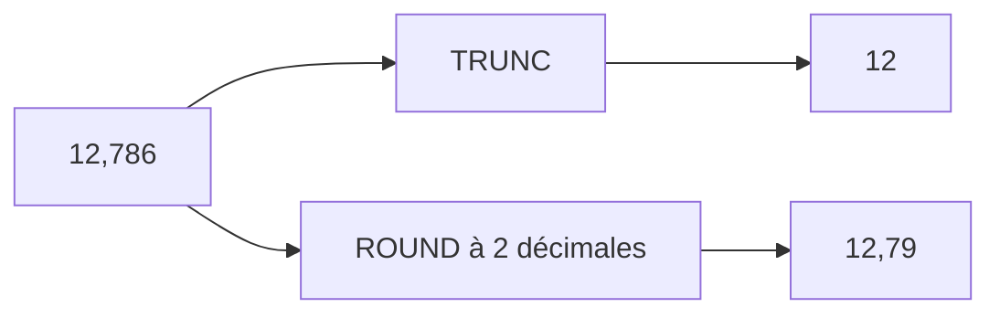

# 🌸 FONCTIONS NUMÉRIQUES ET ARRONDIS

## 🌺 OBJECTIFS

- Utiliser les principales fonctions numériques intégrées
- Distinguer troncature et arrondi
- Contrôler le nombre de décimales du résultat
- Comprendre l’influence du type cible
- Éviter les arrondis implicites non maîtrisés

## 🌺 FONCTIONS COURANTES

| Fonction   | Rôle                                          |
| ---------- | --------------------------------------------- |
| `abs( )`   | Valeur absolue                                |
| `sign( )`  | Signe d’une valeur                            |
| `ceil( )`  | Plus petit entier supérieur ou égal           |
| `floor( )` | Plus grand entier inférieur ou égal           |
| `trunc( )` | Partie entière par suppression de la fraction |
| `frac( )`  | Partie fractionnaire                          |
| `round( )` | Arrondi configurable                          |

Exemple :

```abap
DATA lv_value TYPE decfloat34 VALUE '-12.75'.

DATA(lv_absolute) = abs( lv_value ).
DATA(lv_ceiling)  = ceil( lv_value ).
DATA(lv_floor)    = floor( lv_value ).
DATA(lv_integer)  = trunc( lv_value ).
DATA(lv_fraction) = frac( lv_value ).
```

## 🌺 TRONCATURE ET ARRONDI

La troncature supprime la partie non conservée. L’arrondi décide de la valeur selon une règle.



```abap
DATA lv_amount  TYPE decfloat34 VALUE '12.786'.
DATA lv_rounded TYPE decfloat34.

lv_rounded = round( val = lv_amount dec = 2 ).
```

## 🌺 ARRONDI PAR LE TYPE CIBLE

Une affectation vers un type possédant moins de décimales peut provoquer un arrondi ou une perte d’information selon les règles de conversion.

```abap
DATA lv_source TYPE decfloat34 VALUE '12.786'.
DATA lv_target TYPE p LENGTH 5 DECIMALS 2.

lv_target = lv_source.
```

Cette affectation masque la décision d’arrondi dans la conversion. Pour une règle métier, rendre le traitement explicite :

```abap
lv_target = round( val = lv_source dec = 2 ).
```

## 🌺 SIGNE ET VALEUR ABSOLUE

```abap
DATA lv_difference TYPE p LENGTH 8 DECIMALS 2 VALUE '-15.20'.

IF sign( lv_difference ) < 0.
  WRITE / |Écart négatif : { abs( lv_difference ) }|.
ENDIF.
```

L’exemple utilise `IF` uniquement pour montrer l’exploitation du résultat. Les structures de contrôle seront détaillées dans le dossier suivant.

## 🌺 VALEURS POSITIVES ET NÉGATIVES

Les fonctions `ceil`, `floor` et `trunc` produisent des résultats différents pour les valeurs négatives.

|   Valeur | `ceil` | `floor` | `trunc` |
| -------: | -----: | ------: | ------: |
|  `12.75` |   `13` |    `12` |    `12` |
| `-12.75` |  `-12` |   `-13` |   `-12` |

Ne pas utiliser ces fonctions comme synonymes.

## 🌺 EXEMPLE DE CALCUL DE CONDITIONNEMENT

```abap
DATA lv_requested_qty TYPE decfloat34 VALUE '17'.
DATA lv_pack_size     TYPE decfloat34 VALUE '6'.
DATA lv_pack_count    TYPE decfloat34.
DATA lv_ordered_qty   TYPE decfloat34.

lv_pack_count  = ceil( lv_requested_qty / lv_pack_size ).
lv_ordered_qty = lv_pack_count * lv_pack_size.
```

Le résultat permet de commander un nombre entier de conditionnements :

- quantité demandée : `17` ;
- taille du conditionnement : `6` ;
- conditionnements nécessaires : `3` ;
- quantité commandée : `18`.

## 🌺 BONNES PRATIQUES

- Définir explicitement la règle d’arrondi métier.
- Ne pas confondre arrondi d’affichage et arrondi de valeur.
- Conserver une précision suffisante pendant les calculs intermédiaires.
- N’arrondir qu’au moment prévu par la règle métier.
- Tester les valeurs positives, négatives et proches de zéro.

## 🌺 CAS D’USAGE

Dans un contexte où une interface reçoit des valeurs texte qu’elle doit convertir, comparer, nettoyer et reformater avant traitement, le besoin consiste à **traiter une valeur au moyen de fonctions numériques et arrondis sans conversion ou perte de données involontaire**. Cette notion est pertinente lorsque le lecteur doit pouvoir relier la syntaxe ou l’outil à une situation professionnelle concrète.

## 🌺 PROCÉDURE PAS À PAS

1. Saisir `/nSE38` dans le champ de commande.
2. Entrer le nom d’un programme Z de test, par exemple `ZREF_DEMO`, puis choisir **Créer** ou **Modifier** selon le cas.
3. Pour un exercice local uniquement, affecter `$TMP` ; pour un développement livrable, utiliser le package et l’ordre fournis par le projet.
4. Coller ou adapter le snippet du chapitre.
5. Exécuter le contrôle syntaxique avec `Ctrl+F2`.
6. Activer avec `Ctrl+F3`.
7. Exécuter avec `F8` et comparer le résultat avec la section **Vérification**.

## 🌺 VÉRIFICATION

- Le contrôle syntaxique réussit.
- La version active correspond au code sauvegardé.
- L’exécution produit le résultat décrit dans le chapitre.
- Les cas vide, limite et erreur sont testés séparément lorsque la syntaxe le permet.

## 🌺 ERREURS FRÉQUENTES

- Copier un exemple sans adapter les types, noms d’objets et données disponibles dans le système.
- Tester uniquement le cas nominal et ignorer les valeurs initiales, absentes ou invalides.
- S’appuyer sur une conversion implicite pouvant tronquer ou arrondir.
- Ignorer l’encodage et les formats externes.

## 🌺 SNIPPET À RÉUTILISER

> [!NOTE]
> Adapter les noms `Z*`, les types DDIC, les données et les autorisations au système cible. Effectuer un contrôle syntaxique avant activation.

```abap
DATA lv_value TYPE decfloat34 VALUE '-12.75'.

DATA(lv_absolute) = abs( lv_value ).
DATA(lv_ceiling)  = ceil( lv_value ).
DATA(lv_floor)    = floor( lv_value ).
DATA(lv_integer)  = trunc( lv_value ).
DATA(lv_fraction) = frac( lv_value ).
```

## 🌺 TERMES DU LEXIQUE

- [Instruction ABAP](<../└─ 🧩 00 - LEXIQUE SAP ET ABAP/04 - 🍧 LANGAGE ET DEVELOPPEMENT ABAP.md#instruction-abap>)
- [Expression](<../└─ 🧩 00 - LEXIQUE SAP ET ABAP/04 - 🍧 LANGAGE ET DEVELOPPEMENT ABAP.md#expression>)
- [Type de données](<../└─ 🧩 00 - LEXIQUE SAP ET ABAP/04 - 🍧 LANGAGE ET DEVELOPPEMENT ABAP.md#type-donnees>)

## 🌺 À RETENIR

- À l’issue du chapitre, le lecteur sait **traiter une valeur au moyen de fonctions numériques et arrondis sans conversion ou perte de données involontaire**.
- Toujours tester sur un objet Z ou un jeu de données sans impact avant d’intervenir sur un traitement réel.
- La documentation `F1` du système reste la référence pour la syntaxe disponible dans sa release.

## 🌺 RÉFÉRENCES OFFICIELLES SAP

- [Numeric Functions — ABAP Keyword Documentation](https://help.sap.com/doc/abapdocu_latest_index_htm/latest/en-US/ABENNUMERICAL_FUNCTIONS.html)
- [round — ABAP Keyword Documentation](https://help.sap.com/doc/abapdocu_latest_index_htm/latest/en-US/ABENDEC_FLOATING_POINT_FUNCTIONS.html)
- [Avoiding the Pitfalls of Type Conversions — SAP Learning](https://learning.sap.com/courses/deepening-your-abap-programming-knowledge/avoiding-the-pitfalls-of-type-conversions_e1feca3f-d704-4cd4-aa4e-3072af1659c6)


---

➡️ [Chapitre suivant — EXPRESSIONS LOGIQUES ET COMPARAISONS](<./05 - 🍧 EXPRESSIONS LOGIQUES ET COMPARAISONS.md>)
