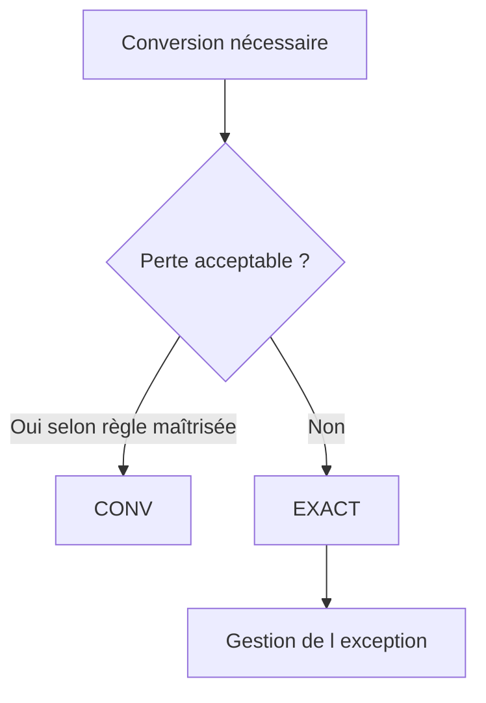

# 🌸 CONVERSIONS EXPLICITES AVEC CONV ET EXACT

## 🌺 OBJECTIFS

- Rendre une conversion visible avec `CONV`
- Utiliser l’inférence de type avec `#`
- Refuser une perte d’information avec `EXACT`
- Intercepter les erreurs de conversion
- Choisir entre conversion permissive et conversion stricte

## 🌺 OPÉRATEUR CONV

`CONV` construit une valeur dans le type demandé.

```abap
DATA lv_text   TYPE string VALUE `125`.
DATA lv_number TYPE i.

lv_number = CONV i( lv_text ).
```

Forme générale :

```abap
CONV type( operand )
```

Le résultat est une valeur temporaire du type indiqué.

## 🌺 INFÉRENCE AVEC

Lorsque le contexte détermine sans ambiguïté le type cible, `#` peut remplacer le type explicite.

```abap
DATA lv_number TYPE i.
DATA lv_text   TYPE string VALUE `125`.

lv_number = CONV #( lv_text ).
```

Préférer le type explicite lorsque :

- le lecteur ne peut pas identifier immédiatement le type cible ;
- le résultat est utilisé dans une expression complexe ;
- plusieurs conversions sont imbriquées ;
- le type fait partie de l’intention métier.

## 🌺 FORCER LE TYPE D’UN CALCUL

```abap
DATA lv_quantity TYPE i VALUE 5.
DATA lv_divisor  TYPE i VALUE 2.
DATA lv_ratio    TYPE decfloat34.

lv_ratio = CONV decfloat34( lv_quantity ) / lv_divisor.
```

La conversion du premier opérande impose une arithmétique décimale adaptée au résultat attendu.

## 🌺 OPÉRATEUR EXACT

`EXACT` effectue une conversion stricte. Une exception est levée lorsque la conversion ne peut pas être réalisée sans perte interdite par ses règles.

```abap
DATA lv_source TYPE decfloat34 VALUE '12.50'.
DATA lv_target TYPE i.

TRY.
    lv_target = EXACT i( lv_source ).
  CATCH cx_sy_conversion_error INTO DATA(lx_conversion).
    WRITE / lx_conversion->get_text( ).
ENDTRY.
```

La conversion vers un entier ne peut pas conserver la partie décimale `0.50`.

## 🌺 CONV OU EXACT

| Besoin                                                              | Opérateur                        |
| ------------------------------------------------------------------- | -------------------------------- |
| Convertir selon les règles normales du langage                      | `CONV`                           |
| Refuser une perte de précision ou une valeur non représentable      | `EXACT`                          |
| Modifier le type d’un opérande avant un calcul                      | `CONV`                           |
| Valider qu’une donnée externe correspond exactement au type attendu | `EXACT` avec gestion d’exception |



## 🌺 CONVERSION D’UNE CHAÎNE EXTERNE

```abap
PARAMETERS p_value TYPE c LENGTH 20.

START-OF-SELECTION.
  TRY.
      DATA(lv_amount) = EXACT decfloat34( p_value ).
      WRITE / |Montant converti : { lv_amount }|.
    CATCH cx_sy_conversion_error INTO DATA(lx_error).
      MESSAGE lx_error->get_text( ) TYPE 'E'.
  ENDTRY.
```

Une saisie externe doit être validée avant utilisation dans un calcul métier.

## 🌺 CONVERSION ET FORMATAGE

`CONV` modifie un type de données. Il ne remplace pas une règle d’affichage dépendante du format utilisateur, de la devise ou de l’unité.

Exemple de conversion technique :

```abap
DATA(lv_text) = CONV string( lv_number ).
```

Exemple de présentation :

```abap
DATA(lv_output) = |{ lv_number NUMBER = USER }|.
```

Le premier produit une valeur `string`. Le second applique une option de formatage dans un modèle de chaîne.

## 🌺 BONNES PRATIQUES

- Ne pas ajouter `CONV` si les types sont déjà identiques et que cela n’améliore pas la compréhension.
- Utiliser `EXACT` aux frontières du système lorsque la donnée doit respecter strictement le contrat attendu.
- Intercepter les exceptions au niveau capable de produire un message utile.
- Ne pas remplacer une validation métier par une conversion technique.

## 🌺 VÉRIFICATION

- Le contrôle syntaxique réussit.
- La version active correspond au code sauvegardé.
- L’exécution produit le résultat décrit dans le chapitre.
- Les cas vide, limite et erreur sont testés séparément lorsque la syntaxe le permet.

## 🌺 ERREURS FRÉQUENTES

- Copier un exemple sans adapter les types, noms d’objets et données disponibles dans le système.
- Tester uniquement le cas nominal et ignorer les valeurs initiales, absentes ou invalides.
- S’appuyer sur une conversion implicite pouvant tronquer ou arrondir.
- Ignorer l’encodage et les formats externes.

## 🌺 SNIPPET À RÉUTILISER

> [!NOTE]
> Adapter les noms `Z*`, les types DDIC, les données et les autorisations au système cible. Effectuer un contrôle syntaxique avant activation.

```abap
PARAMETERS p_value TYPE c LENGTH 20.

START-OF-SELECTION.
  TRY.
      DATA(lv_amount) = EXACT decfloat34( p_value ).
      WRITE / |Montant converti : { lv_amount }|.
    CATCH cx_sy_conversion_error INTO DATA(lx_error).
      MESSAGE lx_error->get_text( ) TYPE 'E'.
  ENDTRY.
```

## 🌺 TERMES DU LEXIQUE

- [Instruction ABAP](<../└─ 🧩 00 - LEXIQUE SAP ET ABAP/04 - 🍧 LANGAGE ET DEVELOPPEMENT ABAP.md#instruction-abap>)
- [Expression](<../└─ 🧩 00 - LEXIQUE SAP ET ABAP/04 - 🍧 LANGAGE ET DEVELOPPEMENT ABAP.md#expression>)
- [Type de données](<../└─ 🧩 00 - LEXIQUE SAP ET ABAP/04 - 🍧 LANGAGE ET DEVELOPPEMENT ABAP.md#type-donnees>)

## 🌺 RÉFÉRENCES OFFICIELLES SAP

- [CONV — Conversion Operator — ABAP Keyword Documentation](https://help.sap.com/doc/abapdocu_latest_index_htm/latest/en-US/ABENCONSTRUCTOR_EXPRESSION_CONV.html)
- [EXACT — Conversion Operator — ABAP Keyword Documentation](https://help.sap.com/doc/abapdocu_latest_index_htm/latest/en-US/ABENCONSTRUCTOR_EXPRESSION_EXACT.html)
- [Avoiding the Pitfalls of Type Conversions — SAP Learning](https://learning.sap.com/courses/deepening-your-abap-programming-knowledge/avoiding-the-pitfalls-of-type-conversions_e1feca3f-d704-4cd4-aa4e-3072af1659c6)


---

➡️ [Chapitre suivant — TRAITEMENT DES CHAÎNES DE CARACTÈRES](<./08 - 🍧 TRAITEMENT DES CHAINES DE CARACTERES.md>)
