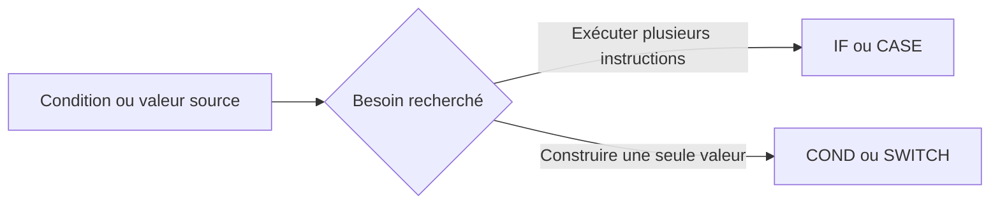

# 🌸 EXPRESSIONS CONDITIONNELLES COND ET SWITCH

## 🌺 OBJECTIFS

- Distinguer une expression conditionnelle d’une structure de contrôle
- Produire directement une valeur avec `COND`
- Sélectionner une valeur avec `SWITCH`
- Connaître les limites de lisibilité de ces expressions
- Vérifier leur compatibilité avec la version ABAP du système

## 🌺 STRUCTURE DE CONTRÔLE OU EXPRESSION

`IF` et `CASE` pilotent l’exécution de blocs d’instructions.

`COND` et `SWITCH` produisent une valeur utilisable dans une affectation ou une autre expression.



> [!IMPORTANT]
> La disponibilité de `COND` et `SWITCH` dépend de la version ABAP. Vérifier la syntaxe sur le système cible et respecter les règles de compatibilité du projet.

## 🌺 EXPRESSION COND

`COND` produit une valeur selon une ou plusieurs conditions logiques.

```abap
DATA lv_amount TYPE p LENGTH 8 DECIMALS 2 VALUE '125.00'.

DATA(lv_category) = COND string(
  WHEN lv_amount < 0   THEN `NEGATIF`
  WHEN lv_amount = 0   THEN `NUL`
  WHEN lv_amount < 100 THEN `STANDARD`
  ELSE                      `ELEVE` ).

WRITE: / lv_category.
```

Équivalent avec `IF` :

```abap
DATA lv_category TYPE string.

IF lv_amount < 0.
  lv_category = `NEGATIF`.
ELSEIF lv_amount = 0.
  lv_category = `NUL`.
ELSEIF lv_amount < 100.
  lv_category = `STANDARD`.
ELSE.
  lv_category = `ELEVE`.
ENDIF.
```

## 🌺 EXPRESSION SWITCH

`SWITCH` produit une valeur en comparant une expression à plusieurs valeurs.

```abap
DATA lv_status TYPE c LENGTH 1 VALUE 'A'.

DATA(lv_status_text) = SWITCH string(
  lv_status
  WHEN 'A' THEN `ACTIF`
  WHEN 'B' THEN `BLOQUE`
  ELSE          `INCONNU` ).

WRITE: / lv_status_text.
```

Équivalent avec `CASE` :

```abap
DATA lv_status_text TYPE string.

CASE lv_status.
  WHEN 'A'.
    lv_status_text = `ACTIF`.
  WHEN 'B'.
    lv_status_text = `BLOQUE`.
  WHEN OTHERS.
    lv_status_text = `INCONNU`.
ENDCASE.
```

## 🌺 TYPE DU RÉSULTAT

Le type peut être indiqué explicitement :

```abap
DATA lv_flag TYPE abap_bool.

lv_flag = COND abap_bool(
  WHEN lv_quantity > 0 THEN abap_true
  ELSE                      abap_false ).
```

Le type explicite facilite la lecture et évite une inférence inadéquate.

## 🌺 QUAND LES UTILISER

Utiliser `COND` ou `SWITCH` lorsque :

- le résultat attendu est une valeur unique ;
- chaque branche reste courte ;
- l’expression reste immédiatement compréhensible ;
- la version ABAP cible les prend en charge.

Préférer `IF` ou `CASE` lorsque :

- chaque branche contient plusieurs instructions ;
- des messages, appels ou effets de bord sont nécessaires ;
- l’expression devient longue ou profondément imbriquée ;
- le code doit rester compatible avec une version ABAP plus ancienne.

## 🌺 ÉVITER L’IMBRICATION D’EXPRESSIONS

À éviter :

```abap
DATA(lv_result) = COND string(
  WHEN lv_active = abap_true
  THEN SWITCH string(
         lv_status
         WHEN 'A' THEN `AUTORISE`
         ELSE          `REFUSE` )
  ELSE `INACTIF` ).
```

Une structure explicite est souvent plus maintenable :

```abap
DATA lv_result TYPE string.

IF lv_active = abap_false.
  lv_result = `INACTIF`.
ELSE.
  CASE lv_status.
    WHEN 'A'.
      lv_result = `AUTORISE`.
    WHEN OTHERS.
      lv_result = `REFUSE`.
  ENDCASE.
ENDIF.
```

## 🌺 CAS D’USAGE

Dans un contexte où un traitement doit appliquer plusieurs règles métier et arrêter ou poursuivre le flux selon les données rencontrées, le besoin consiste à **piloter le flux d’exécution avec expressions conditionnelles cond et switch tout en conservant un code lisible et borné**. Cette notion est pertinente lorsque le lecteur doit pouvoir relier la syntaxe ou l’outil à une situation professionnelle concrète.

## 🌺 PROCÉDURE PAS À PAS

1. Saisir `/nSE38` dans le champ de commande.
2. Entrer le nom d’un programme Z de test, par exemple `ZREF_DEMO`, puis choisir **Créer** ou **Modifier** selon le cas.
3. Pour un exercice local uniquement, affecter `$TMP` ; pour un développement livrable, utiliser le package et l’ordre fournis par le projet.
4. Coller ou adapter le snippet du chapitre.
5. Exécuter le contrôle syntaxique avec `Ctrl+F2`.
6. Activer avec `Ctrl+F3`.
7. Exécuter avec `F8` et comparer le résultat avec la section **Vérification**.

## 🌺 VÉRIFICATION

- Le contrôle syntaxique réussit.
- La version active correspond au code sauvegardé.
- L’exécution produit le résultat décrit dans le chapitre.
- Les cas vide, limite et erreur sont testés séparément lorsque la syntaxe le permet.

## 🌺 ERREURS FRÉQUENTES

- Copier un exemple sans adapter les types, noms d’objets et données disponibles dans le système.
- Tester uniquement le cas nominal et ignorer les valeurs initiales, absentes ou invalides.
- Créer une boucle sans condition de sortie fiable.
- Utiliser `CHECK`, `CONTINUE`, `EXIT` ou `RETURN` sans rendre le flux lisible.

## 🌺 SNIPPET À RÉUTILISER

> [!NOTE]
> Adapter les noms `Z*`, les types DDIC, les données et les autorisations au système cible. Effectuer un contrôle syntaxique avant activation.

```abap
DATA lv_amount TYPE p LENGTH 8 DECIMALS 2 VALUE '125.00'.

DATA(lv_category) = COND string(
  WHEN lv_amount < 0   THEN `NEGATIF`
  WHEN lv_amount = 0   THEN `NUL`
  WHEN lv_amount < 100 THEN `STANDARD`
  ELSE                      `ELEVE` ).

WRITE: / lv_category.
```

## 🌺 TERMES DU LEXIQUE

- [Expression](<../└─ 🧩 00 - LEXIQUE SAP ET ABAP/04 - 🍧 LANGAGE ET DEVELOPPEMENT ABAP.md#expression>)
- [Instruction ABAP](<../└─ 🧩 00 - LEXIQUE SAP ET ABAP/04 - 🍧 LANGAGE ET DEVELOPPEMENT ABAP.md#instruction-abap>)

## 🌺 À RETENIR

- À l’issue du chapitre, le lecteur sait **piloter le flux d’exécution avec expressions conditionnelles cond et switch tout en conservant un code lisible et borné**.
- Toujours tester sur un objet Z ou un jeu de données sans impact avant d’intervenir sur un traitement réel.
- La documentation `F1` du système reste la référence pour la syntaxe disponible dans sa release.

## 🌺 RÉFÉRENCES OFFICIELLES SAP

- [Conditional Expressions — ABAP Keyword Documentation](https://help.sap.com/doc/abapdocu_latest_index_htm/latest/en-US/index.htm?file=abenconditional_expressions.htm)
- [COND Conditional Operator — ABAP Keyword Documentation](https://help.sap.com/doc/abapdocu_latest_index_htm/latest/en-US/index.htm?file=abenconditional_expression_cond.htm)
- [SWITCH Conditional Operator — ABAP Keyword Documentation](https://help.sap.com/doc/abapdocu_latest_index_htm/latest/en-US/index.htm?file=abenconditional_expression_switch.htm)


---

➡️ [Chapitre suivant — BOUCLES COMPTÉES AVEC DO](<./06 - 🍧 BOUCLES COMPTEES AVEC DO.md>)
