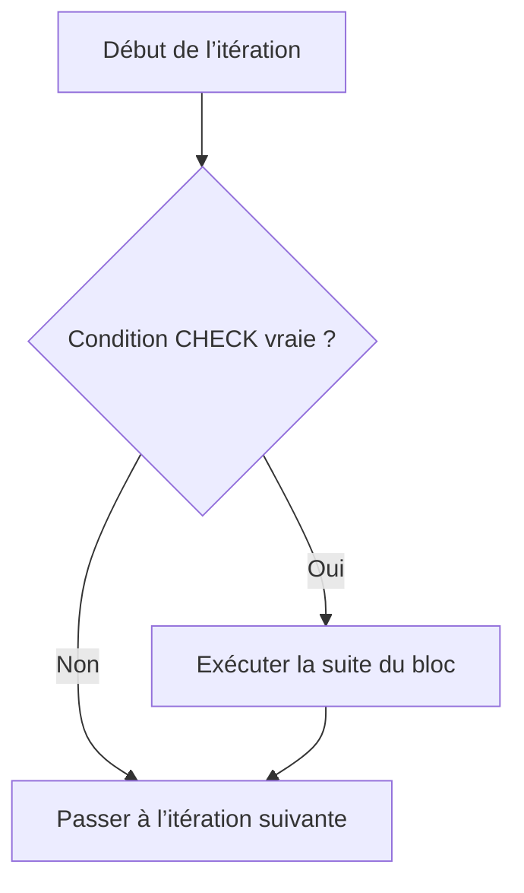

# 🌸 FILTRER UNE ITÉRATION AVEC CHECK ET CONTINUE

## 🌺 OBJECTIFS

- Passer à l’itération suivante sans exécuter la fin du bloc
- Distinguer `CHECK` et `CONTINUE`
- Comprendre le comportement de `CHECK` hors d’une boucle
- Réduire l’imbrication avec des gardes
- Utiliser ces instructions sans masquer le flux principal

## 🌺 CHECK DANS UNE BOUCLE

Dans une boucle, `CHECK condition` poursuit l’itération seulement si la condition est vraie. Si elle est fausse, l’exécution passe à l’itération suivante.

```abap
DO 10 TIMES.
  CHECK sy-index MOD 2 = 0.

  WRITE: / 'Nombre pair :', sy-index.
ENDDO.
```



## 🌺 CONTINUE

`CONTINUE` passe immédiatement à l’itération suivante.

```abap
DO 10 TIMES.
  IF sy-index MOD 2 <> 0.
    CONTINUE.
  ENDIF.

  WRITE: / 'Nombre pair :', sy-index.
ENDDO.
```

Les deux exemples produisent le même résultat.

## 🌺 DIFFÉRENCE D’INTENTION

| Instruction       | Intention                                                                  |
| ----------------- | -------------------------------------------------------------------------- |
| `CHECK condition` | Continuer le traitement courant uniquement si une condition est satisfaite |
| `CONTINUE`        | Abandonner explicitement la suite de l’itération courante                  |

`CHECK` est une garde conditionnelle concise. `CONTINUE` est utile après plusieurs instructions ou dans une branche explicite.

## 🌺 RÉDUIRE L’IMBRICATION

Version imbriquée :

```abap
DO 10 TIMES.
  IF sy-index MOD 2 = 0.
    IF sy-index <= 6.
      WRITE: / sy-index.
    ENDIF.
  ENDIF.
ENDDO.
```

Version avec gardes :

```abap
DO 10 TIMES.
  CHECK sy-index MOD 2 = 0.
  CHECK sy-index <= 6.

  WRITE: / sy-index.
ENDDO.
```

Les gardes rendent le chemin nominal plus visible lorsque les exclusions sont simples.

## 🌺 CHECK HORS D’UNE BOUCLE

Hors d’une boucle, un `CHECK` dont la condition est fausse quitte le bloc de traitement courant.

```abap
PARAMETERS p_value TYPE i.

START-OF-SELECTION.

  CHECK p_value > 0.

  WRITE: / 'Valeur traitée :', p_value.
```

Ce comportement est différent du passage à l’itération suivante.

> [!WARNING]
> La portée de `CHECK` dépend de son emplacement. Dans une boucle, il agit sur l’itération. Hors boucle, il quitte le bloc de traitement. Une utilisation éloignée du début du bloc peut rendre le flux difficile à comprendre.

## 🌺 CHOISIR UNE FORME LISIBLE

Préférer une structure explicite lorsque le message d’erreur ou le traitement d’exclusion est important.

```abap
IF p_value <= 0.
  WRITE: / 'La valeur doit être positive'.
  RETURN.
ENDIF.

WRITE: / 'Valeur traitée :', p_value.
```

## 🌺 LIMITER LE NOMBRE DE SORTIES

Une succession excessive de `CHECK` et `CONTINUE` peut fragmenter le traitement.

Bon compromis :

- placer les gardes au début de l’itération ;
- regrouper les critères liés ;
- éviter un `CONTINUE` caché au milieu d’un long bloc ;
- documenter les exclusions métier non évidentes.

## 🌺 CAS D’USAGE

Dans un contexte où un traitement doit appliquer plusieurs règles métier et arrêter ou poursuivre le flux selon les données rencontrées, le besoin consiste à **piloter le flux d’exécution avec filtrer une itération avec check et continue tout en conservant un code lisible et borné**. Cette notion est pertinente lorsque le lecteur doit pouvoir relier la syntaxe ou l’outil à une situation professionnelle concrète.

## 🌺 PROCÉDURE PAS À PAS

1. Saisir `/nSE38` dans le champ de commande.
2. Entrer le nom d’un programme Z de test, par exemple `ZREF_DEMO`, puis choisir **Créer** ou **Modifier** selon le cas.
3. Pour un exercice local uniquement, affecter `$TMP` ; pour un développement livrable, utiliser le package et l’ordre fournis par le projet.
4. Coller ou adapter le snippet du chapitre.
5. Exécuter le contrôle syntaxique avec `Ctrl+F2`.
6. Activer avec `Ctrl+F3`.
7. Exécuter avec `F8` et comparer le résultat avec la section **Vérification**.

## 🌺 VÉRIFICATION

- Le contrôle syntaxique réussit.
- La version active correspond au code sauvegardé.
- L’exécution produit le résultat décrit dans le chapitre.
- Les cas vide, limite et erreur sont testés séparément lorsque la syntaxe le permet.

## 🌺 ERREURS FRÉQUENTES

- Copier un exemple sans adapter les types, noms d’objets et données disponibles dans le système.
- Tester uniquement le cas nominal et ignorer les valeurs initiales, absentes ou invalides.
- Créer une boucle sans condition de sortie fiable.
- Utiliser `CHECK`, `CONTINUE`, `EXIT` ou `RETURN` sans rendre le flux lisible.

## 🌺 SNIPPET À RÉUTILISER

> [!NOTE]
> Adapter les noms `Z*`, les types DDIC, les données et les autorisations au système cible. Effectuer un contrôle syntaxique avant activation.

```abap
PARAMETERS p_value TYPE i.

START-OF-SELECTION.

  CHECK p_value > 0.

  WRITE: / 'Valeur traitée :', p_value.
```

## 🌺 TERMES DU LEXIQUE

- [Instruction ABAP](<../└─ 🧩 00 - LEXIQUE SAP ET ABAP/04 - 🍧 LANGAGE ET DEVELOPPEMENT ABAP.md#instruction-abap>)
- [Expression](<../└─ 🧩 00 - LEXIQUE SAP ET ABAP/04 - 🍧 LANGAGE ET DEVELOPPEMENT ABAP.md#expression>)

## 🌺 À RETENIR

- À l’issue du chapitre, le lecteur sait **piloter le flux d’exécution avec filtrer une itération avec check et continue tout en conservant un code lisible et borné**.
- Toujours tester sur un objet Z ou un jeu de données sans impact avant d’intervenir sur un traitement réel.
- La documentation `F1` du système reste la référence pour la syntaxe disponible dans sa release.

## 🌺 RÉFÉRENCES OFFICIELLES SAP

- [CHECK — ABAP Keyword Documentation](https://help.sap.com/doc/abapdocu_latest_index_htm/latest/en-US/index.htm?file=abapcheck.htm)
- [CONTINUE — ABAP Keyword Documentation](https://help.sap.com/doc/abapdocu_latest_index_htm/latest/en-US/index.htm?file=abapcontinue.htm)
- [ABAP Statements, Overview — ABAP Keyword Documentation](https://help.sap.com/doc/abapdocu_latest_index_htm/latest/en-US/ABENABAP_STATEMENTS_OVERVIEW.html)


---

➡️ [Chapitre suivant — INTERROMPRE UNE BOUCLE AVEC EXIT](<./10 - 🍧 INTERROMPRE UNE BOUCLE AVEC EXIT.md>)
