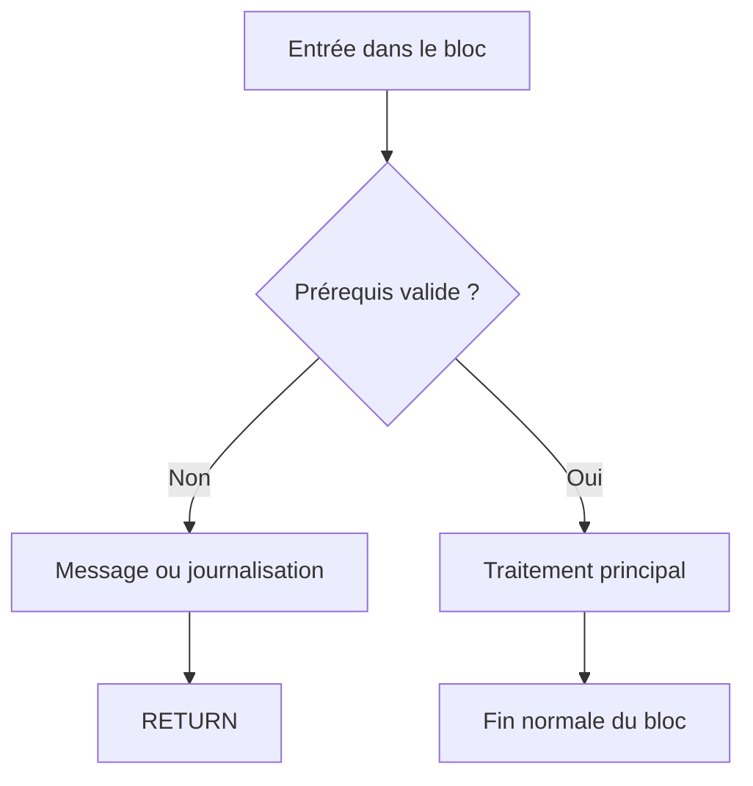

# 🌸 QUITTER UN BLOC AVEC RETURN

## 🌺 OBJECTIFS

- Quitter le bloc de traitement courant
- Utiliser `RETURN` comme garde
- Distinguer `RETURN` de `EXIT` et `CONTINUE`
- Préserver la lisibilité d’un traitement
- Comprendre l’effet dans un événement ou une procédure

## 🌺 PRINCIPE

`RETURN` termine le bloc de traitement courant. Le contrôle revient au point prévu par le contexte d’exécution.

Dans un événement de programme exécutable :

```abap
PARAMETERS p_value TYPE i.

START-OF-SELECTION.

  IF p_value <= 0.
    WRITE: / 'Valeur invalide'.
    RETURN.
  ENDIF.

  WRITE: / 'Traitement de la valeur :', p_value.
```

La seconde instruction `WRITE` n’est pas exécutée lorsque la valeur est invalide.

## 🌺 RETURN COMME GARDE

Une garde traite immédiatement un prérequis non satisfait.

```abap
IF lv_authorized = abap_false.
  WRITE: / 'Utilisateur non autorisé'.
  RETURN.
ENDIF.

IF lv_document IS INITIAL.
  WRITE: / 'Document obligatoire'.
  RETURN.
ENDIF.

WRITE: / 'Début du traitement principal'.
```



## 🌺 DIFFÉRENCE AVEC LES AUTRES INSTRUCTIONS

| Instruction             | Effet attendu                                           |
| ----------------------- | ------------------------------------------------------- |
| `CONTINUE`              | Passe à l’itération suivante                            |
| `EXIT`                  | Quitte la boucle active                                 |
| `RETURN`                | Quitte le bloc de traitement courant                    |
| `CHECK` dans une boucle | Passe à l’itération suivante si la condition est fausse |
| `CHECK` hors boucle     | Quitte le bloc si la condition est fausse               |

## 🌺 RETURN DANS UNE BOUCLE

`RETURN` ne quitte pas seulement la boucle : il quitte le bloc de traitement qui contient la boucle.

```abap
START-OF-SELECTION.

  DO 10 TIMES.
    IF sy-index = 3.
      RETURN.
    ENDIF.

    WRITE: / sy-index.
  ENDDO.

  WRITE: / 'Cette ligne ne sera pas exécutée'.
```

Utiliser `EXIT` lorsque seule la boucle doit être interrompue.

## 🌺 ÉVITER UN RETURN CACHÉ

Un `RETURN` placé au milieu d’un long bloc peut surprendre le lecteur.

Préférer :

- les gardes au début du bloc ;
- des conditions clairement nommées ;
- une journalisation ou un message avant la sortie lorsque nécessaire ;
- des blocs courts grâce à la modularisation.

## 🌺 NE PAS CONFONDRE RETURN ET FIN DE PROGRAMME

`RETURN` termine le bloc courant. Il ne doit pas être présenté comme une instruction générique d’arrêt technique de toute session SAP.

Les instructions de navigation ou de terminaison spécifiques aux programmes de dialogue et aux transactions seront traitées dans les dossiers correspondants.

## 🌺 RETOUR DE VALEUR

Dans une méthode fonctionnelle, la valeur de retour est affectée à un paramètre `RETURNING`, puis `RETURN` peut terminer le traitement de manière anticipée. La déclaration et l’appel des méthodes seront étudiés dans le dossier **ABAP OBJECTS**.

Exemple conceptuel :

```abap
METHOD is_valid.
  result = abap_false.

  IF input IS INITIAL.
    RETURN.
  ENDIF.

  result = abap_true.
ENDMETHOD.
```

## 🌺 CAS D’USAGE

Dans un contexte où un traitement doit appliquer plusieurs règles métier et arrêter ou poursuivre le flux selon les données rencontrées, le besoin consiste à **piloter le flux d’exécution avec quitter un bloc avec return tout en conservant un code lisible et borné**. Cette notion est pertinente lorsque le lecteur doit pouvoir relier la syntaxe ou l’outil à une situation professionnelle concrète.

## 🌺 PROCÉDURE PAS À PAS

1. Saisir `/nSE38` dans le champ de commande.
2. Entrer le nom d’un programme Z de test, par exemple `ZREF_DEMO`, puis choisir **Créer** ou **Modifier** selon le cas.
3. Pour un exercice local uniquement, affecter `$TMP` ; pour un développement livrable, utiliser le package et l’ordre fournis par le projet.
4. Coller ou adapter le snippet du chapitre.
5. Exécuter le contrôle syntaxique avec `Ctrl+F2`.
6. Activer avec `Ctrl+F3`.
7. Exécuter avec `F8` et comparer le résultat avec la section **Vérification**.

## 🌺 VÉRIFICATION

- Le contrôle syntaxique réussit.
- La version active correspond au code sauvegardé.
- L’exécution produit le résultat décrit dans le chapitre.
- Les cas vide, limite et erreur sont testés séparément lorsque la syntaxe le permet.

## 🌺 ERREURS FRÉQUENTES

- Copier un exemple sans adapter les types, noms d’objets et données disponibles dans le système.
- Tester uniquement le cas nominal et ignorer les valeurs initiales, absentes ou invalides.
- Créer une boucle sans condition de sortie fiable.
- Utiliser `CHECK`, `CONTINUE`, `EXIT` ou `RETURN` sans rendre le flux lisible.

## 🌺 SNIPPET À RÉUTILISER

> [!NOTE]
> Adapter les noms `Z*`, les types DDIC, les données et les autorisations au système cible. Effectuer un contrôle syntaxique avant activation.

```abap
PARAMETERS p_value TYPE i.

START-OF-SELECTION.

  IF p_value <= 0.
    WRITE: / 'Valeur invalide'.
    RETURN.
  ENDIF.

  WRITE: / 'Traitement de la valeur :', p_value.
```

## 🌺 TERMES DU LEXIQUE

- [Instruction ABAP](<../└─ 🧩 00 - LEXIQUE SAP ET ABAP/04 - 🍧 LANGAGE ET DEVELOPPEMENT ABAP.md#instruction-abap>)
- [Expression](<../└─ 🧩 00 - LEXIQUE SAP ET ABAP/04 - 🍧 LANGAGE ET DEVELOPPEMENT ABAP.md#expression>)

## 🌺 À RETENIR

- À l’issue du chapitre, le lecteur sait **piloter le flux d’exécution avec quitter un bloc avec return tout en conservant un code lisible et borné**.
- Toujours tester sur un objet Z ou un jeu de données sans impact avant d’intervenir sur un traitement réel.
- La documentation `F1` du système reste la référence pour la syntaxe disponible dans sa release.

## 🌺 RÉFÉRENCES OFFICIELLES SAP

- [RETURN — ABAP Keyword Documentation](https://help.sap.com/doc/abapdocu_latest_index_htm/latest/en-US/index.htm?file=abapreturn.htm)
- [Calling and Exiting Program Units — ABAP Keyword Documentation](https://help.sap.com/doc/abapdocu_latest_index_htm/latest/en-US/index.htm?file=abencalling_processing_blocks.htm)
- [ABAP Statements, Overview — ABAP Keyword Documentation](https://help.sap.com/doc/abapdocu_latest_index_htm/latest/en-US/ABENABAP_STATEMENTS_OVERVIEW.html)


---

➡️ [Chapitre suivant — IMBRICATION, LISIBILITÉ ET SÉCURISATION](<./12 - 🍧 IMBRICATION LISIBILITE ET SECURISATION.md>)
