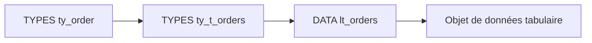

# 🌸 DÉCLARATION DES TYPES ET TABLES INTERNES

## 🌺 OBJECTIFS

- Déclarer un type de ligne et un type de table
- Déclarer directement une table interne avec `DATA`
- Créer une zone de travail compatible
- Utiliser `LIKE LINE OF` et `TYPE LINE OF`
- Distinguer définition de type et création d’objet de données

## 🌺 DÉCLARER LE TYPE DE LIGNE

Le type de ligne peut être élémentaire, structuré, tabulaire ou une référence. Dans la majorité des traitements métier, il s’agit d’une structure.

```abap
TYPES: BEGIN OF ty_order,
         vbeln  TYPE c LENGTH 10,
         posnr  TYPE n LENGTH 6,
         amount TYPE p LENGTH 8 DECIMALS 2,
       END OF ty_order.
```

## 🌺 DÉCLARER UN TYPE DE TABLE

```abap
TYPES ty_t_orders TYPE STANDARD TABLE OF ty_order
                  WITH EMPTY KEY.
```

Cette instruction définit un type. Elle ne crée aucune table en mémoire.

```abap
DATA lt_orders TYPE ty_t_orders.
```

Cette seconde instruction crée l’objet de données.



## 🌺 DÉCLARATION DIRECTE

Un type de table local intermédiaire n’est pas obligatoire.

```abap
DATA lt_orders TYPE STANDARD TABLE OF ty_order
               WITH EMPTY KEY.
```

Créer un type nommé reste utile lorsque plusieurs variables, paramètres ou attributs doivent partager exactement le même type.

## 🌺 ZONE DE TRAVAIL

Une zone de travail est une structure compatible avec une ligne de la table.

```abap
DATA ls_order TYPE ty_order.
```

Elle peut aussi être dérivée directement de la table :

```abap
DATA ls_order_2 LIKE LINE OF lt_orders.
```

Pour définir un type correspondant au type de ligne :

```abap
TYPES ty_order_line TYPE LINE OF ty_t_orders.
```

## 🌺 TYPE LINE OF ET LIKE LINE OF

| Syntaxe                  | Résultat                                                  |
| ------------------------ | --------------------------------------------------------- |
| `TYPE LINE OF lt_orders` | Utilise le type de ligne statique de la table             |
| `LIKE LINE OF lt_orders` | Déclare un objet avec le type de ligne de l’objet indiqué |

Exemple :

```abap
DATA ls_order_a TYPE LINE OF ty_t_orders.
DATA ls_order_b LIKE LINE OF lt_orders.
```

## 🌺 TABLES À LIGNE ÉLÉMENTAIRE

Une table interne peut contenir des valeurs simples.

```abap
DATA lt_numbers TYPE STANDARD TABLE OF i
                WITH EMPTY KEY.

APPEND 10 TO lt_numbers.
APPEND 20 TO lt_numbers.
```

Le pseudo-composant `table_line` représente alors la ligne complète dans une définition de clé.

```abap
DATA lt_unique_numbers TYPE SORTED TABLE OF i
                       WITH UNIQUE KEY table_line.
```

## 🌺 DÉCLARATIONS ANONYMES ET LISIBILITÉ

Une déclaration directe est concise :

```abap
DATA lt_messages TYPE STANDARD TABLE OF string
                 WITH EMPTY KEY.
```

Un type nommé est préférable lorsque le type est réutilisé :

```abap
TYPES ty_t_messages TYPE STANDARD TABLE OF string
                    WITH EMPTY KEY.

DATA lt_errors   TYPE ty_t_messages.
DATA lt_warnings TYPE ty_t_messages.
```

## 🌺 RÈGLE DE CONCEPTION

Définir dans cet ordre :

1. type de ligne ;
2. type de table si nécessaire ;
3. objets de données ;
4. zones de travail, symboles de champ ou références seulement lorsqu’ils sont utiles.

## 🌺 RÉFÉRENCES OFFICIELLES SAP

- [Creating Internal Tables — SAP Help Portal](https://help.sap.com/docs/abap-cloud/abap-concepts/how-to-create-internal-tables-locally)
- [Working with Complex Internal Tables — SAP Learning](https://learning.sap.com/courses/basic-abap-programming/working-with-complex-internal-tables_f8c923f3-6f95-4b47-960f-557001f13977)
- [DATA, Internal Tables — ABAP Keyword Documentation](https://help.sap.com/doc/abapdocu_latest_index_htm/latest/en-US/ABAPDATA_ITAB.html)

---

➡️ [Chapitre suivant — TABLES STANDARD TRIEES ET HACHEES](<./03 - 🍧 TABLES STANDARD TRIEES ET HACHEES.md>)
