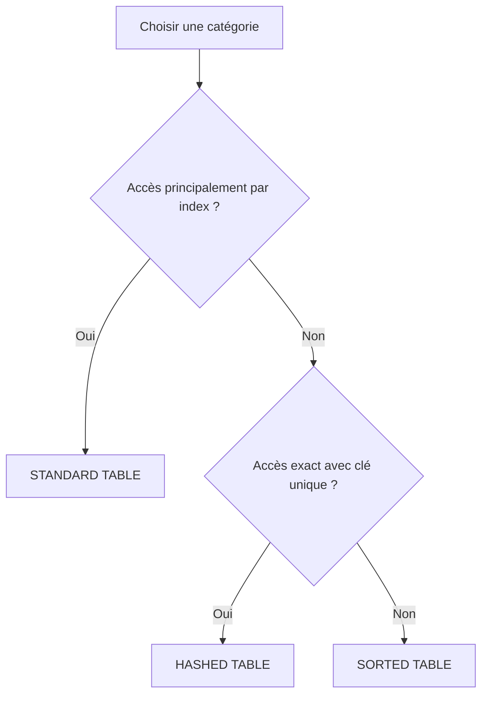

# 🌸 TABLES STANDARD, TRIÉES ET HACHÉES

## 🌺 OBJECTIFS

- Connaître les trois catégories de tables internes
- Comprendre leurs organisations respectives
- Identifier les accès par index et par clé disponibles
- Choisir une catégorie selon le besoin fonctionnel
- Éviter l’utilisation systématique de `STANDARD TABLE`

## 🌺 LES TROIS CATÉGORIES

| Catégorie ABAP   | Organisation                                      | Index primaire | Clé primaire           |
| ---------------- | ------------------------------------------------- | -------------: | ---------------------- |
| `STANDARD TABLE` | Séquence gérée principalement par index           |            Oui | Non unique ou vide     |
| `SORTED TABLE`   | Lignes maintenues dans l’ordre de la clé primaire |            Oui | Unique ou non unique   |
| `HASHED TABLE`   | Organisation par hachage                          |            Non | Obligatoirement unique |



Ce diagramme est une première orientation. Le volume, les insertions, les parcours partiels et les clés secondaires peuvent modifier le choix final.

## 🌺 STANDARD TABLE

```abap
DATA lt_products TYPE STANDARD TABLE OF ty_product
                 WITH EMPTY KEY.
```

Caractéristiques principales :

- adaptée aux ajouts séquentiels ;
- accès direct possible par index ;
- ordre correspondant initialement à l’ordre d’insertion ;
- recherche par clé potentiellement linéaire si aucune clé adaptée n’est utilisée.

```abap
READ TABLE lt_products INTO DATA(ls_product) INDEX 1.
```

## 🌺 SORTED TABLE

```abap
DATA lt_products TYPE SORTED TABLE OF ty_product
                 WITH UNIQUE KEY matnr.
```

Caractéristiques principales :

- lignes automatiquement maintenues dans l’ordre de la clé primaire ;
- accès par index possible ;
- accès par clé efficace ;
- clé primaire unique ou non unique ;
- insertion refusée si elle viole une clé unique.

> [!WARNING]
> Ne pas utiliser `APPEND` comme instruction générique pour alimenter une table triée. Utiliser `INSERT`, qui respecte la catégorie et la clé de la table.

## 🌺 HASHED TABLE

```abap
DATA lt_products TYPE HASHED TABLE OF ty_product
                 WITH UNIQUE KEY matnr.
```

Caractéristiques principales :

- accès exact optimisé par la clé complète ;
- aucune position d’index primaire exploitable ;
- clé primaire obligatoirement unique ;
- pas de tri métier implicite utilisable comme ordre d’affichage.

```abap
READ TABLE lt_products
  INTO DATA(ls_product)
  WITH TABLE KEY matnr = 'MAT-001'.
```

## 🌺 COMPARAISON D’USAGE

| Besoin dominant                                            | Catégorie généralement adaptée          |
| ---------------------------------------------------------- | --------------------------------------- |
| Construire une liste puis la parcourir intégralement       | `STANDARD TABLE`                        |
| Parcourir dans l’ordre d’une clé ou lire des plages de clé | `SORTED TABLE`                          |
| Rechercher fréquemment une ligne par clé complète unique   | `HASHED TABLE`                          |
| Accéder par numéro de ligne                                | `STANDARD TABLE` ou `SORTED TABLE`      |
| Garantir l’unicité d’une clé                               | `SORTED TABLE` unique ou `HASHED TABLE` |

## 🌺 EXEMPLE COMPARATIF

```abap
TYPES: BEGIN OF ty_product,
         matnr TYPE c LENGTH 18,
         maktx TYPE c LENGTH 40,
       END OF ty_product.

DATA lt_standard TYPE STANDARD TABLE OF ty_product
                 WITH EMPTY KEY.

DATA lt_sorted TYPE SORTED TABLE OF ty_product
               WITH UNIQUE KEY matnr.

DATA lt_hashed TYPE HASHED TABLE OF ty_product
               WITH UNIQUE KEY matnr.
```

Le type de ligne est identique. La stratégie de stockage et d’accès est différente.

## 🌺 RÈGLE DE CONCEPTION

Choisir la catégorie à partir des accès réels :

- fréquence des lectures ;
- lecture complète ou ciblée ;
- accès exact ou par plage ;
- nécessité d’un index ;
- unicité attendue ;
- fréquence des insertions et modifications.

## 🌺 CAS D’USAGE

Dans un contexte où un traitement de masse charge des commandes en mémoire, recherche des lignes, élimine des doublons et prépare un résultat, le besoin consiste à **manipuler une table interne avec tables standard, triées et hachées en contrôlant clé, présence des lignes et performance**. Cette notion est pertinente lorsque le lecteur doit pouvoir relier la syntaxe ou l’outil à une situation professionnelle concrète.

## 🌺 PROCÉDURE PAS À PAS

1. Saisir `/nSE38` dans le champ de commande.
2. Entrer le nom d’un programme Z de test, par exemple `ZREF_DEMO`, puis choisir **Créer** ou **Modifier** selon le cas.
3. Pour un exercice local uniquement, affecter `$TMP` ; pour un développement livrable, utiliser le package et l’ordre fournis par le projet.
4. Coller ou adapter le snippet du chapitre.
5. Exécuter le contrôle syntaxique avec `Ctrl+F2`.
6. Activer avec `Ctrl+F3`.
7. Exécuter avec `F8` et comparer le résultat avec la section **Vérification**.

## 🌺 VÉRIFICATION

- Le contrôle syntaxique réussit.
- La version active correspond au code sauvegardé.
- L’exécution produit le résultat décrit dans le chapitre.
- Les cas vide, limite et erreur sont testés séparément lorsque la syntaxe le permet.

## 🌺 ERREURS FRÉQUENTES

- Copier un exemple sans adapter les types, noms d’objets et données disponibles dans le système.
- Tester uniquement le cas nominal et ignorer les valeurs initiales, absentes ou invalides.
- Utiliser une table standard pour des recherches massives par clé sans mesure.
- Modifier une copie de ligne alors que la table devait être mise à jour.

## 🌺 SNIPPET À RÉUTILISER

> [!NOTE]
> Adapter les noms `Z*`, les types DDIC, les données et les autorisations au système cible. Effectuer un contrôle syntaxique avant activation.

```abap
READ TABLE lt_products
  INTO DATA(ls_product)
  WITH TABLE KEY matnr = 'MAT-001'.
```

## 🌺 TERMES DU LEXIQUE

- [Table interne](<../└─ 🧩 00 - LEXIQUE SAP ET ABAP/04 - 🍧 LANGAGE ET DEVELOPPEMENT ABAP.md#table-interne>)
- [Structure](<../└─ 🧩 00 - LEXIQUE SAP ET ABAP/04 - 🍧 LANGAGE ET DEVELOPPEMENT ABAP.md#structure-abap>)
- [Field-symbol](<../└─ 🧩 00 - LEXIQUE SAP ET ABAP/04 - 🍧 LANGAGE ET DEVELOPPEMENT ABAP.md#field-symbol>)
- [Référence](<../└─ 🧩 00 - LEXIQUE SAP ET ABAP/04 - 🍧 LANGAGE ET DEVELOPPEMENT ABAP.md#reference>)

## 🌺 À RETENIR

- À l’issue du chapitre, le lecteur sait **manipuler une table interne avec tables standard, triées et hachées en contrôlant clé, présence des lignes et performance**.
- Toujours tester sur un objet Z ou un jeu de données sans impact avant d’intervenir sur un traitement réel.
- La documentation `F1` du système reste la référence pour la syntaxe disponible dans sa release.

## 🌺 RÉFÉRENCES OFFICIELLES SAP

- [Working with Sorted and Hashed Tables — SAP Learning](https://learning.sap.com/courses/deepening-your-abap-programming-knowledge/working-with-sorted-and-hashed-tables_de84be91-c7db-4166-95cf-2b036c8d5558)
- [Technical Properties of Internal Tables — SAP Help Portal](https://help.sap.com/docs/abap-cloud/abap-concepts/internal-table-setup)
- [Internal Tables, Table Category — ABAP Keyword Documentation](https://help.sap.com/doc/abapdocu_latest_index_htm/latest/en-US/ABENITAB_CATEGORY.html)


---

➡️ [Chapitre suivant — CLÉS PRIMAIRES ET UNICITÉ](<./04 - 🍧 CLES PRIMAIRES ET UNICITE.md>)
