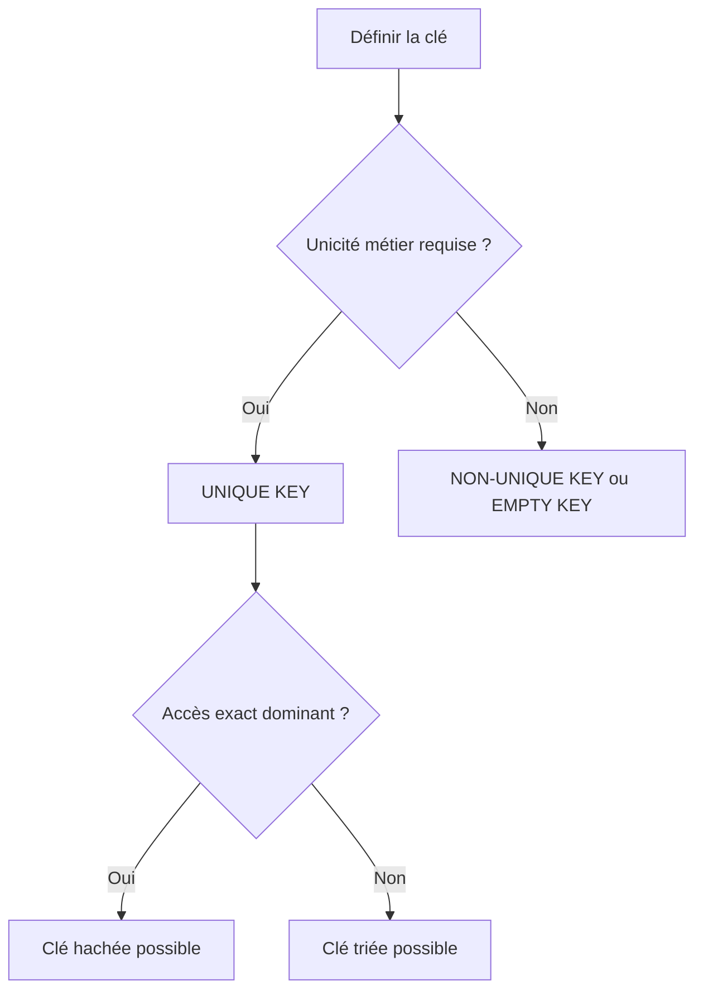

# 🌸 CLÉS PRIMAIRES ET UNICITÉ

## 🌺 OBJECTIFS

- Comprendre le rôle de la clé primaire d’une table interne
- Déclarer une clé standard, triée, hachée ou vide
- Distinguer clé unique et non unique
- Comprendre le pseudo-composant `table_line`
- Éviter les clés par défaut involontaires

## 🌺 RÔLE DE LA CLÉ

La clé primaire participe à plusieurs comportements :

- accès à une ligne par clé ;
- ordre permanent d’une table triée ;
- organisation d’une table hachée ;
- contrôle de l’unicité ;
- comportement de certaines instructions comme `COLLECT`.

## 🌺 CLÉ EXPLICITE

```abap
DATA lt_products TYPE SORTED TABLE OF ty_product
                 WITH UNIQUE KEY matnr.
```

La combinaison des composants indiqués constitue la clé.

```abap
DATA lt_items TYPE SORTED TABLE OF ty_item
              WITH NON-UNIQUE KEY vbeln posnr.
```

## 🌺 UNIQUE ET NON-UNIQUE

| Déclaration           | Conséquence                                                 |
| --------------------- | ----------------------------------------------------------- |
| `WITH UNIQUE KEY`     | Une combinaison de clé ne peut apparaître qu’une seule fois |
| `WITH NON-UNIQUE KEY` | Plusieurs lignes peuvent partager la même combinaison       |

Une table hachée exige une clé primaire unique.

```abap
DATA lt_by_material TYPE HASHED TABLE OF ty_product
                    WITH UNIQUE KEY matnr.
```

## 🌺 EMPTY KEY

`WITH EMPTY KEY` définit explicitement une clé primaire vide pour une table standard.

```abap
DATA lt_messages TYPE STANDARD TABLE OF string
                 WITH EMPTY KEY.
```

Utiliser cette syntaxe lorsqu’aucune recherche par clé primaire ni unicité n’est attendue.

> [!IMPORTANT]
> Une clé vide n’est pas une clé contenant tous les composants. Elle ne contient aucun composant.

## 🌺 DEFAULT KEY

La clé standard par défaut dépend du type de ligne et peut exclure certains composants. Son comportement est moins explicite qu’une clé déclarée volontairement.

```abap
DATA lt_products TYPE STANDARD TABLE OF ty_product
                 WITH DEFAULT KEY.
```

Pour du nouveau code, préférer une clé explicite ou `WITH EMPTY KEY` lorsque cela correspond au besoin.

## 🌺 TABLE_LINE

Pour une table à ligne élémentaire, la ligne complète est désignée par `table_line`.

```abap
DATA lt_codes TYPE SORTED TABLE OF string
              WITH UNIQUE KEY table_line.
```

```abap
INSERT 'A01' INTO TABLE lt_codes.
INSERT 'B02' INTO TABLE lt_codes.
```

## 🌺 CLÉ COMPOSITE

```abap
TYPES: BEGIN OF ty_item,
         vbeln TYPE c LENGTH 10,
         posnr TYPE n LENGTH 6,
         matnr TYPE c LENGTH 18,
       END OF ty_item.

DATA lt_items TYPE HASHED TABLE OF ty_item
              WITH UNIQUE KEY vbeln posnr.
```

La ligne est identifiée par la combinaison `vbeln` + `posnr`.

## 🌺 CHOIX DE LA CLÉ



## 🌺 CONTRÔLER LES INSERTIONS

Avec `INSERT ... INTO TABLE`, `sy-subrc` permet de détecter un doublon sur une clé unique.

```abap
INSERT VALUE #( matnr = 'MAT-001'
                maktx = 'Produit' )
       INTO TABLE lt_products.

IF sy-subrc <> 0.
  WRITE: / 'La clé existe déjà'.
ENDIF.
```

## 🌺 CAS D’USAGE

Dans un contexte où un traitement de masse charge des commandes en mémoire, recherche des lignes, élimine des doublons et prépare un résultat, le besoin consiste à **manipuler une table interne avec clés primaires et unicité en contrôlant clé, présence des lignes et performance**. Cette notion est pertinente lorsque le lecteur doit pouvoir relier la syntaxe ou l’outil à une situation professionnelle concrète.

## 🌺 PROCÉDURE PAS À PAS

1. Saisir `/nSE38` dans le champ de commande.
2. Entrer le nom d’un programme Z de test, par exemple `ZREF_DEMO`, puis choisir **Créer** ou **Modifier** selon le cas.
3. Pour un exercice local uniquement, affecter `$TMP` ; pour un développement livrable, utiliser le package et l’ordre fournis par le projet.
4. Coller ou adapter le snippet du chapitre.
5. Exécuter le contrôle syntaxique avec `Ctrl+F2`.
6. Activer avec `Ctrl+F3`.
7. Exécuter avec `F8` et comparer le résultat avec la section **Vérification**.

## 🌺 VÉRIFICATION

- Le contrôle syntaxique réussit.
- La version active correspond au code sauvegardé.
- L’exécution produit le résultat décrit dans le chapitre.
- Les cas vide, limite et erreur sont testés séparément lorsque la syntaxe le permet.

## 🌺 ERREURS FRÉQUENTES

- Copier un exemple sans adapter les types, noms d’objets et données disponibles dans le système.
- Tester uniquement le cas nominal et ignorer les valeurs initiales, absentes ou invalides.
- Utiliser une table standard pour des recherches massives par clé sans mesure.
- Modifier une copie de ligne alors que la table devait être mise à jour.

## 🌺 SNIPPET À RÉUTILISER

> [!NOTE]
> Adapter les noms `Z*`, les types DDIC, les données et les autorisations au système cible. Effectuer un contrôle syntaxique avant activation.

```abap
INSERT VALUE #( matnr = 'MAT-001'
                maktx = 'Produit' )
       INTO TABLE lt_products.

IF sy-subrc <> 0.
  WRITE: / 'La clé existe déjà'.
ENDIF.
```

## 🌺 TERMES DU LEXIQUE

- [Table interne](<../└─ 🧩 00 - LEXIQUE SAP ET ABAP/04 - 🍧 LANGAGE ET DEVELOPPEMENT ABAP.md#table-interne>)
- [Structure](<../└─ 🧩 00 - LEXIQUE SAP ET ABAP/04 - 🍧 LANGAGE ET DEVELOPPEMENT ABAP.md#structure-abap>)
- [Field-symbol](<../└─ 🧩 00 - LEXIQUE SAP ET ABAP/04 - 🍧 LANGAGE ET DEVELOPPEMENT ABAP.md#field-symbol>)
- [Référence](<../└─ 🧩 00 - LEXIQUE SAP ET ABAP/04 - 🍧 LANGAGE ET DEVELOPPEMENT ABAP.md#reference>)

## 🌺 À RETENIR

- À l’issue du chapitre, le lecteur sait **manipuler une table interne avec clés primaires et unicité en contrôlant clé, présence des lignes et performance**.
- Toujours tester sur un objet Z ou un jeu de données sans impact avant d’intervenir sur un traitement réel.
- La documentation `F1` du système reste la référence pour la syntaxe disponible dans sa release.

## 🌺 RÉFÉRENCES OFFICIELLES SAP

- [Specifying Table Keys in Table Types and Internal Tables — SAP Help Portal](https://help.sap.com/docs/abap-cloud/abap-concepts/how-to-specify-table-keys-in-table-types-and-internal-tables)
- [Specifying Table Keys — SAP Help Portal](https://help.sap.com/docs/abap-cloud/abap-concepts/specifying-table-keys)
- [Internal Tables, Primary Table Key — ABAP Keyword Documentation](https://help.sap.com/doc/abapdocu_latest_index_htm/latest/en-US/ABENITAB_KEY_PRIMARY.html)


---

➡️ [Chapitre suivant — AJOUTER DES LIGNES AVEC APPEND, INSERT ET VALUE](<./05 - 🍧 AJOUTER DES LIGNES AVEC APPEND INSERT ET VALUE.md>)
