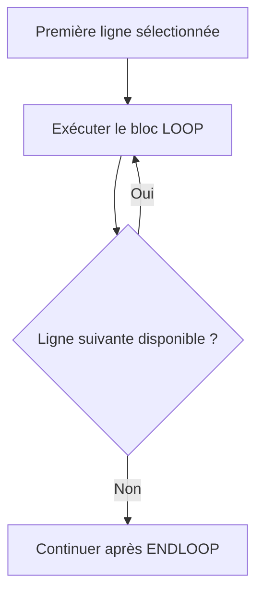

# 🌸 PARCOURIR UNE TABLE AVEC LOOP AT

## 🌺 OBJECTIFS

- Parcourir toutes les lignes d’une table interne
- Filtrer les lignes avec `WHERE`
- Parcourir une plage d’index
- Utiliser `sy-tabix` avec prudence
- Choisir une clé de parcours adaptée

## 🌺 PARCOURS COMPLET

```abap
LOOP AT lt_products INTO DATA(ls_product).
  WRITE: / ls_product-matnr,
           ls_product-maktx,
           ls_product-stock.
ENDLOOP.
```

Le bloc est exécuté une fois pour chaque ligne sélectionnée.



## 🌺 FILTRER AVEC WHERE

```abap
LOOP AT lt_products INTO DATA(ls_product)
     WHERE stock > 0.
  WRITE: / ls_product-matnr, ls_product-stock.
ENDLOOP.
```

Le filtre est appliqué pendant le parcours.

## 🌺 PARCOURIR UNE PLAGE D’INDEX

Pour une table d’index :

```abap
LOOP AT lt_products INTO DATA(ls_product)
     FROM 5 TO 10.
  WRITE: / sy-tabix, ls_product-matnr.
ENDLOOP.
```

Cette variante n’est pas applicable à l’index primaire d’une table hachée.

## 🌺 SY-TABIX

Dans un parcours utilisant un index, `sy-tabix` indique l’index de la ligne courante.

```abap
LOOP AT lt_products INTO DATA(ls_product).
  WRITE: / sy-tabix, ls_product-matnr.
ENDLOOP.
```

Ne pas mémoriser un index pour une utilisation ultérieure si la table peut être triée, alimentée ou vidée entre-temps.

## 🌺 UTILISER UNE CLÉ NOMMÉE

```abap
LOOP AT lt_products
     INTO DATA(ls_product)
     USING KEY sk_category
     WHERE category = 'A'.
  WRITE: / ls_product-matnr.
ENDLOOP.
```

`USING KEY` permet d’imposer l’utilisation d’une clé primaire ou secondaire appropriée.

## 🌺 CHECK ET CONTINUE DANS LOOP

```abap
LOOP AT lt_products INTO DATA(ls_product).
  CHECK ls_product-stock > 0.

  IF ls_product-blocked = abap_true.
    CONTINUE.
  ENDIF.

  WRITE: / ls_product-matnr.
ENDLOOP.
```

Préférer un `WHERE` lorsqu’un critère simple peut être appliqué directement au parcours.

## 🌺 PARCOURS IMBRIQUÉS

```abap
LOOP AT lt_orders INTO DATA(ls_order).
  LOOP AT lt_items INTO DATA(ls_item)
       WHERE vbeln = ls_order-vbeln.
    " Traitement
  ENDLOOP.
ENDLOOP.
```

Ce schéma peut devenir coûteux sur des volumes importants. Une clé adaptée sur la table interne ou une conception différente est alors nécessaire.

## 🌺 RÈGLES PRATIQUES

- Utiliser `WHERE` pour réduire le nombre de passages.
- Utiliser une clé cohérente avec les composants du filtre.
- Éviter les boucles imbriquées sans analyse du volume.
- Ne pas modifier une composante de clé directement pendant un parcours utilisant cette clé.
- Utiliser `ASSIGNING` pour modifier directement les composants non-clés.

## 🌺 CAS D’USAGE

Dans un contexte où un traitement de masse charge des commandes en mémoire, recherche des lignes, élimine des doublons et prépare un résultat, le besoin consiste à **parcourir les lignes en évitant les copies et traitements inutiles**. Cette notion est pertinente lorsque le lecteur doit pouvoir relier la syntaxe ou l’outil à une situation professionnelle concrète.

## 🌺 PROCÉDURE PAS À PAS

1. Saisir `/nSE38` dans le champ de commande.
2. Entrer le nom d’un programme Z de test, par exemple `ZREF_DEMO`, puis choisir **Créer** ou **Modifier** selon le cas.
3. Pour un exercice local uniquement, affecter `$TMP` ; pour un développement livrable, utiliser le package et l’ordre fournis par le projet.
4. Coller ou adapter le snippet du chapitre.
5. Exécuter le contrôle syntaxique avec `Ctrl+F2`.
6. Activer avec `Ctrl+F3`.
7. Exécuter avec `F8` et comparer le résultat avec la section **Vérification**.

## 🌺 VÉRIFICATION

- Le contrôle syntaxique réussit.
- La version active correspond au code sauvegardé.
- L’exécution produit le résultat décrit dans le chapitre.
- Les cas vide, limite et erreur sont testés séparément lorsque la syntaxe le permet.

## 🌺 ERREURS FRÉQUENTES

- Copier un exemple sans adapter les types, noms d’objets et données disponibles dans le système.
- Tester uniquement le cas nominal et ignorer les valeurs initiales, absentes ou invalides.
- Utiliser une table standard pour des recherches massives par clé sans mesure.
- Modifier une copie de ligne alors que la table devait être mise à jour.

## 🌺 SNIPPET À RÉUTILISER

> [!NOTE]
> Adapter les noms `Z*`, les types DDIC, les données et les autorisations au système cible. Effectuer un contrôle syntaxique avant activation.

```abap
LOOP AT lt_products INTO DATA(ls_product).
  CHECK ls_product-stock > 0.

  IF ls_product-blocked = abap_true.
    CONTINUE.
  ENDIF.

  WRITE: / ls_product-matnr.
ENDLOOP.
```

## 🌺 TERMES DU LEXIQUE

- [Table interne](<../└─ 🧩 00 - LEXIQUE SAP ET ABAP/04 - 🍧 LANGAGE ET DEVELOPPEMENT ABAP.md#table-interne>)
- [Structure](<../└─ 🧩 00 - LEXIQUE SAP ET ABAP/04 - 🍧 LANGAGE ET DEVELOPPEMENT ABAP.md#structure-abap>)
- [Field-symbol](<../└─ 🧩 00 - LEXIQUE SAP ET ABAP/04 - 🍧 LANGAGE ET DEVELOPPEMENT ABAP.md#field-symbol>)
- [Référence](<../└─ 🧩 00 - LEXIQUE SAP ET ABAP/04 - 🍧 LANGAGE ET DEVELOPPEMENT ABAP.md#reference>)

## 🌺 À RETENIR

- À l’issue du chapitre, le lecteur sait **parcourir les lignes en évitant les copies et traitements inutiles**.
- Toujours tester sur un objet Z ou un jeu de données sans impact avant d’intervenir sur un traitement réel.
- La documentation `F1` du système reste la référence pour la syntaxe disponible dans sa release.

## 🌺 RÉFÉRENCES OFFICIELLES SAP

- [Reading Internal Tables Line by Line — SAP Help Portal](https://help.sap.com/docs/SUPPORT_CONTENT/abap/3353526149.html)
- [LOOP AT itab — ABAP Keyword Documentation](https://help.sap.com/doc/abapdocu_latest_index_htm/latest/en-US/ABAPLOOP_AT_ITAB.html)
- [Processing the Contents of Internal Tables — SAP Learning](https://learning.sap.com/courses/deepening-your-abap-programming-knowledge/processing-the-contents-of-internal-tables_b69864af-3b88-4887-83c8-7ac6701add94)


---

➡️ [Chapitre suivant — TRAITER LES LIGNES AVEC INTO, ASSIGNING ET REFERENCE INTO](<./09 - 🍧 TRAITER LES LIGNES AVEC INTO ASSIGNING ET REFERENCE INTO.md>)
