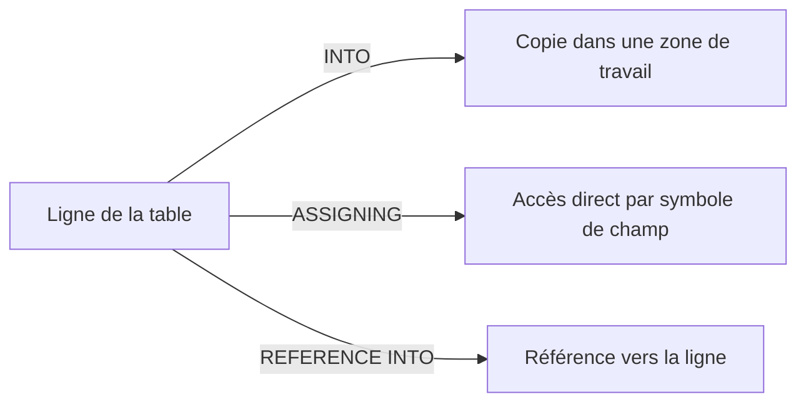
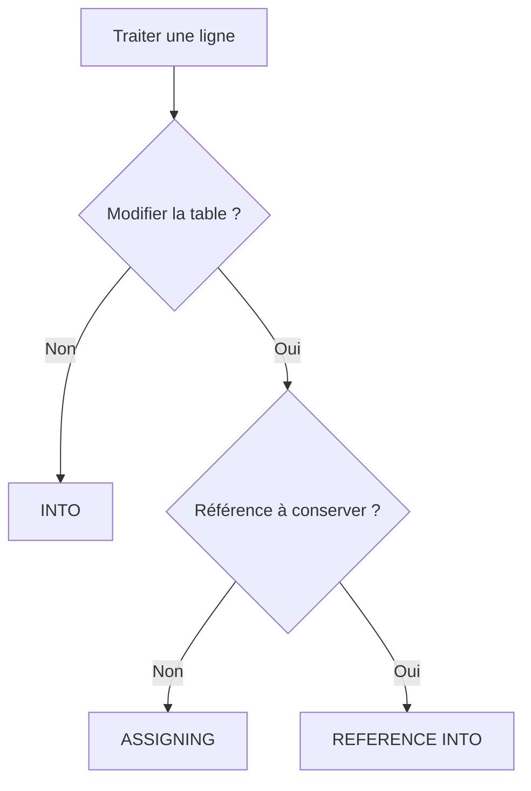

# 🌸 TRAITER LES LIGNES AVEC INTO, ASSIGNING ET REFERENCE INTO

## 🌺 OBJECTIFS

- Comprendre les trois modes principaux d’accès à une ligne
- Distinguer copie, affectation directe et référence
- Modifier efficacement des lignes pendant un parcours
- Éviter les modifications involontaires
- Choisir le mode adapté au traitement

## 🌺 INTO : COPIER LA LIGNE

```abap
LOOP AT lt_products INTO DATA(ls_product).
  ls_product-stock = ls_product-stock + 1.
ENDLOOP.
```

`ls_product` est une copie. La table n’est pas modifiée par cette seule affectation.

Pour répercuter la modification :

```abap
LOOP AT lt_products INTO DATA(ls_product).
  ls_product-stock = ls_product-stock + 1.
  MODIFY lt_products FROM ls_product INDEX sy-tabix.
ENDLOOP.
```

## 🌺 ASSIGNING : ACCÈS DIRECT

```abap
LOOP AT lt_products ASSIGNING FIELD-SYMBOL(<ls_product>).
  <ls_product>-stock = <ls_product>-stock + 1.
ENDLOOP.
```

Le symbole de champ désigne directement la ligne courante. Aucun `MODIFY` supplémentaire n’est nécessaire pour les composants modifiables.



## 🌺 REFERENCE INTO

```abap
LOOP AT lt_products REFERENCE INTO DATA(lr_product).
  lr_product->stock = lr_product->stock + 1.
ENDLOOP.
```

La variable de référence pointe vers la ligne de la table.

## 🌺 COMPARAISON

| Mode             | Copie de la ligne | Modification directe | Usage principal                              |
| ---------------- | ----------------: | -------------------: | -------------------------------------------- |
| `INTO`           |               Oui |                  Non | Lecture isolée ou traitement d’une copie     |
| `ASSIGNING`      |               Non |                  Oui | Parcours et modification directe             |
| `REFERENCE INTO` |               Non |                  Oui | Conserver ou transmettre une référence typée |

## 🌺 COMPOSANTS DE CLÉ

Modifier un composant appartenant à une clé triée ou hachée peut invalider l’organisation de la table. ABAP interdit ou limite ces modifications selon le contexte.

Approche sûre :

1. lire ou copier la ligne ;
2. supprimer l’ancienne ligne si la clé doit changer ;
3. modifier la clé dans la copie ;
4. réinsérer la ligne ;
5. contrôler le résultat de l’insertion.

## 🌺 DÉSASSIGNATION

Après la fin du parcours, ne pas supposer qu’un symbole de champ reste utilisable pour représenter une ligne métier courante.

```abap
UNASSIGN <ls_product>.
```

Cette instruction rend explicite la fin de l’utilisation du symbole.

## 🌺 EXEMPLE COMPLET

```abap
LOOP AT lt_products ASSIGNING FIELD-SYMBOL(<ls_product>)
     WHERE stock < 0.
  <ls_product>-stock = 0.
  <ls_product>-status = 'BLOCKED'.
ENDLOOP.
```

## 🌺 CRITÈRE DE CHOIX



## 🌺 RÉFÉRENCES OFFICIELLES SAP

- [Using Field Symbols to Process Internal Tables — SAP Learning](https://learning.sap.com/courses/deepening-your-abap-programming-knowledge/using-field-symbols-to-process-internal-tables_f1855f41-00d3-4f8d-9a2c-663a321c6637)
- [LOOP AT itab, result — ABAP Keyword Documentation](https://help.sap.com/doc/abapdocu_latest_index_htm/latest/en-US/ABAPLOOP_AT_ITAB_RESULT.html)
- [Modifying Internal Tables in a Loop — ABAP Keyword Documentation](https://help.sap.com/doc/abapdocu_latest_index_htm/latest/en-US/ABENITAB_LOOP_CHANGE.html)

---

➡️ [Chapitre suivant — MODIFIER DES LIGNES](<./10 - 🍧 MODIFIER DES LIGNES.md>)
