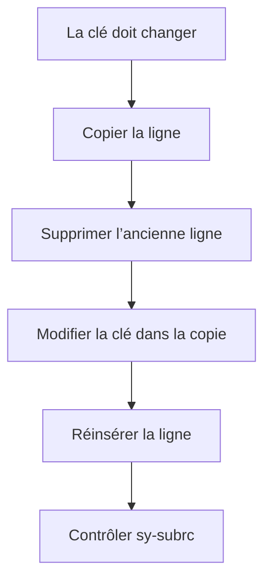

# 🌸 MODIFIER DES LIGNES

## 🌺 OBJECTIFS

- Modifier une ligne par index ou par clé
- Utiliser `MODIFY ... TRANSPORTING`
- Modifier plusieurs lignes avec `WHERE`
- Modifier directement avec une expression de table
- Comprendre les restrictions portant sur les clés

## 🌺 MODIFIER PAR INDEX

```abap
READ TABLE lt_products INTO DATA(ls_product) INDEX 1.

IF sy-subrc = 0.
  ls_product-stock = 100.
  MODIFY lt_products FROM ls_product INDEX 1.
ENDIF.
```

Cette variante concerne les tables d’index.

## 🌺 MODIFIER PAR CLÉ

```abap
ls_product-matnr = 'MAT-001'.
ls_product-stock = 100.

MODIFY TABLE lt_products FROM ls_product.
```

La ligne cible est identifiée au moyen de la clé de table applicable.

## 🌺 TRANSPORTING

`TRANSPORTING` limite les composants remplacés.

```abap
MODIFY lt_products
  FROM ls_product
  TRANSPORTING stock status
  WHERE category = 'A'.
```

Seuls `stock` et `status` sont modifiés pour les lignes qui respectent le filtre.

## 🌺 MODIFIER DANS LOOP AVEC INTO

```abap
LOOP AT lt_products INTO DATA(ls_product)
     WHERE stock < 0.
  ls_product-stock = 0.
  MODIFY lt_products FROM ls_product INDEX sy-tabix.
ENDLOOP.
```

## 🌺 MODIFIER DANS LOOP AVEC ASSIGNING

```abap
LOOP AT lt_products ASSIGNING FIELD-SYMBOL(<ls_product>)
     WHERE stock < 0.
  <ls_product>-stock = 0.
ENDLOOP.
```

Cette forme est plus directe lorsqu’aucune copie n’est nécessaire.

## 🌺 EXPRESSION DE TABLE À GAUCHE

```abap
lt_products[ matnr = 'MAT-001' ]-stock = 100.
```

La ligne doit exister. Sinon, l’exception `CX_SY_ITAB_LINE_NOT_FOUND` est levée.

Approche contrôlée :

```abap
IF line_exists( lt_products[ matnr = 'MAT-001' ] ).
  lt_products[ matnr = 'MAT-001' ]-stock = 100.
ENDIF.
```

## 🌺 MODIFIER UNE CLÉ

Pour une table triée ou hachée, ne pas modifier directement les composants de la clé primaire de manière à contredire l’organisation de la table.



## 🌺 SY-SUBRC

Contrôler `sy-subrc` lorsqu’une modification peut ne trouver aucune ligne ou violer une contrainte de clé.

```abap
MODIFY TABLE lt_products FROM ls_product.

IF sy-subrc <> 0.
  WRITE: / 'Aucune ligne modifiée'.
ENDIF.
```

## 🌺 CHOISIR LA TECHNIQUE

| Situation                           | Technique                           |
| ----------------------------------- | ----------------------------------- |
| Une ligne connue par index          | `MODIFY ... INDEX`                  |
| Une ligne connue par clé            | `MODIFY TABLE`                      |
| Plusieurs lignes filtrées           | `MODIFY ... TRANSPORTING ... WHERE` |
| Modification pendant un parcours    | `LOOP ... ASSIGNING`                |
| Modification concise d’un composant | Expression de table à gauche        |

## 🌺 RÉFÉRENCES OFFICIELLES SAP

- [Modifying Table Content — SAP Help Portal](https://help.sap.com/docs/abap-cloud/abap-concepts/modifying-table-content)
- [MODIFY itab — ABAP Keyword Documentation](https://help.sap.com/doc/abapdocu_latest_index_htm/latest/en-US/ABAPMODIFY_ITAB.html)
- [Modifying Internal Tables in a Loop — ABAP Keyword Documentation](https://help.sap.com/doc/abapdocu_latest_index_htm/latest/en-US/ABENITAB_LOOP_CHANGE.html)

---

➡️ [Chapitre suivant — SUPPRIMER VIDER ET LIBERER UNE TABLE](<./11 - 🍧 SUPPRIMER VIDER ET LIBERER UNE TABLE.md>)
