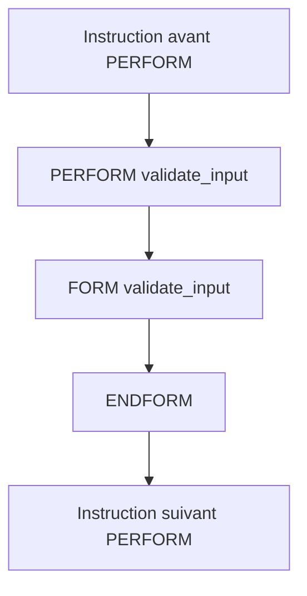

# 🌸 APPELS AVEC PERFORM

## 🌺 OBJECTIFS

- Appeler un sous-programme statiquement
- Comprendre le transfert du contrôle
- Respecter l’ordre des paramètres
- Identifier les erreurs d’appel courantes
- Différencier appel interne et appel externe

## 🌺 APPEL INTERNE SIMPLE

```abap
PERFORM form_name.
```

L’appel transfère le contrôle au sous-programme. Après `ENDFORM`, l’exécution reprend à l’instruction suivant le `PERFORM`.



## 🌺 EXEMPLE COMPLET

```abap
REPORT z_demo_perform_01.

START-OF-SELECTION.
  WRITE / 'Avant'.
  PERFORM display_step.
  WRITE / 'Après'.

FORM display_step.
  WRITE / 'Dans le sous-programme'.
ENDFORM.
```

Résultat :

```text
Avant
Dans le sous-programme
Après
```

## 🌺 APPEL AVEC PARAMÈTRES

```abap
DATA: lv_quantity TYPE i VALUE 4,
      lv_price    TYPE p LENGTH 8 DECIMALS 2 VALUE '12.50',
      lv_total    TYPE p LENGTH 10 DECIMALS 2.

PERFORM calculate_total
  USING    lv_quantity
           lv_price
  CHANGING lv_total.
```

La définition doit présenter une interface compatible et dans le même ordre :

```abap
FORM calculate_total
  USING    iv_quantity TYPE i
           iv_price    TYPE p
  CHANGING cv_total    TYPE p.

  cv_total = iv_quantity * iv_price.
ENDFORM.
```

> [!IMPORTANT]
> Pour les types `p`, la longueur et le nombre de décimales doivent être définis par un type nommé lorsque la précision doit être strictement contrôlée. Un type générique peut entraîner des conversions selon le paramètre réel.

## 🌺 ORDRE POSITIONNEL

Les paramètres d’un sous-programme sont positionnels. Les noms utilisés dans le `FORM` ne figurent pas dans l’appel.

```abap
PERFORM calculate_difference
  USING lv_first lv_second
  CHANGING lv_result.
```

Inverser `lv_first` et `lv_second` change le résultat sans nécessairement produire d’erreur de syntaxe si les types restent compatibles.

## 🌺 APPELS EN CHAÎNE

```abap
START-OF-SELECTION.
  PERFORM validate_selection.
  PERFORM read_data.
  PERFORM calculate_result.
  PERFORM display_result.
```

Cette forme rend le scénario principal lisible, à condition que chaque sous-programme conserve une responsabilité unique.

## 🌺 RÉCURSIVITÉ

Un sous-programme peut techniquement rappeler un sous-programme, y compris lui-même selon le contexte. La récursivité doit disposer d’une condition d’arrêt certaine, sinon l’exécution finit par épuiser la pile disponible.

Pour les traitements métier classiques, une boucle explicite est souvent plus simple à maintenir.

## 🌺 ERREURS COURANTES

- nom de sous-programme inexistant ;
- nombre de paramètres différent ;
- ordre incorrect ;
- type réel incompatible avec le paramètre formel ;
- modification implicite d’un paramètre déclaré dans `USING` ;
- appel dynamique inutile.

## 🌺 POINTS À RETENIR

- `PERFORM` appelle un sous-programme.
- L’exécution reprend après l’appel lorsque `ENDFORM` est atteint.
- L’association des paramètres est positionnelle.
- L’ordre et les types doivent correspondre à la définition.
- Les appels externes ou dynamiques sont à éviter et seront traités séparément.

## 🌺 VÉRIFICATION

- Le contrôle syntaxique réussit.
- La version active correspond au code sauvegardé.
- L’exécution produit le résultat décrit dans le chapitre.
- Les cas vide, limite et erreur sont testés séparément lorsque la syntaxe le permet.

## 🌺 ERREURS FRÉQUENTES

- Copier un exemple sans adapter les types, noms d’objets et données disponibles dans le système.
- Tester uniquement le cas nominal et ignorer les valeurs initiales, absentes ou invalides.
- Créer des sous-programmes avec trop de paramètres globaux.
- Utiliser des appels externes ou dynamiques sans contrôle du nom et de l’existence.

## 🌺 SNIPPET À RÉUTILISER

> [!NOTE]
> Adapter les noms `Z*`, les types DDIC, les données et les autorisations au système cible. Effectuer un contrôle syntaxique avant activation.

```abap
REPORT z_demo_perform_01.

START-OF-SELECTION.
  WRITE / 'Avant'.
  PERFORM display_step.
  WRITE / 'Après'.

FORM display_step.
  WRITE / 'Dans le sous-programme'.
ENDFORM.
```

## 🌺 TERMES DU LEXIQUE

- [Programme exécutable](<../└─ 🧩 00 - LEXIQUE SAP ET ABAP/06 - 🍧 PROGRAMMES CLASSES ET OBJETS TECHNIQUES.md#programme-executable>)
- [Module fonction](<../└─ 🧩 00 - LEXIQUE SAP ET ABAP/06 - 🍧 PROGRAMMES CLASSES ET OBJETS TECHNIQUES.md#module-fonction>)
- [ABAP](<../└─ 🧩 00 - LEXIQUE SAP ET ABAP/10 - 🍧 ACRONYMES SAP.md#acro-abap>)

## 🌺 RÉFÉRENCES OFFICIELLES SAP

- [PERFORM — ABAP Keyword Documentation](https://help.sap.com/doc/abapdocu_latest_index_htm/latest/en-US/ABAPPERFORM.html)
- [FORM — ABAP Keyword Documentation](https://help.sap.com/doc/abapdocu_latest_index_htm/latest/en-US/ABAPFORM.html)
- [Source Code Modularization — ABAP Keyword Documentation](https://help.sap.com/doc/abapdocu_latest_index_htm/latest/en-US/ABENSOURCE_CODE_MODULAR_GUIDL.html)


---

➡️ [Chapitre suivant — INTERFACES USING ET CHANGING](<./05 - 🍧 INTERFACES USING ET CHANGING.md>)
