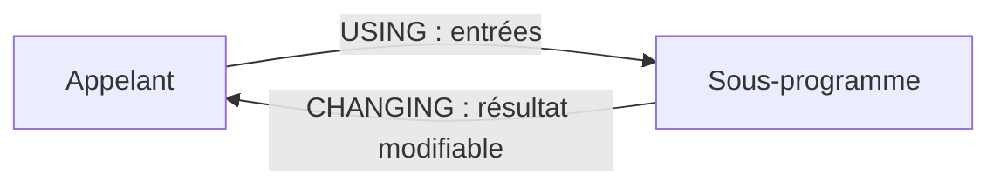

# 🌸 INTERFACES USING ET CHANGING

## 🌺 OBJECTIFS

- Définir les entrées et sorties d’un sous-programme
- Utiliser `USING` pour les données d’entrée
- Utiliser `CHANGING` pour les données modifiables
- Éviter l’ancienne addition `TABLES`
- Concevoir une interface explicite

## 🌺 INTERFACE D’UN SOUS-PROGRAMME

L’interface décrit les données échangées entre l’appelant et le sous-programme.

```abap
FORM calculate_total
  USING    iv_quantity TYPE i
           iv_price    TYPE ty_amount
  CHANGING cv_total    TYPE ty_amount.
```



## 🌺 USING

`USING` représente les paramètres d’entrée du point de vue fonctionnel.

```abap
FORM display_customer
  USING iv_customer_id TYPE kunnr.

  WRITE / iv_customer_id.
ENDFORM.
```

Appel :

```abap
PERFORM display_customer USING lv_customer_id.
```

Par défaut, un paramètre de sous-programme peut être transmis par référence. La convention `USING` n’empêche donc pas techniquement toute modification. Le sous-programme doit traiter ces paramètres comme des entrées et ne pas les modifier.

## 🌺 CHANGING

`CHANGING` indique qu’une donnée peut être lue puis modifiée.

```abap
FORM increase_quantity
  CHANGING cv_quantity TYPE i.

  cv_quantity = cv_quantity + 1.
ENDFORM.
```

Appel :

```abap
PERFORM increase_quantity CHANGING lv_quantity.
```

Après l’appel, `lv_quantity` contient la nouvelle valeur.

## 🌺 PLUSIEURS RÉSULTATS

```abap
FORM calculate_amounts
  USING    iv_quantity  TYPE i
           iv_unit_price TYPE ty_amount
  CHANGING cv_net       TYPE ty_amount
           cv_tax       TYPE ty_amount
           cv_gross     TYPE ty_amount.

  cv_net   = iv_quantity * iv_unit_price.
  cv_tax   = cv_net * '0.20'.
  cv_gross = cv_net + cv_tax.
ENDFORM.
```

Une longue liste de paramètres `CHANGING` signale souvent qu’une structure de résultat ou une autre unité de conception serait plus lisible.

## 🌺 PARAMÈTRES DE TABLES INTERNES

Utiliser un type de table explicite avec `USING` ou `CHANGING`.

```abap
TYPES ty_t_messages TYPE STANDARD TABLE OF bapiret2
                    WITH EMPTY KEY.

FORM add_message
  USING    iv_text     TYPE string
  CHANGING ct_messages TYPE ty_t_messages.

  APPEND VALUE #( type = 'I'
                  message = iv_text )
         TO ct_messages.
ENDFORM.
```

## 🌺 ADDITION TABLES

L’addition historique `TABLES` des sous-programmes est obsolète. Elle repose sur une interface particulière pour les tables internes et ne doit pas être utilisée dans du nouveau code.

À éviter :

```abap
FORM process_items TABLES pt_items.
  " Ancienne syntaxe
ENDFORM.
```

Préférer :

```abap
FORM process_items
  CHANGING ct_items TYPE ty_t_items.
```

## 🌺 CONVENTIONS DE NOMMAGE

Une convention fréquente distingue l’intention des paramètres :

| Préfixe | Intention            |
| ------- | -------------------- |
| `iv_`   | valeur d’entrée      |
| `is_`   | structure d’entrée   |
| `it_`   | table d’entrée       |
| `cv_`   | valeur modifiable    |
| `cs_`   | structure modifiable |
| `ct_`   | table modifiable     |

Ces préfixes ne font pas partie du langage ABAP. Ils doivent rester cohérents avec les règles du projet.

## 🌺 POINTS À RETENIR

- `USING` documente les entrées.
- `CHANGING` documente les données modifiées par la procédure.
- Les paramètres sont associés selon leur position.
- Une table interne doit être typée explicitement avec `USING` ou `CHANGING`.
- L’addition `TABLES` est obsolète et doit être évitée dans le nouveau code.

## 🌺 RÉFÉRENCES OFFICIELLES SAP

- [FORM — ABAP Keyword Documentation](https://help.sap.com/doc/abapdocu_latest_index_htm/latest/en-US/ABAPFORM.html)
- [PERFORM — ABAP Keyword Documentation](https://help.sap.com/doc/abapdocu_latest_index_htm/latest/en-US/ABAPPERFORM.html)
- [Source Code Modularization — ABAP Keyword Documentation](https://help.sap.com/doc/abapdocu_latest_index_htm/latest/en-US/ABENSOURCE_CODE_MODULAR_GUIDL.html)

---

➡️ [Chapitre suivant — TYPAGE ET PASSAGE DES PARAMETRES](<./06 - 🍧 TYPAGE ET PASSAGE DES PARAMETRES.md>)
