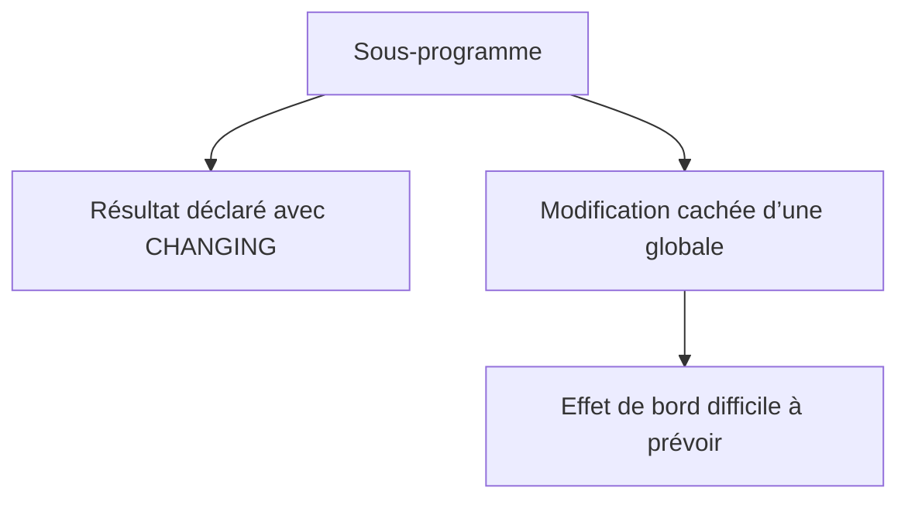

# 🌸 PORTÉE DES DONNÉES ET EFFETS DE BORD

## 🌺 OBJECTIFS

- Distinguer données globales et locales
- Comprendre les dépendances implicites
- Réduire les effets de bord
- Identifier les risques liés aux modifications globales
- Concevoir des sous-programmes prévisibles

## 🌺 DONNÉES GLOBALES

Une donnée déclarée dans la partie globale du programme est accessible depuis les blocs de traitement et sous-programmes appartenant à ce programme.

```abap
DATA gv_total TYPE p LENGTH 10 DECIMALS 2.

FORM calculate_total.
  gv_total = 100.
ENDFORM.
```

Le sous-programme ne déclare aucune sortie, mais modifie pourtant l’état du programme.

## 🌺 DONNÉES LOCALES

```abap
FORM calculate_total
  USING    iv_quantity TYPE i
           iv_price    TYPE ty_amount
  CHANGING cv_total    TYPE ty_amount.

  DATA lv_raw_total TYPE decfloat34.

  lv_raw_total = iv_quantity * iv_price.
  cv_total = lv_raw_total.
ENDFORM.
```

`lv_raw_total` n’existe que pendant l’exécution du sous-programme.

## 🌺 EFFET DE BORD

Un effet de bord est une modification observable en dehors du résultat explicitement annoncé par l’interface.



Exemple problématique :

```abap
DATA: gv_error TYPE abap_bool,
      gt_log   TYPE ty_t_log.

FORM validate_input USING iv_value TYPE i.
  IF iv_value < 0.
    gv_error = abap_true.
    APPEND 'Valeur négative' TO gt_log.
  ENDIF.
ENDFORM.
```

L’appelant doit connaître deux dépendances globales non visibles dans l’appel.

## 🌺 RENDRE LES DÉPENDANCES EXPLICITES

```abap
FORM validate_input
  USING    iv_value    TYPE i
  CHANGING cv_has_error TYPE abap_bool
           ct_log       TYPE ty_t_log.

  IF iv_value < 0.
    cv_has_error = abap_true.
    APPEND 'Valeur négative' TO ct_log.
  ENDIF.
ENDFORM.
```

Cette interface reste procédurale, mais l’appel expose les données modifiées.

## 🌺 INITIALISER LES SORTIES

Une procédure doit définir clairement si elle :

- remplace le contenu d’une sortie ;
- enrichit un contenu déjà existant ;
- conserve la valeur si aucune règle ne s’applique.

Exemple de remplacement :

```abap
FORM build_messages
  USING    iv_value    TYPE i
  CHANGING ct_messages TYPE ty_t_messages.

  CLEAR ct_messages.

  IF iv_value < 0.
    APPEND VALUE #( type = 'E' message = 'Valeur négative' )
      TO ct_messages.
  ENDIF.
ENDFORM.
```

Le contrat doit être documenté lorsqu’il n’est pas évident.

## 🌺 MASQUAGE DES NOMS

Éviter de réutiliser localement le nom d’une donnée globale. Même lorsque le langage permet une résolution non ambiguë, le lecteur peut se tromper sur la donnée réellement manipulée.

## 🌺 RÈGLES PRATIQUES

- passer les données nécessaires par l’interface ;
- limiter les globales aux états réellement partagés ;
- ne pas modifier un paramètre `USING` ;
- initialiser les sorties selon un contrat explicite ;
- éviter les procédures qui lisent et modifient de nombreuses globales ;
- documenter les effets persistants ou les mises à jour externes.

## 🌺 POINTS À RETENIR

- Une globale crée une dépendance implicite.
- Une variable locale limite la portée d’une modification.
- Une interface explicite rend le sous-programme plus prévisible.
- Un résultat caché dans une globale est plus difficile à tester et à maintenir.
- Une forte dépendance aux globales indique souvent qu’une refactorisation est nécessaire.

## 🌺 CAS D’USAGE

Dans un contexte où un report devenu long doit être découpé en unités compréhensibles et testables sans modifier son résultat, le besoin consiste à **répéter un traitement un nombre connu ou borné de fois**. Cette notion est pertinente lorsque le lecteur doit pouvoir relier la syntaxe ou l’outil à une situation professionnelle concrète.

## 🌺 PROCÉDURE PAS À PAS

1. Saisir `/nSE38` dans le champ de commande.
2. Entrer le nom d’un programme Z de test, par exemple `ZREF_DEMO`, puis choisir **Créer** ou **Modifier** selon le cas.
3. Pour un exercice local uniquement, affecter `$TMP` ; pour un développement livrable, utiliser le package et l’ordre fournis par le projet.
4. Coller ou adapter le snippet du chapitre.
5. Exécuter le contrôle syntaxique avec `Ctrl+F2`.
6. Activer avec `Ctrl+F3`.
7. Exécuter avec `F8` et comparer le résultat avec la section **Vérification**.

## 🌺 VÉRIFICATION

- Le contrôle syntaxique réussit.
- La version active correspond au code sauvegardé.
- L’exécution produit le résultat décrit dans le chapitre.
- Les cas vide, limite et erreur sont testés séparément lorsque la syntaxe le permet.

## 🌺 ERREURS FRÉQUENTES

- Copier un exemple sans adapter les types, noms d’objets et données disponibles dans le système.
- Tester uniquement le cas nominal et ignorer les valeurs initiales, absentes ou invalides.
- Créer des sous-programmes avec trop de paramètres globaux.
- Utiliser des appels externes ou dynamiques sans contrôle du nom et de l’existence.

## 🌺 SNIPPET À RÉUTILISER

> [!NOTE]
> Adapter les noms `Z*`, les types DDIC, les données et les autorisations au système cible. Effectuer un contrôle syntaxique avant activation.

```abap
FORM build_messages
  USING    iv_value    TYPE i
  CHANGING ct_messages TYPE ty_t_messages.

  CLEAR ct_messages.

  IF iv_value < 0.
    APPEND VALUE #( type = 'E' message = 'Valeur négative' )
      TO ct_messages.
  ENDIF.
ENDFORM.
```

## 🌺 TERMES DU LEXIQUE

- [Programme exécutable](<../└─ 🧩 00 - LEXIQUE SAP ET ABAP/06 - 🍧 PROGRAMMES CLASSES ET OBJETS TECHNIQUES.md#programme-executable>)
- [Module fonction](<../└─ 🧩 00 - LEXIQUE SAP ET ABAP/06 - 🍧 PROGRAMMES CLASSES ET OBJETS TECHNIQUES.md#module-fonction>)
- [ABAP](<../└─ 🧩 00 - LEXIQUE SAP ET ABAP/10 - 🍧 ACRONYMES SAP.md#acro-abap>)

## 🌺 RÉFÉRENCES OFFICIELLES SAP

- [Source Code Modularization — ABAP Keyword Documentation](https://help.sap.com/doc/abapdocu_latest_index_htm/latest/en-US/ABENSOURCE_CODE_MODULAR_GUIDL.html)
- [Source Code Organization — ABAP Keyword Documentation](https://help.sap.com/doc/abapdocu_latest_index_htm/latest/en-US/ABENSOURCE_CODE_ORGA_GDL.html)
- [Naming — ABAP Programming Guidelines](https://help.sap.com/doc/abapdocu_latest_index_htm/latest/en-US/ABENNAMING_GDL.html)


---

➡️ [Chapitre suivant — ORGANISATION DU CODE AVEC INCLUDE](<./08 - 🍧 ORGANISATION DU CODE AVEC INCLUDE.md>)
