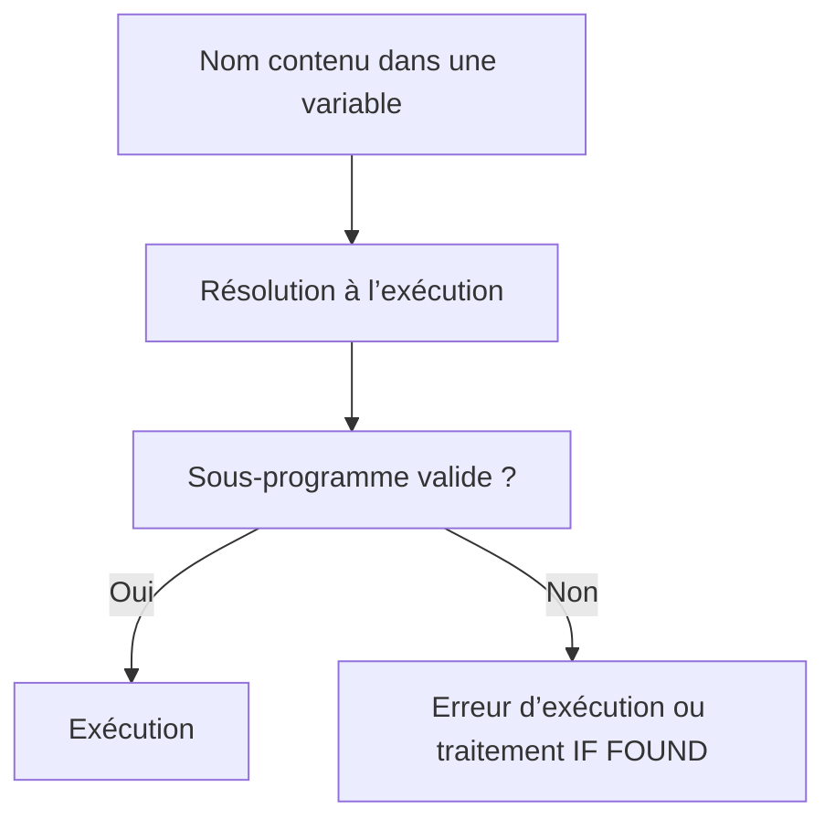

# 🌸 APPELS DYNAMIQUES ET EXTERNES

## 🌺 OBJECTIFS

- Identifier un appel dynamique de sous-programme
- Reconnaître un appel externe
- Comprendre les risques de résolution à l’exécution
- Connaître le statut obsolète des appels externes
- Privilégier des interfaces explicites

## 🌺 APPEL STATIQUE INTERNE

Forme recommandée dans un programme procédural existant :

```abap
PERFORM validate_input.
```

Le nom est connu lors du contrôle de syntaxe et le sous-programme appartient au même programme principal.

## 🌺 APPEL DYNAMIQUE

Le nom du sous-programme peut être fourni dans une donnée :

```abap
DATA lv_form_name TYPE c LENGTH 30 VALUE 'DISPLAY_RESULT'.

PERFORM (lv_form_name).
```

La cible n’est déterminée qu’à l’exécution.



## 🌺 APPEL EXTERNE

ABAP possède également des variantes permettant d’appeler un sous-programme d’un autre programme.

Exemple de syntaxe historique :

```abap
PERFORM external_form IN PROGRAM z_external_program.
```

Des variantes dynamiques existent également.

## 🌺 STATUT ET RECOMMANDATION

La documentation ABAP classe les appels externes de sous-programmes parmi les éléments obsolètes. Ils créent une dépendance forte envers l’implémentation interne d’un autre programme.

À la place, utiliser une interface conçue pour être appelée :

- méthode publique ;
- module fonction ;
- API ou service adapté au scénario.

## 🌺 IF FOUND

Certaines variantes externes ou dynamiques proposent `IF FOUND` afin d’éviter l’arrêt immédiat lorsque la cible n’existe pas.

Cette addition ne transforme pas l’appel en interface sûre :

- la signature peut rester incompatible ;
- le nom n’est pas contrôlé statiquement ;
- la dépendance n’est pas visible dans les usages classiques ;
- le comportement peut changer après transport.

## 🌺 POURQUOI CES APPELS SONT FRAGILES

| Risque                             | Conséquence                                    |
| ---------------------------------- | ---------------------------------------------- |
| Nom construit dynamiquement        | Recherche d’usages incomplète                  |
| Programme cible modifié            | Rupture à l’exécution                          |
| Interface positionnelle            | Incompatibilité silencieuse ou erreur runtime  |
| Accès à une implémentation interne | Couplage non contractuel                       |
| Contrôle tardif                    | Défaut détecté uniquement sur certains chemins |

## 🌺 MAINTENANCE D’UN CODE EXISTANT

Lorsqu’un appel externe existe déjà :

1. identifier toutes les valeurs possibles du programme et du sous-programme ;
2. vérifier l’interface réelle de chaque cible ;
3. analyser les transports et dépendances ;
4. ajouter des tests sur les branches dynamiques ;
5. préparer une migration vers une interface explicite.

## 🌺 POINTS À RETENIR

- Un appel dynamique résout sa cible à l’exécution.
- Un appel externe vise un sous-programme d’un autre programme.
- Les appels externes de sous-programmes sont obsolètes.
- `IF FOUND` réduit un risque d’absence, mais ne sécurise pas l’interface.
- Pour du nouveau code, utiliser des méthodes ou modules fonction selon le besoin.

## 🌺 CAS D’USAGE

Dans un contexte où un report devenu long doit être découpé en unités compréhensibles et testables sans modifier son résultat, le besoin consiste à **organiser un programme procédural avec appels dynamiques et externes sans créer de dépendances globales inutiles**. Cette notion est pertinente lorsque le lecteur doit pouvoir relier la syntaxe ou l’outil à une situation professionnelle concrète.

## 🌺 PROCÉDURE PAS À PAS

1. Saisir `/nSE38` dans le champ de commande.
2. Entrer le nom d’un programme Z de test, par exemple `ZREF_DEMO`, puis choisir **Créer** ou **Modifier** selon le cas.
3. Pour un exercice local uniquement, affecter `$TMP` ; pour un développement livrable, utiliser le package et l’ordre fournis par le projet.
4. Coller ou adapter le snippet du chapitre.
5. Exécuter le contrôle syntaxique avec `Ctrl+F2`.
6. Activer avec `Ctrl+F3`.
7. Exécuter avec `F8` et comparer le résultat avec la section **Vérification**.

## 🌺 VÉRIFICATION

- Le contrôle syntaxique réussit.
- La version active correspond au code sauvegardé.
- L’exécution produit le résultat décrit dans le chapitre.
- Les cas vide, limite et erreur sont testés séparément lorsque la syntaxe le permet.

## 🌺 ERREURS FRÉQUENTES

- Copier un exemple sans adapter les types, noms d’objets et données disponibles dans le système.
- Tester uniquement le cas nominal et ignorer les valeurs initiales, absentes ou invalides.
- Créer des sous-programmes avec trop de paramètres globaux.
- Utiliser des appels externes ou dynamiques sans contrôle du nom et de l’existence.

## 🌺 SNIPPET À RÉUTILISER

> [!NOTE]
> Adapter les noms `Z*`, les types DDIC, les données et les autorisations au système cible. Effectuer un contrôle syntaxique avant activation.

```abap
DATA lv_form_name TYPE c LENGTH 30 VALUE 'DISPLAY_RESULT'.

PERFORM (lv_form_name).
```

## 🌺 TERMES DU LEXIQUE

- [Programme exécutable](<../└─ 🧩 00 - LEXIQUE SAP ET ABAP/06 - 🍧 PROGRAMMES CLASSES ET OBJETS TECHNIQUES.md#programme-executable>)
- [Module fonction](<../└─ 🧩 00 - LEXIQUE SAP ET ABAP/06 - 🍧 PROGRAMMES CLASSES ET OBJETS TECHNIQUES.md#module-fonction>)
- [ABAP](<../└─ 🧩 00 - LEXIQUE SAP ET ABAP/10 - 🍧 ACRONYMES SAP.md#acro-abap>)

## 🌺 RÉFÉRENCES OFFICIELLES SAP

- [PERFORM, External Calls — ABAP Keyword Documentation](https://help.sap.com/doc/abapdocu_latest_index_htm/latest/en-US/ABAPPERFORM_OBSOLETE.html)
- [External Procedure Call — ABAP Keyword Documentation](https://help.sap.com/doc/abapdocu_latest_index_htm/latest/en-US/ABENCALL_PROCEDURES_EXTERN.html)
- [Source Code Modularization — ABAP Keyword Documentation](https://help.sap.com/doc/abapdocu_latest_index_htm/latest/en-US/ABENSOURCE_CODE_MODULAR_GUIDL.html)


---

➡️ [Chapitre suivant — DEBUG ET ANALYSE DES APPELS](<./11 - 🍧 DEBUG ET ANALYSE DES APPELS.md>)
