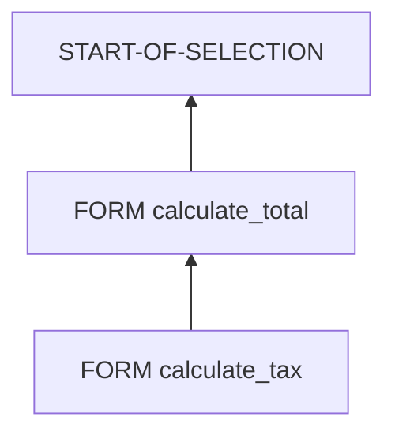

# 🌸 DEBUG ET ANALYSE DES APPELS

## 🌺 OBJECTIFS

- Poser un point d’arrêt dans un sous-programme
- Entrer dans un appel `PERFORM`
- Lire la pile d’appels
- Comparer paramètres formels et réels
- Diagnostiquer un effet de bord

## 🌺 POINT D’ARRÊT DANS UN FORM

Placer un point d’arrêt sur une instruction du sous-programme :

```abap
FORM calculate_total
  USING    iv_quantity TYPE i
           iv_price    TYPE ty_amount
  CHANGING cv_total    TYPE ty_amount.

  BREAK-POINT.
  cv_total = iv_quantity * iv_price.
ENDFORM.
```

`BREAK-POINT` ne doit pas rester dans le code productif. Utiliser de préférence un point d’arrêt de session ou externe depuis l’éditeur ou le débogueur.

## 🌺 PAS À PAS

Lorsqu’un `PERFORM` est atteint :

- **Entrer dans** exécute la première instruction du sous-programme ;
- **Exécuter** traite l’appel comme une seule étape et s’arrête après son retour ;
- **Retour** poursuit jusqu’à la sortie du bloc courant selon les fonctions du débogueur disponible.

Les libellés exacts et raccourcis peuvent varier selon la version du nouveau ou de l’ancien débogueur ABAP.

## 🌺 PILE D’APPELS

La pile montre l’enchaînement des blocs actifs.



Elle permet de répondre à deux questions :

- quel bloc a appelé le sous-programme courant ;
- par quels appels successifs l’exécution est arrivée ici.

## 🌺 PARAMÈTRES FORMELS ET RÉELS

Dans le débogueur, comparer :

- la valeur du paramètre réel avant l’appel ;
- la valeur du paramètre formel à l’entrée ;
- les modifications pendant la procédure ;
- la valeur du paramètre réel après le retour.

Pour un passage par référence, le paramètre formel désigne la donnée réelle. Une modification peut donc être immédiatement visible.

Pour `VALUE(...)`, une copie locale est visible dans la procédure.

## 🌺 DIAGNOSTIQUER UNE MODIFICATION INATTENDUE

Scénario : une globale change alors qu’elle ne figure pas dans l’appel.

Méthode :

1. poser un watchpoint sur la variable globale ;
2. relancer le scénario ;
3. consulter la pile lorsque le watchpoint se déclenche ;
4. identifier le sous-programme responsable ;
5. vérifier si cette dépendance doit devenir un paramètre explicite.

## 🌺 APPELS DYNAMIQUES

Pour un `PERFORM (lv_form_name)`, contrôler avant l’appel :

- le contenu exact du nom ;
- les espaces ou conversions ;
- le programme cible éventuel ;
- le nombre et le type des paramètres ;
- le chemin qui a construit cette valeur.

## 🌺 ANALYSE STATIQUE

Selon les outils installés sur le système SAP GUI :

- recherche d’utilisations dans `SE80` ;
- liste des sous-programmes du programme ;
- Code Inspector `SCI` ;
- ABAP Test Cockpit lorsqu’il est disponible ;
- analyse de temps `SAT` si le problème concerne les performances.

Ces outils seront approfondis dans le dossier consacré au débogage et à l’analyse.

## 🌺 CHECKLIST

- [ ] La cible du `PERFORM` est-elle celle attendue ?
- [ ] L’ordre des paramètres réels correspond-il à la définition ?
- [ ] Une donnée `USING` est-elle modifiée ?
- [ ] Une globale change-t-elle sans apparaître dans l’interface ?
- [ ] Une copie `VALUE(...)` explique-t-elle une valeur non retransmise ?
- [ ] Un appel dynamique dépend-il d’un nom incorrect ?
- [ ] La pile d’appels confirme-t-elle le chemin supposé ?

## 🌺 POINTS À RETENIR

- Entrer dans le `PERFORM` permet d’observer l’interface réelle.
- La pile d’appels montre le chemin d’exécution.
- Les watchpoints sont efficaces pour localiser un effet de bord.
- Le passage par référence et `VALUE(...)` produisent des comportements distincts dans le débogueur.
- Les appels dynamiques exigent une vérification des noms au runtime.

## 🌺 VÉRIFICATION

- Le contrôle syntaxique réussit.
- La version active correspond au code sauvegardé.
- L’exécution produit le résultat décrit dans le chapitre.
- Les cas vide, limite et erreur sont testés séparément lorsque la syntaxe le permet.

## 🌺 ERREURS FRÉQUENTES

- Copier un exemple sans adapter les types, noms d’objets et données disponibles dans le système.
- Tester uniquement le cas nominal et ignorer les valeurs initiales, absentes ou invalides.
- Créer des sous-programmes avec trop de paramètres globaux.
- Utiliser des appels externes ou dynamiques sans contrôle du nom et de l’existence.

## 🌺 SNIPPET À RÉUTILISER

> [!NOTE]
> Adapter les noms `Z*`, les types DDIC, les données et les autorisations au système cible. Effectuer un contrôle syntaxique avant activation.

```abap
FORM calculate_total
  USING    iv_quantity TYPE i
           iv_price    TYPE ty_amount
  CHANGING cv_total    TYPE ty_amount.

  BREAK-POINT.
  cv_total = iv_quantity * iv_price.
ENDFORM.
```

## 🌺 TERMES DU LEXIQUE

- [Programme exécutable](<../└─ 🧩 00 - LEXIQUE SAP ET ABAP/06 - 🍧 PROGRAMMES CLASSES ET OBJETS TECHNIQUES.md#programme-executable>)
- [Module fonction](<../└─ 🧩 00 - LEXIQUE SAP ET ABAP/06 - 🍧 PROGRAMMES CLASSES ET OBJETS TECHNIQUES.md#module-fonction>)
- [ABAP](<../└─ 🧩 00 - LEXIQUE SAP ET ABAP/10 - 🍧 ACRONYMES SAP.md#acro-abap>)

## 🌺 RÉFÉRENCES OFFICIELLES SAP

- [PERFORM — ABAP Keyword Documentation](https://help.sap.com/doc/abapdocu_latest_index_htm/latest/en-US/ABAPPERFORM.html)
- [Source Code Organization — ABAP Keyword Documentation](https://help.sap.com/doc/abapdocu_latest_index_htm/latest/en-US/ABENSOURCE_CODE_ORGA_GDL.html)
- [Utilities for Technical Information About a Program — SAP Help Portal](https://help.sap.com/docs/ABAP_PLATFORM_NEW/bd833c8355f34e96a6e83096b38bf192/d1801b0a454211d189710000e8322d00.html)


---

➡️ [Chapitre suivant — BONNES PRATIQUES ET REFACTORISATION](<./12 - 🍧 BONNES PRATIQUES ET REFACTORISATION.md>)
