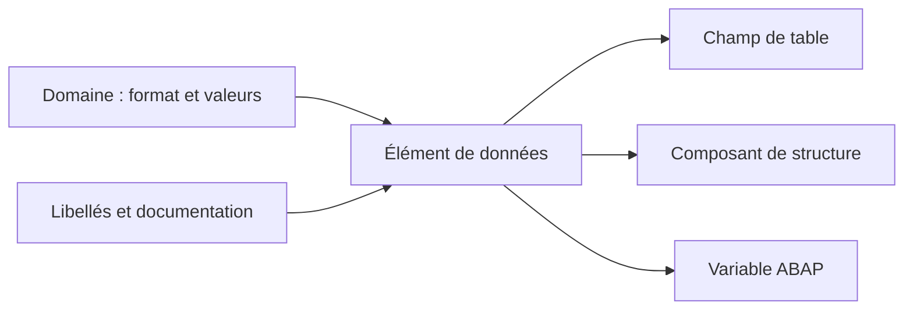

# 🌸 ÉLÉMENTS DE DONNÉES ET SÉMANTIQUE

## 🌺 OBJECTIFS

- Comprendre le rôle d’un élément de données
- Séparer caractéristiques techniques et signification métier
- Maintenir les libellés et la documentation
- Réutiliser un élément de données dans les objets DDIC et le code ABAP
- Choisir entre domaine et type prédéfini

## 🌺 DÉFINITION

Un élément de données définit un type élémentaire global et lui associe une signification fonctionnelle.

Il peut être basé :

- sur un domaine ;
- directement sur un type prédéfini du Dictionary.

Pour les champs de tables persistantes, l’utilisation d’un élément de données basé sur un domaine favorise la cohérence et la réutilisation.

## 🌺 CONTENU D’UN ÉLÉMENT DE DONNÉES

| Information                            | Fonction                                                 |
| -------------------------------------- | -------------------------------------------------------- |
| Domaine ou type prédéfini              | Définition technique                                     |
| Texte court                            | Description technique de l’objet                         |
| Libellés court, moyen, long et en-tête | Textes proposés aux interfaces classiques                |
| Documentation                          | Définition détaillée de la donnée                        |
| Aide à la recherche éventuelle         | Proposition de valeurs F4                                |
| ID de paramètre éventuel               | Mémorisation utilisateur dans certains écrans classiques |



## 🌺 DOMAINE ET ÉLÉMENT DE DONNÉES

| Question                           | Domaine |             Élément de données |
| ---------------------------------- | ------: | -----------------------------: |
| Quelle est la longueur technique ? |     Oui | Héritée ou définie directement |
| Quelles valeurs sont autorisées ?  |     Oui |                Non directement |
| Que signifie la donnée ?           |     Non |                            Oui |
| Quels libellés afficher ?          |     Non |                            Oui |
| Peut-il typer une variable ABAP ?  |     Non |                            Oui |

Deux données peuvent partager le même format sans avoir la même signification. Elles utilisent alors le même domaine, mais des éléments de données distincts.

## 🌺 EXEMPLE

Le domaine `ZDM_ID_10` définit un identifiant alphanumérique de dix caractères.

Il peut être utilisé par :

- `ZDE_CUSTOMER_ID` : identifiant client ;
- `ZDE_CONTRACT_ID` : identifiant contrat ;
- `ZDE_REQUEST_ID` : identifiant demande.

Les trois éléments ont la même représentation technique, mais pas la même sémantique.

```abap
DATA lv_customer_id TYPE zde_customer_id.
DATA lv_contract_id TYPE zde_contract_id.
```

## 🌺 LIBELLÉS

Les quatre longueurs de libellés permettent aux écrans et listes classiques de choisir un texte adapté à l’espace disponible.

Les libellés doivent rester cohérents entre eux et décrire la donnée, pas le traitement courant.

| Type    | Exemple               |
| ------- | --------------------- |
| Court   | Client                |
| Moyen   | Identifiant client    |
| Long    | Identifiant du client |
| En-tête | ID client             |

## 🌺 DOCUMENTATION

La documentation doit préciser, lorsque nécessaire :

- le sens fonctionnel ;
- les valeurs particulières ;
- les règles d’alimentation ;
- l’unité ou la devise ;
- les restrictions d’usage.

Elle ne doit pas reproduire uniquement le nom technique.

## 🌺 POINTS À RETENIR

- L’élément de données est un type global élémentaire.
- Le domaine porte le format ; l’élément de données porte la sémantique.
- Les libellés et la documentation font partie de la conception.
- Un même domaine peut alimenter plusieurs éléments de données métier.
- Un élément de données peut être utilisé directement avec `TYPE` en ABAP.

## 🌺 RÉFÉRENCES OFFICIELLES SAP

- [Data Elements — SAP Help Portal](https://help.sap.com/docs/SAP_NETWEAVER_740/ec1c9c8191b74de98feb94001a95dd76/908d72feb1af11d194f600a0c929b3c3.html)
- [Using Dictionary Objects as Data Types — SAP Learning](https://learning.sap.com/courses/building-data-models-with-the-abap-dictionary-and-abap-core-data-services/using-dictionary-objects-as-data-types_e28df7c3-7686-414e-9827-673dceeb21fb)

---

➡️ [Chapitre suivant — STRUCTURES ET STRUCTURES INCLUDE](<./05 - 🍧 STRUCTURES ET STRUCTURES INCLUDE.md>)
