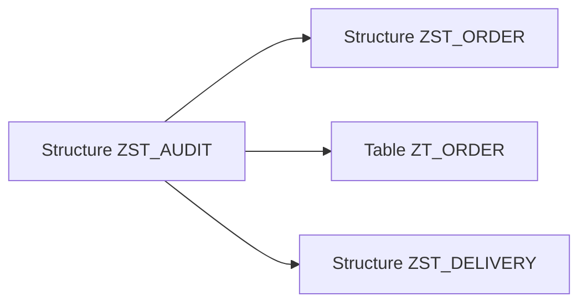

# 🌸 STRUCTURES ET STRUCTURES INCLUDE

## 🌺 OBJECTIFS

- Créer un type structuré global
- Distinguer structure plate, imbriquée et profonde
- Réutiliser une structure avec un include
- Différencier include et append
- Gérer les références de devise et d’unité

## 🌺 DÉFINITION

Une structure DDIC regroupe plusieurs composants dans un type global.

Elle ne crée aucune table physique dans la base de données.

```abap
DATA ls_address TYPE zst_address.
```

## 🌺 CATÉGORIES DE STRUCTURES

| Catégorie | Contenu                                                                        |
| --------- | ------------------------------------------------------------------------------ |
| Plate     | Uniquement des composants élémentaires sans chaîne, référence ni table interne |
| Imbriquée | Au moins un composant structuré                                                |
| Profonde  | Au moins une chaîne, référence ou table interne                                |

La distinction est importante car certains usages classiques exigent des structures plates.

## 🌺 CRÉATION DANS SE11

1. Ouvrir `SE11`.
2. Choisir **Type de données**.
3. Saisir un nom `Z...` ou `Y...`.
4. Choisir **Structure**.
5. Définir les composants et leurs types.
6. Maintenir la catégorie d’amélioration lorsque demandée.
7. Contrôler puis activer.

## 🌺 EXEMPLE DE STRUCTURE

| Composant     | Type                |
| ------------- | ------------------- |
| `CUSTOMER_ID` | `ZDE_CUSTOMER_ID`   |
| `NAME`        | `ZDE_CUSTOMER_NAME` |
| `CITY`        | `ORT01`             |
| `COUNTRY`     | `LAND1`             |

```abap
DATA ls_customer TYPE zst_customer.

ls_customer-customer_id = 'C000000001'.
ls_customer-city        = 'PARIS'.
```

## 🌺 STRUCTURES INCLUDE

Une structure include permet de réutiliser un groupe de composants dans plusieurs structures ou tables.



Exemple de composants communs :

- utilisateur de création ;
- date de création ;
- utilisateur de modification ;
- date de modification.

Les composants ne sont pas copiés indépendamment : les objets consommateurs dépendent de la structure incluse.

## 🌺 INCLUDE ET APPEND

| Mécanisme | Objectif                                                                         |
| --------- | -------------------------------------------------------------------------------- |
| Include   | Réutiliser volontairement un groupe de composants dans un objet que l’on conçoit |
| Append    | Étendre un objet existant sans modifier sa définition d’origine                  |

Une structure include peut être positionnée dans la liste des composants. Les champs d’un append sont ajoutés à l’objet cible lors de l’activation.

## 🌺 MONTANTS ET QUANTITÉS

Un composant de type montant ou quantité doit référencer le composant qui contient respectivement la devise ou l’unité.

| Type   | Champ de référence attendu                   |
| ------ | -------------------------------------------- |
| `CURR` | Code devise, généralement de type `CUKY`     |
| `QUAN` | Unité de mesure, généralement de type `UNIT` |

Cette référence permet aux technologies classiques d’interpréter correctement le nombre de décimales et l’affichage.

## 🌺 POINTS À RETENIR

- Une structure DDIC est un type global sans persistance propre.
- Une structure profonde contient au moins un composant profond.
- Un include factorise un groupe de composants communs.
- Un append étend un objet existant et répond à un autre besoin.
- Les montants et quantités doivent être associés à leur devise ou unité.

## 🌺 RÉFÉRENCES OFFICIELLES SAP

- [Structures — SAP Help Portal](https://help.sap.com/docs/SAP_NETWEAVER_740/ec1c9c8191b74de98feb94001a95dd76/908d7301b1af11d194f600a0c929b3c3.html)
- [Creating Database Tables — Include Structures — SAP Learning](https://learning.sap.com/courses/building-data-models-with-the-abap-dictionary-and-abap-core-data-services/creating-database-tables_ebc1477d-96ed-414b-82d4-4171da43f4a6)

---

➡️ [Chapitre suivant — TYPES DE TABLE DU DICTIONNAIRE](<./06 - 🍧 TYPES DE TABLE DU DICTIONNAIRE.md>)
