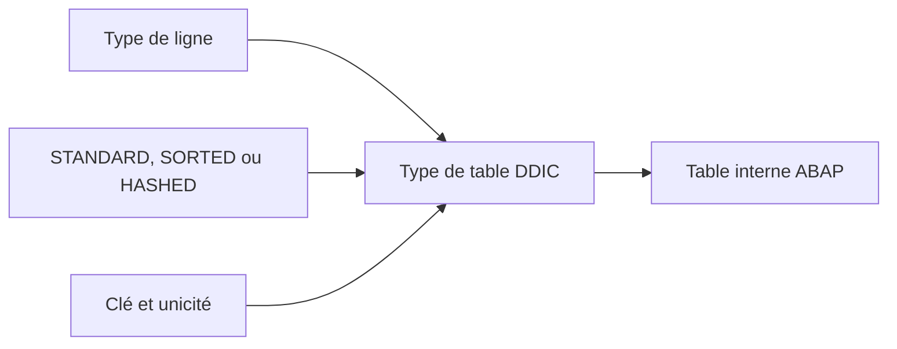

# 🌸 TYPES DE TABLE DU DICTIONNAIRE

## 🌺 OBJECTIFS

- Définir un type global de table interne
- Choisir un type de ligne
- Définir la catégorie d’accès et la clé
- Réutiliser le type dans plusieurs programmes
- Distinguer type de table DDIC et table persistante

## 🌺 DÉFINITION

Un type de table DDIC définit le type d’une table interne globale.

Il ne crée aucune table dans la base de données.

```abap
DATA lt_messages TYPE ztt_message.
```

## 🌺 COMPOSANTS DU TYPE

Un type de table comprend :

- un type de ligne ;
- une catégorie de table ;
- une clé primaire ;
- éventuellement une taille initiale ou des propriétés complémentaires selon le système.



## 🌺 TYPE DE LIGNE

Le type de ligne peut être :

- un élément de données ;
- une structure DDIC ;
- un type de référence ;
- un autre type compatible selon les possibilités de la version.

Pour une table métier comportant plusieurs colonnes, utiliser généralement une structure dédiée.

## 🌺 CATÉGORIES DE TABLE

| Catégorie | Organisation             | Usage principal                   |
| --------- | ------------------------ | --------------------------------- |
| Standard  | Index primaire           | Parcours et accès par index       |
| Triée     | Ordre permanent par clé  | Accès par clé et parcours ordonné |
| Hachée    | Organisation par hachage | Accès exact par clé unique        |

Le choix doit refléter les accès réels. Il ne doit pas être effectué uniquement par habitude.

## 🌺 CLÉ

La clé peut être :

- unique ou non unique selon la catégorie ;
- composée de plusieurs composants ;
- définie explicitement ;
- standard dans certains cas simples.

Une table hachée exige une clé unique. Une table triée peut utiliser une clé unique ou non unique.

## 🌺 EXEMPLE DE CONCEPTION

Structure de ligne : `ZST_MESSAGE`

| Composant | Type         |
| --------- | ------------ |
| `TYPE`    | `BAPI_MTYPE` |
| `ID`      | `SYMSGID`    |
| `NUMBER`  | `SYMSGNO`    |
| `TEXT`    | `BAPI_MSG`   |

Type de table : `ZTT_MESSAGE`

- type de ligne : `ZST_MESSAGE` ;
- catégorie : table standard ;
- clé : standard ou vide selon le besoin.

## 🌺 TYPE DE TABLE ET TABLE DE BASE DE DONNÉES

| Objet                   | Réside en mémoire interne | Persiste en base |
| ----------------------- | ------------------------: | ---------------: |
| Type de table DDIC      | Définit seulement un type |              Non |
| Table interne ABAP      |                       Oui |              Non |
| Table transparente DDIC |           Non directement |              Oui |

## 🌺 POINTS À RETENIR

- Un type de table DDIC est un type global de table interne.
- Il dépend d’un type de ligne et d’une catégorie de table.
- La clé doit correspondre aux accès prévus.
- Il ne crée aucun objet physique en base.
- Les opérations sur les tables internes restent détaillées dans le dossier dédié.

## 🌺 RÉFÉRENCES OFFICIELLES SAP

- [Defining Dictionary Table Types — SAP Learning](https://learning.sap.com/courses/building-data-models-with-the-abap-dictionary-and-abap-core-data-services/defining-dictionary-table-types_df502cc6-441f-4fdc-aa9e-cc81caf6919c)
- [Data Types in the ABAP Dictionary — SAP Help Portal](https://help.sap.com/docs/SAP_NETWEAVER_740/ec1c9c8191b74de98feb94001a95dd76/cf21f2e5446011d189700000e8322d00.html)

---

➡️ [Chapitre suivant — TABLES TRANSPARENTES ET CHAMPS](<./07 - 🍧 TABLES TRANSPARENTES ET CHAMPS.md>)
