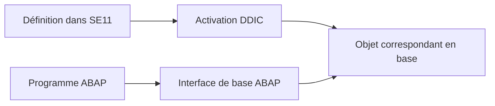

# 🌸 TABLES TRANSPARENTES ET CHAMPS

## 🌺 OBJECTIFS

- Comprendre la relation entre définition DDIC et table physique
- Créer une table transparente dans SE11
- Définir les champs et la clé primaire
- Maintenir les propriétés fonctionnelles de la table
- Éviter les erreurs de modélisation courantes

## 🌺 TABLE TRANSPARENTE

Une table transparente DDIC possède une représentation correspondante dans la base de données.

La définition est indépendante du système de base de données utilisé. L’interface de base ABAP exploite les métadonnées du Dictionary lors des accès Open SQL.



## 🌺 ÉTAPES DE CRÉATION

1. Ouvrir `SE11`.
2. Choisir **Table de base de données**.
3. Saisir un nom dans l’espace client, généralement `Z...` ou `Y...`.
4. Créer la table et renseigner le texte court.
5. Maintenir la classe de livraison et l’autorisation de maintenance.
6. Définir les champs et la clé primaire.
7. Maintenir les références de devise ou d’unité si nécessaire.
8. Maintenir les paramètres techniques.
9. Définir la catégorie d’amélioration.
10. Contrôler et activer.

## 🌺 CHAMPS

Pour chaque champ, définir :

- un nom technique ;
- son appartenance éventuelle à la clé ;
- un élément de données ou un type technique approprié ;
- les références complémentaires pour les montants et quantités.

Préférer des éléments de données réutilisables pour les champs métier.

## 🌺 CLÉ PRIMAIRE

Chaque table doit posséder une clé primaire qui identifie une ligne de manière unique.

Les champs de clé sont placés au début de la définition et doivent former un ensemble stable.

Exemple :

| Clé | Champ        | Élément de données   |
| --: | ------------ | -------------------- |
| Oui | `MANDT`      | `MANDT`              |
| Oui | `REQUEST_ID` | `ZDE_REQUEST_ID`     |
| Non | `STATUS`     | `ZDE_REQUEST_STATUS` |
| Non | `CREATED_BY` | `ERNAM`              |
| Non | `CREATED_ON` | `ERDAT`              |

## 🌺 PROPRIÉTÉS FONCTIONNELLES

| Propriété                | Question associée                                                     |
| ------------------------ | --------------------------------------------------------------------- |
| Classe de livraison      | Quelle est la nature des données et leur comportement de transport ?  |
| Affichage/maintenance    | Les données peuvent-elles être maintenues par les outils génériques ? |
| Dépendance au mandant    | Les données sont-elles séparées par client SAP ?                      |
| Catégorie d’amélioration | L’objet peut-il être étendu et avec quels types de composants ?       |

## 🌺 TABLES DE PERSONNALISATION ET DONNÉES APPLICATIVES

Une table de paramétrage n’a pas le même cycle de vie qu’une table transactionnelle.

Avant de choisir la classe de livraison, déterminer :

- qui crée les données ;
- dans quel système elles sont créées ;
- si elles doivent être transportées ;
- si elles dépendent du mandant ;
- si elles sont maintenues par SM30 ou par une application.

## 🌺 POINTS À RETENIR

- Une table transparente définit un objet persistant en base.
- Chaque table possède une clé primaire cohérente et stable.
- Les champs métier doivent utiliser des types sémantiques adaptés.
- La classe de livraison et les paramètres techniques ne sont pas accessoires.
- La création n’est terminée qu’après contrôle et activation.

## 🌺 CAS D’USAGE

Dans un contexte où une application Z nécessite un modèle de données partagé, cohérent et réutilisable dans plusieurs programmes, le besoin consiste à **définir une table Z cohérente, transportable et correctement paramétrée**. Cette notion est pertinente lorsque le lecteur doit pouvoir relier la syntaxe ou l’outil à une situation professionnelle concrète.

## 🌺 PROCÉDURE PAS À PAS

1. Saisir `/nSE11`.
2. Choisir le type d’objet DDIC correspondant au chapitre.
3. Entrer le nom technique ; utiliser **Afficher** pour un objet existant ou **Créer** pour un objet Z autorisé.
4. Renseigner les attributs et composants en suivant les règles du chapitre.
5. Lancer le contrôle de cohérence.
6. Activer l’objet et traiter chaque message avant de poursuivre.
7. Utiliser la liste d’utilisation et, pour les tables, vérifier les paramètres techniques et la structure physique.

## 🌺 VÉRIFICATION

- Le contrôle de cohérence ne retourne aucune erreur bloquante.
- L’objet est actif et son entrée de répertoire pointe vers le package attendu.
- La liste d’utilisation et les dépendances correspondent au périmètre prévu.
- Pour une table Z, la structure active et la structure de base sont cohérentes.

## 🌺 ERREURS FRÉQUENTES

- Modifier un objet standard au lieu d’utiliser une extension.
- Activer une table sans vérifier clé, paramètres techniques et impact base.

## 🌺 FICHE DE CONTRÔLE À COPIER

```text
Système / SID       :
Mandant             :
Utilisateur         :
Transaction / outil :
Objet technique     :
Jeu de données      :
Résultat attendu    :
Résultat observé    :
Horodatage          :
Ordre de transport  :
```

## 🌺 TERMES DU LEXIQUE

- [ABAP Dictionary](<../└─ 🧩 00 - LEXIQUE SAP ET ABAP/05 - 🍧 DONNEES DICTIONNAIRE ET BASE DE DONNEES.md#abap-dictionary>)
- [Domaine](<../└─ 🧩 00 - LEXIQUE SAP ET ABAP/05 - 🍧 DONNEES DICTIONNAIRE ET BASE DE DONNEES.md#domaine>)
- [Élément de données](<../└─ 🧩 00 - LEXIQUE SAP ET ABAP/05 - 🍧 DONNEES DICTIONNAIRE ET BASE DE DONNEES.md#element-donnees>)
- [Table transparente](<../└─ 🧩 00 - LEXIQUE SAP ET ABAP/05 - 🍧 DONNEES DICTIONNAIRE ET BASE DE DONNEES.md#table-transparente>)
- [MANDT](<../└─ 🧩 00 - LEXIQUE SAP ET ABAP/05 - 🍧 DONNEES DICTIONNAIRE ET BASE DE DONNEES.md#mandt>)

## 🌺 RÉFÉRENCES OFFICIELLES SAP

- [Creating Database Tables and Table Fields — SAP Help Portal](https://help.sap.com/docs/ABAP_PLATFORM_NEW/ec1c9c8191b74de98feb94001a95dd76/44f4ef984a1c2952e10000000a11466f.html)
- [Creating Database Tables — SAP Learning](https://learning.sap.com/courses/building-data-models-with-the-abap-dictionary-and-abap-core-data-services/creating-database-tables_ebc1477d-96ed-414b-82d4-4171da43f4a6)
- [Delivery Class — SAP Help Portal](https://help.sap.com/docs/SAP_NETWEAVER_731_BW_ABAP/ec1c9c8191b74de98feb94001a95dd76/4345860774b711d2959700a0c929b3c3.html)


---

➡️ [Chapitre suivant — CLÉS, INDEX ET DÉPENDANCE AU MANDANT](<./08 - 🍧 CLES INDEX ET DEPENDANCE AU MANDANT.md>)
