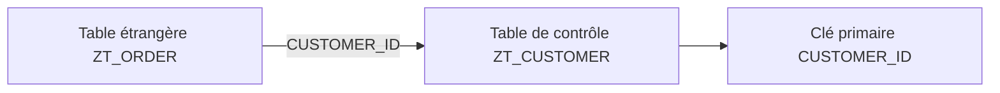
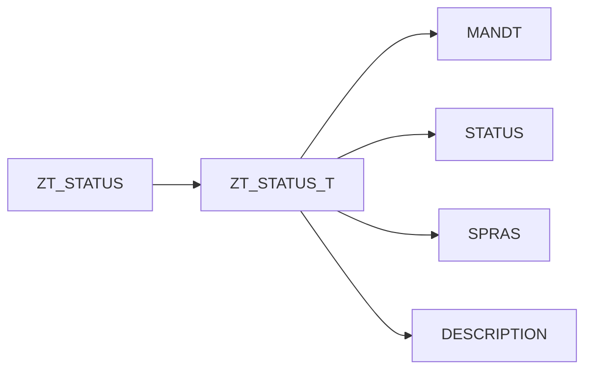

# 🌸 CLÉS ÉTRANGÈRES, TABLES DE CONTRÔLE ET TABLES DE TEXTE

## 🌺 OBJECTIFS

- Définir une relation entre deux tables DDIC
- Distinguer table de valeurs et table de contrôle
- Comprendre les cardinalités
- Identifier une table de texte
- Connaître les limites des contrôles DDIC

## 🌺 CLÉ ÉTRANGÈRE

Une clé étrangère DDIC relie les champs d’une table à la clé primaire d’une table de contrôle.

La définition contient :

- la table de contrôle ;
- l’affectation entre les champs ;
- la cardinalité ;
- le type sémantique de la relation.

## 🌺 TABLE ÉTRANGÈRE ET TABLE DE CONTRÔLE

| Rôle              | Description                                                                  |
| ----------------- | ---------------------------------------------------------------------------- |
| Table étrangère   | Contient le champ dont la valeur doit correspondre à une entrée de référence |
| Table de contrôle | Contient les valeurs de référence dans sa clé primaire                       |

Exemple : une commande contient un identifiant client ; la table client fournit les identifiants valides.

## 🌺 TABLE DE VALEURS ET TABLE DE CONTRÔLE

| Table de valeurs du domaine               | Table de contrôle de la clé étrangère      |
| ----------------------------------------- | ------------------------------------------ |
| Proposition générique associée au domaine | Relation définie pour un champ précis      |
| Ne crée pas seule un contrôle             | Porte la relation et le contrôle classique |
| Peut être réutilisée comme proposition    | Dépend du contexte de la table étrangère   |

## 🌺 CARDINALITÉ

La cardinalité décrit le nombre possible d’occurrences entre les tables.

Elle précise notamment :

- si une ligne de la table étrangère doit obligatoirement trouver une ligne de contrôle ;
- combien de lignes étrangères peuvent référencer une ligne de contrôle.

La cardinalité doit refléter la règle métier réelle, pas seulement les données présentes au moment de la création.

## 🌺 CONTRÔLE EFFECTIF

Une clé étrangère DDIC fournit des métadonnées utilisées par les écrans classiques, les aides F4, les vues de maintenance et divers générateurs.

Elle ne garantit pas à elle seule que toute écriture effectuée par n’importe quel programme ABAP sera contrôlée. Le code applicatif et les interfaces d’écriture doivent respecter l’intégrité attendue.

## 🌺 TABLE DE TEXTE

Une table de texte contient les libellés dépendants de la langue d’une table principale.

Sa clé contient généralement :

- la clé de la table principale ;
- un champ de langue, typiquement `SPRAS`.

La relation doit être définie avec le type sémantique approprié pour que le Dictionary reconnaisse la table de texte.

## 🌺 POINTS À RETENIR

- Une clé étrangère relie une table étrangère à une table de contrôle.
- La table de valeurs d’un domaine n’est qu’une proposition.
- La cardinalité représente une règle structurelle.
- Les métadonnées DDIC n’empêchent pas toutes les écritures incohérentes par elles-mêmes.
- Une table de texte associe une clé métier à des libellés traduits.

## 🌺 RÉFÉRENCES OFFICIELLES SAP

- [Foreign Keys — SAP Help Portal](https://help.sap.com/docs/SAP_NETWEAVER_702/ff5206fc6c551014a1d28b076487e7df/cf21ea77446011d189700000e8322d00.html)
- [Generic and Constant Foreign Keys — SAP Help Portal](https://help.sap.com/docs/SAP_NETWEAVER_731_BW_ABAP/ec1c9c8191b74de98feb94001a95dd76/cf21ea84446011d189700000e8322d00.html)

---

➡️ [Chapitre suivant — AIDES A LA RECHERCHE ELEMENTAIRES ET COLLECTIVES](<./11 - 🍧 AIDES A LA RECHERCHE ELEMENTAIRES ET COLLECTIVES.md>)
