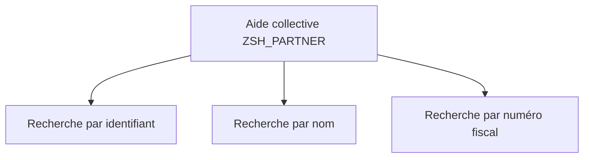

# 🌸 AIDES À LA RECHERCHE ÉLÉMENTAIRES ET COLLECTIVES

## 🌺 OBJECTIFS

- Comprendre le fonctionnement d’une aide F4 DDIC
- Créer une aide élémentaire
- Regrouper plusieurs chemins dans une aide collective
- Configurer les paramètres d’import et d’export
- Choisir le niveau d’affectation approprié

## 🌺 FONCTION

Une aide à la recherche définit un processus de sélection de valeurs pour un champ de saisie.

Elle indique :

- où lire les valeurs ;
- quels champs afficher ;
- quels critères proposer ;
- quelles valeurs recevoir depuis l’écran ;
- quelles valeurs retourner à l’écran.

## 🌺 AIDE ÉLÉMENTAIRE

Une aide élémentaire décrit un seul chemin de recherche.

Elle contient notamment :

- une méthode de sélection : table, vue ou autre source compatible ;
- une interface de paramètres ;
- les positions dans la boîte de dialogue de sélection ;
- les positions dans la liste de résultats ;
- un comportement de dialogue ;
- éventuellement un exit d’aide à la recherche.

## 🌺 PARAMÈTRES

| Indicateur            | Fonction                                                                  |
| --------------------- | ------------------------------------------------------------------------- |
| Import                | Reçoit une valeur déjà présente sur l’écran pour restreindre la sélection |
| Export                | Retourne une valeur vers le champ ou la structure appelante               |
| Position de sélection | Affiche le paramètre comme critère de recherche                           |
| Position de liste     | Affiche le paramètre dans la liste des résultats                          |

Un paramètre peut être à la fois import et export.

## 🌺 AIDE COLLECTIVE

Une aide collective regroupe plusieurs aides élémentaires représentant des chemins alternatifs.

Exemple : rechercher un partenaire par :

- identifiant ;
- nom et ville ;
- numéro fiscal.

Les paramètres de l’aide collective doivent être affectés aux paramètres correspondants de chaque aide élémentaire incluse.

## 🌺 NIVEAUX D’AFFECTATION

Une aide peut être affectée :

- à un élément de données ;
- à un champ de table ou de structure ;
- à une table de contrôle ;
- directement à un champ d’écran selon la technologie.

L’affectation la plus générale est généralement placée sur l’élément de données. Une affectation locale peut la remplacer pour un contexte spécifique.

## 🌺 EXIT D’AIDE À LA RECHERCHE

Un exit permet d’adapter dynamiquement le processus :

- modifier les critères ;
- compléter les résultats ;
- filtrer les chemins disponibles ;
- implémenter une logique non couverte par la définition standard.

Il doit rester réservé aux besoins impossibles à exprimer par la configuration DDIC, car il augmente la complexité de maintenance.

## 🌺 POINTS À RETENIR

- Une aide élémentaire définit un chemin de recherche.
- Une aide collective regroupe plusieurs aides élémentaires.
- Les paramètres d’import filtrent ; les paramètres d’export retournent les valeurs.
- Le niveau d’affectation détermine la portée de l’aide.
- Un exit est une extension avancée, pas le mécanisme par défaut.

## 🌺 RÉFÉRENCES OFFICIELLES SAP

- [Search Helps — SAP Help Portal](https://help.sap.com/docs/ABAP_PLATFORM_NEW/ec1c9c8191b74de98feb94001a95dd76/cf21ee2b446011d189700000e8322d00.html?version=202310.latest)
- [Input Help from the ABAP Dictionary — SAP Help Portal](https://help.sap.com/docs/SAP_NETWEAVER_731_BW_ABAP/f68e489816e043f1add91d69a6842931/4a439ebd5a503f04e10000000a421937.html)

---

➡️ [Chapitre suivant — VUES CLASSIQUES DU DICTIONNAIRE](<./12 - 🍧 VUES CLASSIQUES DU DICTIONNAIRE.md>)
