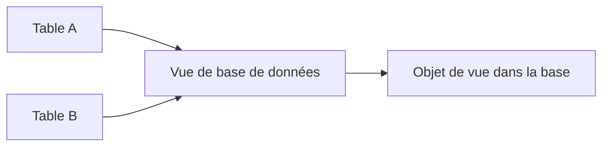
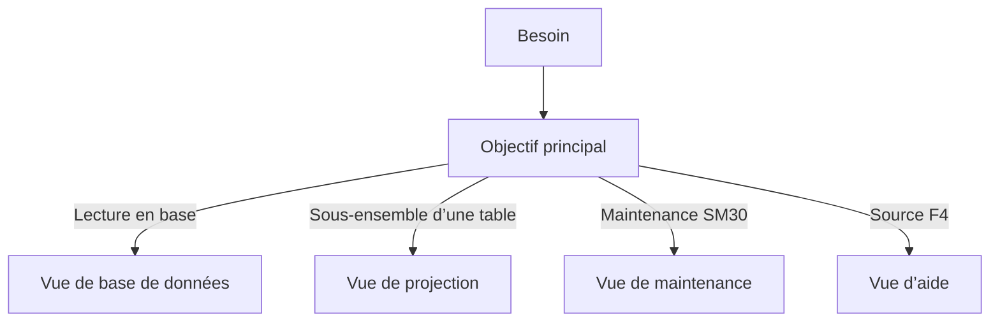

# 🌸 VUES CLASSIQUES DU DICTIONNAIRE

## 🌺 OBJECTIFS

- Identifier les types de vues classiques de SE11
- Comprendre leur mode d’implémentation
- Choisir une vue selon le besoin
- Reconnaître les contraintes de jointure
- Situer les vues classiques par rapport aux développements modernes

## 🌺 TYPES DE VUES

Le Dictionary classique propose plusieurs catégories de vues.

| Type                   | Usage                                                                                   | Objet correspondant en base |
| ---------------------- | --------------------------------------------------------------------------------------- | --------------------------: |
| Vue de base de données | Lire une projection ou une jointure interne                                             |                         Oui |
| Vue de projection      | Masquer certains champs d’une table                                                     |                         Non |
| Vue de maintenance     | Maintenir conjointement des données reliées                                             |                         Non |
| Vue d’aide             | Fournir une source pour une aide à la recherche, avec possibilités de jointure adaptées |                         Non |

## 🌺 VUE DE BASE DE DONNÉES

Une vue de base de données est représentée par une vue correspondante dans la base.

Elle combine les tables avec des conditions de jointure de type interne et expose une sélection de champs.



Elle est principalement utilisée pour la lecture.

## 🌺 VUE DE PROJECTION

Une vue de projection présente uniquement certains champs d’une table unique.

Elle ne possède pas d’objet de vue propre dans la base. Elle sert à limiter l’exposition d’une structure de table dans les usages classiques.

## 🌺 VUE DE MAINTENANCE

Une vue de maintenance permet de générer un dialogue de maintenance commun à plusieurs tables reliées par des clés étrangères.

Elle est utilisée avec le générateur de maintenance et la transaction `SM30`.

Les relations entre tables doivent être correctement modélisées dans le Dictionary.

## 🌺 VUE D’AIDE

Une vue d’aide sert principalement de méthode de sélection pour une aide à la recherche.

Elle permet de réunir des données de plusieurs tables en tenant compte des relations DDIC et des besoins de recherche.

## 🌺 CHOIX DU TYPE



## 🌺 POSITIONNEMENT ACTUEL

Les vues classiques restent présentes dans de nombreux systèmes et sont nécessaires pour maintenir des applications SAP GUI existantes, des aides à la recherche et des dialogues de maintenance.

Pour de nouveaux modèles de lecture, SAP privilégie les vues CDS. Leur conception nécessite un traitement distinct dans le futur dossier consacré à ADT.

## 🌺 POINTS À RETENIR

- Les quatre types de vues classiques répondent à des usages différents.
- Seule la vue de base de données crée une vue correspondante dans la base.
- Les vues de maintenance et d’aide s’appuient sur les relations DDIC.
- Une vue de projection ne porte que sur une table.
- Les vues CDS ne sont pas traitées dans ce dossier SAP GUI.

## 🌺 PROCÉDURE PAS À PAS

1. Saisir `/nSE11`.
2. Choisir le type d’objet DDIC correspondant au chapitre.
3. Entrer le nom technique ; utiliser **Afficher** pour un objet existant ou **Créer** pour un objet Z autorisé.
4. Renseigner les attributs et composants en suivant les règles du chapitre.
5. Lancer le contrôle de cohérence.
6. Activer l’objet et traiter chaque message avant de poursuivre.
7. Utiliser la liste d’utilisation et, pour les tables, vérifier les paramètres techniques et la structure physique.

## 🌺 VÉRIFICATION

- Le contrôle de cohérence ne retourne aucune erreur bloquante.
- L’objet est actif et son entrée de répertoire pointe vers le package attendu.
- La liste d’utilisation et les dépendances correspondent au périmètre prévu.
- Pour une table Z, la structure active et la structure de base sont cohérentes.

## 🌺 ERREURS FRÉQUENTES

- Modifier un objet standard au lieu d’utiliser une extension.
- Activer une table sans vérifier clé, paramètres techniques et impact base.

## 🌺 FICHE DE CONTRÔLE À COPIER

```text
Système / SID       :
Mandant             :
Utilisateur         :
Transaction / outil :
Objet technique     :
Jeu de données      :
Résultat attendu    :
Résultat observé    :
Horodatage          :
Ordre de transport  :
```

## 🌺 TERMES DU LEXIQUE

- [ABAP Dictionary](<../└─ 🧩 00 - LEXIQUE SAP ET ABAP/05 - 🍧 DONNEES DICTIONNAIRE ET BASE DE DONNEES.md#abap-dictionary>)
- [Domaine](<../└─ 🧩 00 - LEXIQUE SAP ET ABAP/05 - 🍧 DONNEES DICTIONNAIRE ET BASE DE DONNEES.md#domaine>)
- [Élément de données](<../└─ 🧩 00 - LEXIQUE SAP ET ABAP/05 - 🍧 DONNEES DICTIONNAIRE ET BASE DE DONNEES.md#element-donnees>)
- [Table transparente](<../└─ 🧩 00 - LEXIQUE SAP ET ABAP/05 - 🍧 DONNEES DICTIONNAIRE ET BASE DE DONNEES.md#table-transparente>)
- [MANDT](<../└─ 🧩 00 - LEXIQUE SAP ET ABAP/05 - 🍧 DONNEES DICTIONNAIRE ET BASE DE DONNEES.md#mandt>)

## 🌺 RÉFÉRENCES OFFICIELLES SAP

- [Views — ABAP Dictionary — SAP Help Portal](https://help.sap.com/docs/SAP_NETWEAVER_AS_ABAP_FOR_SOH_740/ec1c9c8191b74de98feb94001a95dd76/cf21ec5d446011d189700000e8322d00.html?version=7.40.30)
- [Maintenance Views — SAP Help Portal](https://help.sap.com/docs/SAP_NETWEAVER_731_BW_ABAP/ec1c9c8191b74de98feb94001a95dd76/cf21ecdf446011d189700000e8322d00.html)


---

➡️ [Chapitre suivant — OBJETS DE VERROUILLAGE](<./13 - 🍧 OBJETS DE VERROUILLAGE.md>)
