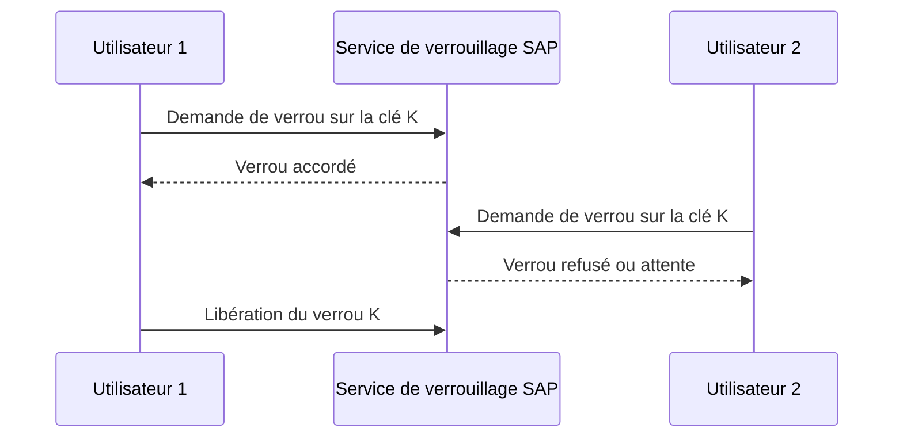

# 🌸 OBJETS DE VERROUILLAGE

## 🌺 OBJECTIFS

- Comprendre le verrouillage logique SAP
- Créer un objet de verrouillage dans SE11
- Identifier les modules fonction générés
- Choisir les champs de l’argument de verrouillage
- Diagnostiquer les verrous avec prudence

## 🌺 POURQUOI UN VERROU LOGIQUE

Une transaction métier peut durer plus longtemps qu’une opération de base de données unique.

Le verrouillage logique SAP empêche plusieurs utilisateurs ou traitements de modifier simultanément la même ressource métier pendant cette durée.



## 🌺 DÉFINITION DANS SE11

Un objet de verrouillage indique :

- une table primaire ;
- éventuellement des tables secondaires reliées ;
- les champs qui composent l’argument de verrouillage ;
- le mode de verrouillage proposé.

Lors de l’activation, le système génère généralement deux modules fonction :

- `ENQUEUE_<objet>` ;
- `DEQUEUE_<objet>`.

## 🌺 MODES CLASSIQUES

| Mode                   | Principe                                                     |
| ---------------------- | ------------------------------------------------------------ |
| Partagé                | Plusieurs lectures protégées peuvent coexister               |
| Exclusif               | Une seule modification logique est autorisée                 |
| Exclusif non cumulatif | Variante exclusive avec règles de cumul plus strictes        |
| Optimiste              | Verrou initial pouvant être converti lors de la modification |

Le mode exact doit correspondre au scénario métier et à l’architecture de l’application.

## 🌺 EXEMPLE D’APPEL

Pour un objet `EZ_ORDER` générant `ENQUEUE_EZ_ORDER` :

```abap
CALL FUNCTION 'ENQUEUE_EZ_ORDER'
  EXPORTING
    mandt      = sy-mandt
    order_id   = lv_order_id
  EXCEPTIONS
    foreign_lock = 1
    system_failure = 2
    OTHERS       = 3.

IF sy-subrc <> 0.
  MESSAGE 'Objet déjà verrouillé' TYPE 'E'.
ENDIF.
```

La signature réelle dépend des champs de l’objet généré. Elle doit être vérifiée dans `SE37`.

Le verrou doit ensuite être libéré au moment cohérent du traitement, explicitement ou selon la portée configurée.

## 🌺 ANALYSE AVEC SM12

La transaction `SM12` permet d’analyser les entrées de verrouillage.

Supprimer manuellement un verrou peut permettre à deux traitements incompatibles de s’exécuter simultanément. Cette action exige de vérifier :

- l’utilisateur propriétaire ;
- l’heure de création ;
- la transaction concernée ;
- l’état du traitement ;
- l’absence réelle de session active.

## 🌺 POINTS À RETENIR

- Un objet de verrouillage protège une ressource métier au niveau SAP.
- L’activation génère les modules `ENQUEUE_...` et `DEQUEUE_...`.
- L’argument doit être assez précis pour éviter de verrouiller trop de données.
- La durée du verrou doit couvrir le traitement critique sans être excessive.
- Un verrou ne doit pas être supprimé dans SM12 sans diagnostic.

## 🌺 RÉFÉRENCES OFFICIELLES SAP

- [Lock Objects — ABAP Dictionary — SAP Help Portal](https://help.sap.com/docs/SAP_NETWEAVER_731_BW_ABAP/ec1c9c8191b74de98feb94001a95dd76/cf21eea5446011d189700000e8322d00.html)
- [SAP Lock Concept — SAP Help Portal](https://help.sap.com/docs/SAP_NETWEAVER_AS_ABAP_752/47df3d6f30fd4c9d8a91d99f6e2be3e5/4ec5c7196e391014adc9fffe4e204223.html)

---

➡️ [Chapitre suivant — GENERATEUR DE MAINTENANCE ET SM30](<./14 - 🍧 GENERATEUR DE MAINTENANCE ET SM30.md>)
