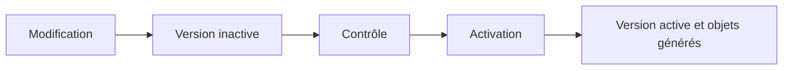
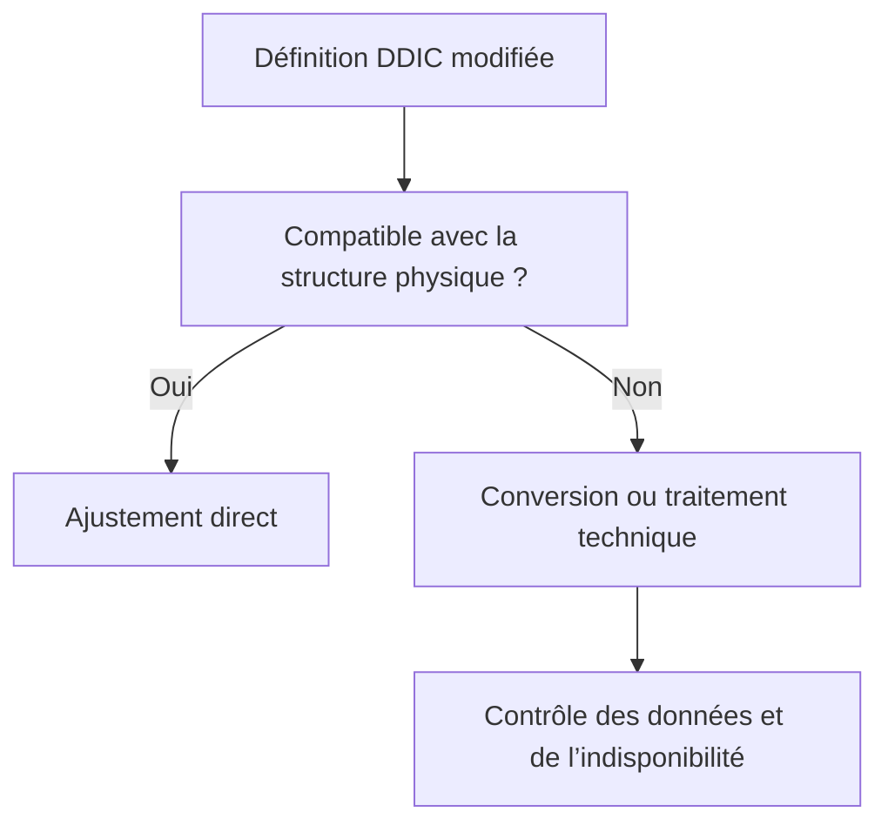

# 🌸 ACTIVATION, AJUSTEMENT BASE ET ANALYSE DES DÉPENDANCES

## 🌺 OBJECTIFS

- Comprendre la différence entre version inactive et active
- Activer les objets dans un ordre cohérent
- Identifier les changements nécessitant un ajustement de base
- Utiliser SE14 avec prudence
- Analyser les dépendances avant et après modification

## 🌺 VERSION ACTIVE ET VERSION INACTIVE

L’enregistrement conserve les modifications dans une version inactive.

L’activation contrôle l’objet, génère sa représentation d’exécution et rend la nouvelle définition disponible aux consommateurs.



Une erreur d’activation laisse généralement la dernière version active utilisable, tandis que les nouvelles modifications restent inactives.

## 🌺 ORDRE D’ACTIVATION

Activer d’abord les dépendances de bas niveau :

1. domaines ;
2. éléments de données ;
3. structures et types de table ;
4. tables, vues, aides à la recherche et objets de verrouillage ;
5. programmes consommateurs.

Les outils peuvent proposer une activation collective, mais les erreurs restent plus simples à diagnostiquer lorsque les dépendances sont comprises.

## 🌺 IMPACT D’UNE MODIFICATION

Exemples de modifications à risque :

- réduction de longueur ;
- changement de type incompatible ;
- modification de clé ;
- suppression d’un champ ;
- modification d’une structure include ;
- ajout ou retrait d’un append ;
- changement de paramètres techniques.

Une modification indirecte d’un domaine ou d’un élément de données peut affecter plusieurs tables.

## 🌺 AJUSTEMENT DE BASE

Lorsque la définition active d’une table ne correspond plus à la structure physique, un ajustement est nécessaire.

La transaction `SE14` fournit l’utilitaire de base de données permettant notamment :

- d’afficher l’état DDIC et l’état base ;
- d’activer et ajuster une table ;
- de planifier certaines conversions ;
- de reconstruire ou traiter des index selon les fonctions disponibles.



## 🌺 PRUDENCE AVEC SE14

Une conversion peut :

- verrouiller la table ;
- consommer du temps et de l’espace ;
- nécessiter une table de sauvegarde temporaire ;
- entraîner une indisponibilité ;
- provoquer une perte de données si une action destructive est choisie.

Ne pas lancer une suppression, recréation ou conversion sur un environnement productif sans procédure validée, sauvegarde et coordination avec l’administration technique.

## 🌺 ANALYSE DES DÉPENDANCES

Avant la modification :

- consulter la liste d’utilisation ;
- identifier les tables et structures dépendantes ;
- vérifier les programmes, interfaces et formulaires consommateurs ;
- analyser les transports en cours ;
- comparer les versions si nécessaire.

Après l’activation :

- contrôler les journaux d’activation ;
- vérifier l’état dans SE14 pour les tables ;
- tester les lectures et écritures principales ;
- rechercher les objets inactifs ou incohérents.

## 🌺 POINTS À RETENIR

- Enregistrer ne signifie pas activer.
- Les objets de base doivent être activés avant leurs consommateurs.
- Une modification DDIC peut avoir un impact indirect important.
- SE14 est un outil technique puissant et potentiellement destructif.
- La liste d’utilisation et les tests de non-régression sont obligatoires avant une modification structurante.

## 🌺 CAS D’USAGE

Dans un contexte où une application Z nécessite un modèle de données partagé, cohérent et réutilisable dans plusieurs programmes, le besoin consiste à **analyser ou modéliser activation, ajustement base et analyse des dépendances dans l’ABAP Dictionary avec des dépendances cohérentes**. Cette notion est pertinente lorsque le lecteur doit pouvoir relier la syntaxe ou l’outil à une situation professionnelle concrète.

## 🌺 PROCÉDURE PAS À PAS

1. Saisir `/nSE11`.
2. Choisir le type d’objet DDIC correspondant au chapitre.
3. Entrer le nom technique ; utiliser **Afficher** pour un objet existant ou **Créer** pour un objet Z autorisé.
4. Renseigner les attributs et composants en suivant les règles du chapitre.
5. Lancer le contrôle de cohérence.
6. Activer l’objet et traiter chaque message avant de poursuivre.
7. Utiliser la liste d’utilisation et, pour les tables, vérifier les paramètres techniques et la structure physique.

## 🌺 VÉRIFICATION

- Le contrôle de cohérence ne retourne aucune erreur bloquante.
- L’objet est actif et son entrée de répertoire pointe vers le package attendu.
- La liste d’utilisation et les dépendances correspondent au périmètre prévu.
- Pour une table Z, la structure active et la structure de base sont cohérentes.

## 🌺 ERREURS FRÉQUENTES

- Modifier un objet standard au lieu d’utiliser une extension.
- Activer une table sans vérifier clé, paramètres techniques et impact base.

## 🌺 FICHE DE CONTRÔLE À COPIER

```text
Système / SID       :
Mandant             :
Utilisateur         :
Transaction / outil :
Objet technique     :
Jeu de données      :
Résultat attendu    :
Résultat observé    :
Horodatage          :
Ordre de transport  :
```

## 🌺 TERMES DU LEXIQUE

- [ABAP Dictionary](<../└─ 🧩 00 - LEXIQUE SAP ET ABAP/05 - 🍧 DONNEES DICTIONNAIRE ET BASE DE DONNEES.md#abap-dictionary>)
- [Domaine](<../└─ 🧩 00 - LEXIQUE SAP ET ABAP/05 - 🍧 DONNEES DICTIONNAIRE ET BASE DE DONNEES.md#domaine>)
- [Élément de données](<../└─ 🧩 00 - LEXIQUE SAP ET ABAP/05 - 🍧 DONNEES DICTIONNAIRE ET BASE DE DONNEES.md#element-donnees>)
- [Table transparente](<../└─ 🧩 00 - LEXIQUE SAP ET ABAP/05 - 🍧 DONNEES DICTIONNAIRE ET BASE DE DONNEES.md#table-transparente>)
- [MANDT](<../└─ 🧩 00 - LEXIQUE SAP ET ABAP/05 - 🍧 DONNEES DICTIONNAIRE ET BASE DE DONNEES.md#mandt>)

## 🌺 RÉFÉRENCES OFFICIELLES SAP

- [Adjustment of Database Structures — SAP Help Portal](https://help.sap.com/docs/SAP_NETWEAVER_740/ec1c9c8191b74de98feb94001a95dd76/cf21f1ab446011d189700000e8322d00.html)
- [Handling Changes to Database Tables — SAP Learning](https://learning.sap.com/courses/building-data-models-with-the-abap-dictionary-and-abap-core-data-services/handling-changes-to-database-tables_d6d6d97a-979e-4efe-b5c3-f3e3d85332fb)


---

➡️ [Chapitre suivant — BONNES PRATIQUES DE MODÉLISATION DDIC](<./17 - 🍧 BONNES PRATIQUES DE MODELISATION DDIC.md>)
