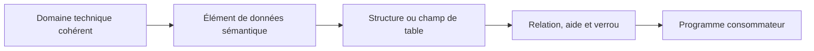

# 🌸 BONNES PRATIQUES DE MODÉLISATION DDIC

## 🌺 OBJECTIFS

- Concevoir des objets DDIC réutilisables
- Réduire les dépendances inutiles
- Sécuriser les extensions et évolutions
- Éviter les erreurs classiques de modélisation
- Disposer d’une checklist de revue

## 🌺 MODÉLISER PAR NIVEAUX

Chaque niveau doit apporter une information distincte : format, sens, composition, persistance ou comportement.

## 🌺 RÈGLES DE CONCEPTION

### Domaines

- créer un domaine partagé uniquement lorsque les valeurs ont réellement le même format et la même plage ;
- ne pas utiliser une table de valeurs comme substitut à une clé étrangère ;
- documenter les routines de conversion particulières ;
- éviter les domaines génériques sans signification technique stable.

### Éléments de données

- créer un élément par concept métier identifiable ;
- maintenir les quatre libellés ;
- rédiger une documentation utile pour les champs ambigus ;
- éviter de réutiliser un élément uniquement parce que sa longueur correspond.

### Structures

- créer des structures dédiées aux interfaces plutôt que d’exposer systématiquement une table complète ;
- utiliser les includes pour les groupes de champs réellement communs ;
- limiter les structures profondes lorsque les consommateurs exigent des types plats.

### Tables

- choisir une clé stable ;
- décider explicitement de la dépendance au mandant ;
- choisir la classe de livraison selon le cycle de vie des données ;
- maintenir les références de devise et d’unité ;
- ne pas activer la bufferisation sans analyse ;
- créer un index seulement après démonstration du besoin.

### Relations et aides

- maintenir les clés étrangères et cardinalités correctes ;
- utiliser des tables de texte pour les libellés traduits ;
- placer les aides F4 au niveau le plus réutilisable ;
- réserver les exits aux cas non couverts par la définition standard.

### Extensions

- utiliser append ou customer include lorsque le mécanisme est prévu ;
- ne pas modifier directement un objet standard ;
- vérifier la catégorie d’amélioration ;
- tester les consommateurs après tout changement de structure.

## 🌺 ANTI-PATTERNS

- domaine `CHAR50` réutilisé pour des concepts sans rapport ;
- élément de données sans libellé ni documentation ;
- table indépendante du mandant créée par omission de `MANDT` ;
- clé composée de champs modifiables ;
- bufferisation intégrale d’une table transactionnelle ;
- index secondaire créé sans mesure ;
- appel direct à SE14 pour contourner une erreur d’activation ;
- ajout d’un champ standard par modification plutôt que par extension.

## 🌺 CHECKLIST DE REVUE

- [ ] Le nom technique est-il dans l’espace client et compréhensible ?
- [ ] Le domaine correspond-il réellement au format et à la plage de valeurs ?
- [ ] L’élément de données exprime-t-il une sémantique unique ?
- [ ] Les libellés et la documentation sont-ils complets ?
- [ ] La structure est-elle plate ou profonde de manière intentionnelle ?
- [ ] La clé primaire est-elle stable et minimale ?
- [ ] La dépendance au mandant est-elle volontaire ?
- [ ] La classe de livraison correspond-elle au cycle de vie des données ?
- [ ] Les clés étrangères et cardinalités sont-elles correctes ?
- [ ] Les paramètres techniques sont-ils justifiés ?
- [ ] Les dépendances et impacts d’activation ont-ils été analysés ?
- [ ] L’objet standard est-il étendu sans modification directe ?

## 🌺 POINTS À RETENIR

- La qualité du modèle DDIC conditionne le code, les contrôles et les interfaces classiques.
- La réutilisation doit être sémantique, pas uniquement technique.
- Les décisions sur clé, mandant, livraison et buffer doivent être explicites.
- Les extensions doivent utiliser les mécanismes prévus par SAP.
- Toute évolution DDIC exige une analyse des dépendances et de la base physique.

## 🌺 RÉFÉRENCES OFFICIELLES SAP

- [Exploring ABAP Dictionary — SAP Learning](https://learning.sap.com/courses/building-data-models-with-the-abap-dictionary-and-abap-core-data-services/exploring-abap-dictionary_af8fdedf-0a10-43ab-aa1b-20abbece9d8b)
- [Using Dictionary Objects as Data Types — SAP Learning](https://learning.sap.com/courses/building-data-models-with-the-abap-dictionary-and-abap-core-data-services/using-dictionary-objects-as-data-types_e28df7c3-7686-414e-9827-673dceeb21fb)
- [Creating Database Tables — SAP Learning](https://learning.sap.com/courses/building-data-models-with-the-abap-dictionary-and-abap-core-data-services/creating-database-tables_ebc1477d-96ed-414b-82d4-4171da43f4a6)
- [Append Structures — SAP Help Portal](https://help.sap.com/docs/SAP_NETWEAVER_731_BW_ABAP/ec1c9c8191b74de98feb94001a95dd76/cf21eb61446011d189700000e8322d00.html)
