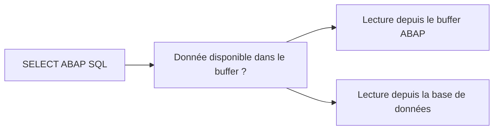

# 🌸 SOURCES DE DONNÉES, MANDANT ET BUFFER

## 🌺 OBJECTIFS

- Identifier les sources utilisables dans ABAP SQL
- Comprendre la gestion implicite du mandant
- Comprendre l’influence du buffer de tables
- Éviter les accès inter-mandants non maîtrisés
- Distinguer données persistantes et résultats calculés

## 🌺 SOURCES DE DONNÉES

Une instruction `SELECT` peut lire notamment :

- une table transparente du Dictionary ABAP ;
- une vue classique du Dictionary ;
- une entité CDS exploitable par ABAP SQL ;
- certaines sources supplémentaires selon la version ABAP.

Dans ce dossier SAP GUI, les exemples restent centrés sur les tables et vues classiques. La création de CDS relève du futur dossier ADT.

## 🌺 GESTION IMPLICITE DU MANDANT

Une table dépendante du mandant possède normalement le champ `MANDT` comme premier champ de clé, avec le type `CLNT`.

Pour les accès standards, ABAP SQL limite automatiquement la lecture au mandant courant.

```abap
SELECT carrid, carrname
  FROM scarr
  INTO TABLE @DATA(lt_carriers).
```

Si `SCARR` est dépendante du mandant dans le système, le filtrage correspondant est géré par l’interface de base de données. Il n’est pas nécessaire d’ajouter manuellement :

```abap
WHERE mandt = @sy-mandt
```

> [!WARNING]
> Un accès inter-mandants est une opération sensible. Ne pas utiliser les additions dédiées sans besoin explicite, autorisation et analyse de sécurité.

## 🌺 TABLES INDÉPENDANTES DU MANDANT

Une table sans champ client est lue de la même manière dans tous les mandants du système.

Exemples possibles :

- données techniques globales ;
- données de customizing explicitement indépendantes du mandant ;
- référentiels communs à l’ensemble du système.

La dépendance au mandant est définie dans le Dictionary et doit être comprise avant toute lecture ou écriture.

## 🌺 BUFFER DE TABLES

Certaines tables DDIC peuvent être bufferisées sur les serveurs d’application ABAP.



Le buffer peut améliorer les lectures répétées de petites tables peu modifiées. Il n’est pas adapté aux tables transactionnelles fréquemment modifiées.

Certaines constructions SQL contournent le buffer ou empêchent son utilisation. Ne pas déduire qu’un `SELECT` est sans accès base uniquement parce que la table est déclarée bufferisée.

## 🌺 RÈGLE DE CONCEPTION

Avant d’écrire une requête, vérifier :

1. la nature de la source ;
2. sa dépendance au mandant ;
3. son volume ;
4. sa stratégie de bufferisation ;
5. son API métier éventuelle.

## 🌺 VÉRIFICATION

- Le contrôle syntaxique réussit.
- La version active correspond au code sauvegardé.
- L’exécution produit le résultat décrit dans le chapitre.
- Les cas vide, limite et erreur sont testés séparément lorsque la syntaxe le permet.

## 🌺 ERREURS FRÉQUENTES

- Copier un exemple sans adapter les types, noms d’objets et données disponibles dans le système.
- Tester uniquement le cas nominal et ignorer les valeurs initiales, absentes ou invalides.
- Lire toutes les colonnes ou toutes les lignes par défaut.
- Effectuer des commits dans une méthode réutilisable sans contrat explicite.

## 🌺 SNIPPET À RÉUTILISER

> [!NOTE]
> Adapter les noms `Z*`, les types DDIC, les données et les autorisations au système cible. Effectuer un contrôle syntaxique avant activation.

```abap
SELECT carrid, carrname
  FROM scarr
  INTO TABLE @DATA(lt_carriers).
```

## 🌺 TERMES DU LEXIQUE

- [Mandant](<../└─ 🧩 00 - LEXIQUE SAP ET ABAP/01 - 🍧 SYSTEMES ENVIRONNEMENTS ET MANDANTS.md#mandant>)
- [SQL](<../└─ 🧩 00 - LEXIQUE SAP ET ABAP/10 - 🍧 ACRONYMES SAP.md#acro-sql>)
- [MANDT](<../└─ 🧩 00 - LEXIQUE SAP ET ABAP/05 - 🍧 DONNEES DICTIONNAIRE ET BASE DE DONNEES.md#mandt>)
- [Table transparente](<../└─ 🧩 00 - LEXIQUE SAP ET ABAP/05 - 🍧 DONNEES DICTIONNAIRE ET BASE DE DONNEES.md#table-transparente>)
- [LUW base de données](<../└─ 🧩 00 - LEXIQUE SAP ET ABAP/08 - 🍧 EXECUTION EXPLOITATION ET ADMINISTRATION.md#luw-base>)

## 🌺 MODÈLE DE DÉMONSTRATION SFLIGHT

> [!NOTE]
> Les tables `SCARR`, `SPFLI` et `SFLIGHT` appartiennent au modèle de démonstration SAP et peuvent être absentes ou non alimentées dans certains systèmes. Dans ce cas, remplacer les exemples par une table Z de démonstration ou par une source en lecture seule autorisée, sans modifier une table applicative standard.

## 🌺 RÉFÉRENCES OFFICIELLES SAP

- [ABAP SQL — ABAP Keyword Documentation](https://help.sap.com/doc/abapdocu_latest_index_htm/latest/en-US/ABENABAP_SQL_OVIEW.html)
- [Client Handling and Table Buffering — SAP Help Portal](https://help.sap.com/docs/abap-cloud/abap-integration-connectivity/client-handling-and-table-buffering)
- [FROM Clause — ABAP Keyword Documentation](https://help.sap.com/doc/abapdocu_latest_index_htm/latest/en-US/ABAPFROM_CLAUSE.html)


---

➡️ [Chapitre suivant — LECTURE SIMPLE AVEC SELECT](<./03 - 🍧 LECTURE SIMPLE AVEC SELECT.md>)
