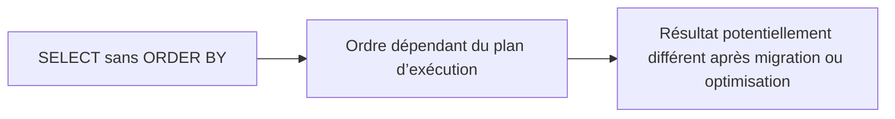

# 🌸 SELECT SINGLE, UP TO N ROWS ET ORDER BY

## 🌺 OBJECTIFS

- Choisir entre `SELECT SINGLE` et `UP TO 1 ROWS`
- Garantir un résultat déterministe avec `ORDER BY`
- Limiter le nombre de lignes retournées
- Éviter de dépendre d’un ordre implicite
- Utiliser `OFFSET` avec prudence

## 🌺 SELECT SINGLE

Utiliser `SELECT SINGLE` lorsqu’une seule ligne doit être lue, généralement à partir d’une clé complète ou d’une condition qui garantit fonctionnellement l’unicité.

```abap
SELECT SINGLE carrid, carrname
  FROM scarr
  WHERE carrid = @p_carrid
  INTO @DATA(ls_carrier).
```

## 🌺 UP TO 1 ROWS

Utiliser `UP TO 1 ROWS` lorsqu’il faut choisir une ligne parmi plusieurs selon un ordre explicite.

```abap
SELECT fldate, price, currency
  FROM sflight
  WHERE carrid = @p_carrid
    AND connid = @p_connid
  ORDER BY fldate DESCENDING
  INTO TABLE @DATA(lt_latest)
  UP TO 1 ROWS.
```

L’ordre exact des clauses dépend de la syntaxe prise en charge par la release. Le contrôle de syntaxe de l’éditeur fait foi.

## 🌺 ORDRE NON GARANTI

Sans `ORDER BY`, l’ordre des lignes d’un résultat SQL n’est pas garanti.



Ne jamais supposer que la base renvoie les lignes selon la clé primaire ou l’ordre physique.

## 🌺 ORDER BY

```abap
SELECT carrid, connid, cityfrom, cityto
  FROM spfli
  WHERE carrid = @p_carrid
  ORDER BY cityfrom ASCENDING, cityto ASCENDING
  INTO TABLE @DATA(lt_connections).
```

`ORDER BY` est justifié lorsque l’ordre est nécessaire au résultat. Un tri inutile impose un travail supplémentaire à la base.

## 🌺 LIMITATION ET PAGINATION

`UP TO n ROWS` limite le volume retourné. `OFFSET` permet de sauter un nombre de lignes sur les versions qui le prennent en charge.

Une pagination stable exige :

- un `ORDER BY` déterministe ;
- une clé de tri suffisamment unique ;
- une stratégie compatible avec les modifications concurrentes.

## 🌺 CAS D’USAGE

Dans un contexte où un report doit lire ou mettre à jour des données en limitant le volume transféré et en conservant une transaction cohérente, le besoin consiste à **écrire une lecture ABAP SQL déterministe et limitée aux données nécessaires**. Cette notion est pertinente lorsque le lecteur doit pouvoir relier la syntaxe ou l’outil à une situation professionnelle concrète.

## 🌺 PROCÉDURE PAS À PAS

1. Saisir `/nSE38` dans le champ de commande.
2. Entrer le nom d’un programme Z de test, par exemple `ZREF_DEMO`, puis choisir **Créer** ou **Modifier** selon le cas.
3. Pour un exercice local uniquement, affecter `$TMP` ; pour un développement livrable, utiliser le package et l’ordre fournis par le projet.
4. Coller ou adapter le snippet du chapitre.
5. Exécuter le contrôle syntaxique avec `Ctrl+F2`.
6. Activer avec `Ctrl+F3`.
7. Exécuter avec `F8` et comparer le résultat avec la section **Vérification**.

## 🌺 VÉRIFICATION

- Le contrôle syntaxique réussit.
- La version active correspond au code sauvegardé.
- L’exécution produit le résultat décrit dans le chapitre.
- Les cas vide, limite et erreur sont testés séparément lorsque la syntaxe le permet.

## 🌺 ERREURS FRÉQUENTES

- Copier un exemple sans adapter les types, noms d’objets et données disponibles dans le système.
- Tester uniquement le cas nominal et ignorer les valeurs initiales, absentes ou invalides.
- Lire toutes les colonnes ou toutes les lignes par défaut.
- Effectuer des commits dans une méthode réutilisable sans contrat explicite.

## 🌺 SNIPPET À RÉUTILISER

> [!NOTE]
> Adapter les noms `Z*`, les types DDIC, les données et les autorisations au système cible. Effectuer un contrôle syntaxique avant activation.

```abap
SELECT fldate, price, currency
  FROM sflight
  WHERE carrid = @p_carrid
    AND connid = @p_connid
  ORDER BY fldate DESCENDING
  INTO TABLE @DATA(lt_latest)
  UP TO 1 ROWS.
```

## 🌺 TERMES DU LEXIQUE

- [SQL](<../└─ 🧩 00 - LEXIQUE SAP ET ABAP/10 - 🍧 ACRONYMES SAP.md#acro-sql>)
- [MANDT](<../└─ 🧩 00 - LEXIQUE SAP ET ABAP/05 - 🍧 DONNEES DICTIONNAIRE ET BASE DE DONNEES.md#mandt>)
- [Table transparente](<../└─ 🧩 00 - LEXIQUE SAP ET ABAP/05 - 🍧 DONNEES DICTIONNAIRE ET BASE DE DONNEES.md#table-transparente>)
- [LUW base de données](<../└─ 🧩 00 - LEXIQUE SAP ET ABAP/08 - 🍧 EXECUTION EXPLOITATION ET ADMINISTRATION.md#luw-base>)

## 🌺 À RETENIR

- À l’issue du chapitre, le lecteur sait **écrire une lecture ABAP SQL déterministe et limitée aux données nécessaires**.
- Toujours tester sur un objet Z ou un jeu de données sans impact avant d’intervenir sur un traitement réel.
- La documentation `F1` du système reste la référence pour la syntaxe disponible dans sa release.

## 🌺 MODÈLE DE DÉMONSTRATION SFLIGHT

> [!NOTE]
> Les tables `SCARR`, `SPFLI` et `SFLIGHT` appartiennent au modèle de démonstration SAP et peuvent être absentes ou non alimentées dans certains systèmes. Dans ce cas, remplacer les exemples par une table Z de démonstration ou par une source en lecture seule autorisée, sans modifier une table applicative standard.

## 🌺 RÉFÉRENCES OFFICIELLES SAP

- [SELECT SINGLE — ABAP Keyword Documentation](https://help.sap.com/doc/abapdocu_latest_index_htm/latest/en-US/ABAPSELECT_SINGLE.html)
- [UP TO and OFFSET — ABAP Keyword Documentation](https://help.sap.com/doc/abapdocu_latest_index_htm/latest/en-US/ABAPSELECT_UP_TO_OFFSET.html)
- [ORDER BY — ABAP Keyword Documentation](https://help.sap.com/doc/abapdocu_latest_index_htm/latest/en-US/ABAPORDERBY_CLAUSE.html)
- [Sorting and Condensing Data Sets in ABAP SQL — SAP Learning](https://learning.sap.com/courses/deepening-your-abap-programming-knowledge/sorting-and-condensing-data-sets-in-abap-sql_cd074ff4-ebc9-4b68-8708-7fa6043bf34c)


---

➡️ [Chapitre suivant — RÉCEPTION DES RÉSULTATS AVEC INTO](<./07 - 🍧 RECEPTION DES RESULTATS AVEC INTO.md>)
