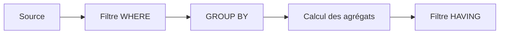

# 🌸 AGRÉGATIONS, GROUP BY ET HAVING

## 🌺 OBJECTIFS

- Calculer des agrégats en base
- Utiliser `COUNT`, `SUM`, `MIN`, `MAX` et `AVG`
- Regrouper les lignes avec `GROUP BY`
- Filtrer les groupes avec `HAVING`
- Éviter les boucles ABAP d’agrégation inutiles

## 🌺 FONCTIONS D’AGRÉGATION

```abap
SELECT COUNT( * ) AS flight_count,
       MIN( price ) AS min_price,
       MAX( price ) AS max_price,
       AVG( price ) AS avg_price
  FROM sflight
  WHERE carrid = @p_carrid
  INTO @DATA(ls_aggregates).
```

Une requête contenant uniquement des agrégats retourne normalement une ligne de résultat, y compris lorsque l’ensemble de départ est vide. La valeur exacte dépend de la fonction.

## 🌺 GROUP BY

Lorsque la liste contient à la fois des colonnes normales et des agrégats, les colonnes non agrégées doivent généralement figurer dans `GROUP BY`.

```abap
SELECT carrid,
       COUNT( * ) AS flight_count,
       MIN( price ) AS min_price,
       MAX( price ) AS max_price
  FROM sflight
  GROUP BY carrid
  INTO TABLE @DATA(lt_by_carrier).
```

## 🌺 HAVING

`WHERE` filtre les lignes avant le regroupement. `HAVING` filtre les groupes après calcul des agrégats.

```abap
SELECT carrid,
       COUNT( * ) AS flight_count
  FROM sflight
  WHERE fldate >= @sy-datum
  GROUP BY carrid
  HAVING COUNT( * ) >= 10
  INTO TABLE @DATA(lt_active_carriers).
```



## 🌺 COUNT DISTINCT

```abap
SELECT COUNT( DISTINCT connid )
  FROM sflight
  WHERE carrid = @p_carrid
  INTO @DATA(lv_connection_count).
```

## 🌺 CODE PUSH-DOWN

Mauvais schéma : lire toutes les lignes, boucler, additionner et compter en ABAP.

Meilleur schéma : demander directement à la base le résultat agrégé nécessaire.

## 🌺 RÉFÉRENCES OFFICIELLES SAP

- [Sorting and Condensing Data Sets in ABAP SQL — SAP Learning](https://learning.sap.com/courses/deepening-your-abap-programming-knowledge/sorting-and-condensing-data-sets-in-abap-sql_cd074ff4-ebc9-4b68-8708-7fa6043bf34c)
- [Aggregate Expressions — ABAP Keyword Documentation](https://help.sap.com/doc/abapdocu_latest_index_htm/latest/en-US/ABAPSELECT_AGGREGATE.html)
- [GROUP BY — ABAP Keyword Documentation](https://help.sap.com/doc/abapdocu_latest_index_htm/latest/en-US/ABAPGROUPBY_CLAUSE.html)
- [HAVING — ABAP Keyword Documentation](https://help.sap.com/doc/abapdocu_latest_index_htm/latest/en-US/ABAPHAVING_CLAUSE.html)

---

➡️ [Chapitre suivant — SOUS REQUETES ET OPERATIONS D ENSEMBLE](<./10 - 🍧 SOUS REQUETES ET OPERATIONS D ENSEMBLE.md>)
