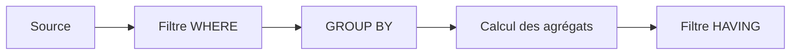

# 🌸 AGRÉGATIONS, GROUP BY ET HAVING

## 🌺 OBJECTIFS

- Calculer des agrégats en base
- Utiliser `COUNT`, `SUM`, `MIN`, `MAX` et `AVG`
- Regrouper les lignes avec `GROUP BY`
- Filtrer les groupes avec `HAVING`
- Éviter les boucles ABAP d’agrégation inutiles

## 🌺 FONCTIONS D’AGRÉGATION

```abap
SELECT COUNT( * ) AS flight_count,
       MIN( price ) AS min_price,
       MAX( price ) AS max_price,
       AVG( price ) AS avg_price
  FROM sflight
  WHERE carrid = @p_carrid
  INTO @DATA(ls_aggregates).
```

Une requête contenant uniquement des agrégats retourne normalement une ligne de résultat, y compris lorsque l’ensemble de départ est vide. La valeur exacte dépend de la fonction.

## 🌺 GROUP BY

Lorsque la liste contient à la fois des colonnes normales et des agrégats, les colonnes non agrégées doivent généralement figurer dans `GROUP BY`.

```abap
SELECT carrid,
       COUNT( * ) AS flight_count,
       MIN( price ) AS min_price,
       MAX( price ) AS max_price
  FROM sflight
  GROUP BY carrid
  INTO TABLE @DATA(lt_by_carrier).
```

## 🌺 HAVING

`WHERE` filtre les lignes avant le regroupement. `HAVING` filtre les groupes après calcul des agrégats.

```abap
SELECT carrid,
       COUNT( * ) AS flight_count
  FROM sflight
  WHERE fldate >= @sy-datum
  GROUP BY carrid
  HAVING COUNT( * ) >= 10
  INTO TABLE @DATA(lt_active_carriers).
```



## 🌺 COUNT DISTINCT

```abap
SELECT COUNT( DISTINCT connid )
  FROM sflight
  WHERE carrid = @p_carrid
  INTO @DATA(lv_connection_count).
```

## 🌺 CODE PUSH-DOWN

Mauvais schéma : lire toutes les lignes, boucler, additionner et compter en ABAP.

Meilleur schéma : demander directement à la base le résultat agrégé nécessaire.

## 🌺 CAS D’USAGE

Dans un contexte où un report doit lire ou mettre à jour des données en limitant le volume transféré et en conservant une transaction cohérente, le besoin consiste à **écrire et vérifier une instruction ABAP SQL utilisant agrégations, group by et having sur un jeu de données maîtrisé**. Cette notion est pertinente lorsque le lecteur doit pouvoir relier la syntaxe ou l’outil à une situation professionnelle concrète.

## 🌺 PROCÉDURE PAS À PAS

1. Saisir `/nSE38` dans le champ de commande.
2. Entrer le nom d’un programme Z de test, par exemple `ZREF_DEMO`, puis choisir **Créer** ou **Modifier** selon le cas.
3. Pour un exercice local uniquement, affecter `$TMP` ; pour un développement livrable, utiliser le package et l’ordre fournis par le projet.
4. Coller ou adapter le snippet du chapitre.
5. Exécuter le contrôle syntaxique avec `Ctrl+F2`.
6. Activer avec `Ctrl+F3`.
7. Exécuter avec `F8` et comparer le résultat avec la section **Vérification**.

## 🌺 VÉRIFICATION

- Le contrôle syntaxique réussit.
- La version active correspond au code sauvegardé.
- L’exécution produit le résultat décrit dans le chapitre.
- Les cas vide, limite et erreur sont testés séparément lorsque la syntaxe le permet.

## 🌺 ERREURS FRÉQUENTES

- Copier un exemple sans adapter les types, noms d’objets et données disponibles dans le système.
- Tester uniquement le cas nominal et ignorer les valeurs initiales, absentes ou invalides.
- Lire toutes les colonnes ou toutes les lignes par défaut.
- Effectuer des commits dans une méthode réutilisable sans contrat explicite.

## 🌺 SNIPPET À RÉUTILISER

> [!NOTE]
> Adapter les noms `Z*`, les types DDIC, les données et les autorisations au système cible. Effectuer un contrôle syntaxique avant activation.

```abap
SELECT carrid,
       COUNT( * ) AS flight_count,
       MIN( price ) AS min_price,
       MAX( price ) AS max_price
  FROM sflight
  GROUP BY carrid
  INTO TABLE @DATA(lt_by_carrier).
```

## 🌺 TERMES DU LEXIQUE

- [SQL](<../└─ 🧩 00 - LEXIQUE SAP ET ABAP/10 - 🍧 ACRONYMES SAP.md#acro-sql>)
- [MANDT](<../└─ 🧩 00 - LEXIQUE SAP ET ABAP/05 - 🍧 DONNEES DICTIONNAIRE ET BASE DE DONNEES.md#mandt>)
- [Table transparente](<../└─ 🧩 00 - LEXIQUE SAP ET ABAP/05 - 🍧 DONNEES DICTIONNAIRE ET BASE DE DONNEES.md#table-transparente>)
- [LUW base de données](<../└─ 🧩 00 - LEXIQUE SAP ET ABAP/08 - 🍧 EXECUTION EXPLOITATION ET ADMINISTRATION.md#luw-base>)

## 🌺 À RETENIR

- À l’issue du chapitre, le lecteur sait **écrire et vérifier une instruction ABAP SQL utilisant agrégations, group by et having sur un jeu de données maîtrisé**.
- Toujours tester sur un objet Z ou un jeu de données sans impact avant d’intervenir sur un traitement réel.
- La documentation `F1` du système reste la référence pour la syntaxe disponible dans sa release.

## 🌺 MODÈLE DE DÉMONSTRATION SFLIGHT

> [!NOTE]
> Les tables `SCARR`, `SPFLI` et `SFLIGHT` appartiennent au modèle de démonstration SAP et peuvent être absentes ou non alimentées dans certains systèmes. Dans ce cas, remplacer les exemples par une table Z de démonstration ou par une source en lecture seule autorisée, sans modifier une table applicative standard.

## 🌺 RÉFÉRENCES OFFICIELLES SAP

- [Sorting and Condensing Data Sets in ABAP SQL — SAP Learning](https://learning.sap.com/courses/deepening-your-abap-programming-knowledge/sorting-and-condensing-data-sets-in-abap-sql_cd074ff4-ebc9-4b68-8708-7fa6043bf34c)
- [Aggregate Expressions — ABAP Keyword Documentation](https://help.sap.com/doc/abapdocu_latest_index_htm/latest/en-US/ABAPSELECT_AGGREGATE.html)
- [GROUP BY — ABAP Keyword Documentation](https://help.sap.com/doc/abapdocu_latest_index_htm/latest/en-US/ABAPGROUPBY_CLAUSE.html)
- [HAVING — ABAP Keyword Documentation](https://help.sap.com/doc/abapdocu_latest_index_htm/latest/en-US/ABAPHAVING_CLAUSE.html)


---

➡️ [Chapitre suivant — SOUS-REQUÊTES ET OPÉRATIONS D’ENSEMBLE](<./10 - 🍧 SOUS REQUETES ET OPERATIONS D ENSEMBLE.md>)
