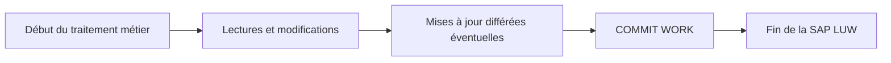

# 🌸 LUW, COMMIT WORK ET ROLLBACK WORK

## 🌺 OBJECTIFS

- Comprendre la différence entre SAP LUW et database LUW
- Savoir quand une modification devient persistante
- Utiliser `COMMIT WORK` et `ROLLBACK WORK` avec prudence
- Éviter les validations techniques placées au mauvais niveau
- Préparer le futur dossier transactionnel

## 🌺 DATABASE LUW ET SAP LUW

Une unité logique de travail de base de données est délimitée par un commit ou un rollback de la base.

Une **SAP LUW** regroupe un processus métier qui peut traverser plusieurs étapes de dialogue et utiliser les mécanismes de mise à jour SAP.



## 🌺 COMMIT WORK

`COMMIT WORK` termine la SAP LUW courante et déclenche notamment les traitements enregistrés en update task.

```abap
INSERT zdev_product FROM @ls_product.

IF sy-subrc = 0.
  COMMIT WORK AND WAIT.
ENDIF.
```

`AND WAIT` attend la fin des mises à jour synchrones concernées et fournit un retour exploitable selon le contexte.

> [!WARNING]
> Ne pas placer un `COMMIT WORK` dans une méthode technique réutilisable, un exit, une BAdI ou une fonction appelée au milieu d’un processus sans contrat explicite. Le niveau appelant doit généralement contrôler la transaction.

## 🌺 ROLLBACK WORK

`ROLLBACK WORK` annule les modifications non validées de la SAP LUW courante et supprime certains enregistrements différés associés.

```abap
IF lv_error = abap_true.
  ROLLBACK WORK.
  RETURN.
ENDIF.
```

## 🌺 VALIDATION IMPLICITE

Plusieurs événements du runtime SAP peuvent provoquer une fin de LUW ou un commit implicite selon le contexte. Il est donc incorrect de considérer qu’une transaction ABAP correspond toujours à une seule transaction de base de données du début à la fin de l’écran.

## 🌺 BAPI ET COMMIT

De nombreuses BAPI de modification ne réalisent pas elles-mêmes le commit. L’appelant utilise généralement les mécanismes BAPI prévus pour valider ou annuler après analyse des messages retournés.

Le sujet sera détaillé dans le dossier consacré aux modules fonction, RFC et BAPI.

## 🌺 VÉRIFICATION

- Le contrôle syntaxique réussit.
- La version active correspond au code sauvegardé.
- L’exécution produit le résultat décrit dans le chapitre.
- Les cas vide, limite et erreur sont testés séparément lorsque la syntaxe le permet.

## 🌺 ERREURS FRÉQUENTES

- Copier un exemple sans adapter les types, noms d’objets et données disponibles dans le système.
- Tester uniquement le cas nominal et ignorer les valeurs initiales, absentes ou invalides.
- Lire toutes les colonnes ou toutes les lignes par défaut.
- Effectuer des commits dans une méthode réutilisable sans contrat explicite.

## 🌺 SNIPPET À RÉUTILISER

> [!NOTE]
> Adapter les noms `Z*`, les types DDIC, les données et les autorisations au système cible. Effectuer un contrôle syntaxique avant activation.

```abap
INSERT zdev_product FROM @ls_product.

IF sy-subrc = 0.
  COMMIT WORK AND WAIT.
ENDIF.
```

## 🌺 TERMES DU LEXIQUE

- [COMMIT WORK](<../└─ 🧩 00 - LEXIQUE SAP ET ABAP/08 - 🍧 EXECUTION EXPLOITATION ET ADMINISTRATION.md#commit-work>)
- [ROLLBACK WORK](<../└─ 🧩 00 - LEXIQUE SAP ET ABAP/08 - 🍧 EXECUTION EXPLOITATION ET ADMINISTRATION.md#rollback-work>)
- [SQL](<../└─ 🧩 00 - LEXIQUE SAP ET ABAP/10 - 🍧 ACRONYMES SAP.md#acro-sql>)
- [MANDT](<../└─ 🧩 00 - LEXIQUE SAP ET ABAP/05 - 🍧 DONNEES DICTIONNAIRE ET BASE DE DONNEES.md#mandt>)
- [Table transparente](<../└─ 🧩 00 - LEXIQUE SAP ET ABAP/05 - 🍧 DONNEES DICTIONNAIRE ET BASE DE DONNEES.md#table-transparente>)
- [LUW base de données](<../└─ 🧩 00 - LEXIQUE SAP ET ABAP/08 - 🍧 EXECUTION EXPLOITATION ET ADMINISTRATION.md#luw-base>)

## 🌺 RÉFÉRENCES OFFICIELLES SAP

- [LUWs in ABAP — SAP Help Portal](https://help.sap.com/docs/ABAP_PLATFORM_NEW/8132142fd1a144a59303663a03a7c2d4/54f5462a9604498382319304869a4280.html)
- [COMMIT WORK — ABAP Keyword Documentation](https://help.sap.com/doc/abapdocu_latest_index_htm/latest/en-US/ABAPCOMMIT.html)
- [ROLLBACK WORK — ABAP Keyword Documentation](https://help.sap.com/doc/abapdocu_latest_index_htm/latest/en-US/ABAPROLLBACK.html)


---

➡️ [Chapitre suivant — PERFORMANCE, ANALYSE ET BONNES PRATIQUES](<./18 - 🍧 PERFORMANCE ANALYSE ET BONNES PRATIQUES.md>)
