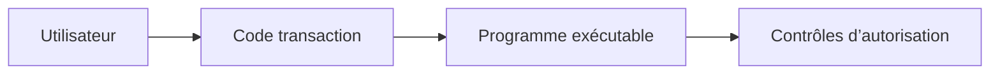

# 🌸 ATTRIBUTS, EXÉCUTION ET DOCUMENTATION

## 🌺 OBJECTIFS

- Comprendre les attributs d’un programme exécutable
- Lancer un programme avec les transactions SAP GUI adaptées
- Distinguer exécution, modification et documentation
- Préparer une utilisation par transaction ou job
- Éviter les dépendances implicites à l’environnement utilisateur

## 🌺 ATTRIBUTS DU PROGRAMME

Lors de la création dans `SE38` ou `SE80`, le programme reçoit notamment :

| Attribut    | Rôle                                         |
| ----------- | -------------------------------------------- |
| Titre       | Description fonctionnelle courte             |
| Type        | Programme exécutable                         |
| Statut      | Classification du programme selon le système |
| Application | Domaine applicatif                           |
| Package     | Affectation au Repository et au transport    |

D’autres attributs peuvent apparaître selon la version du système.

## 🌺 TRANSACTIONS PRINCIPALES

| Transaction | Usage                                              |
| ----------- | -------------------------------------------------- |
| `SE38`      | Créer, modifier, vérifier et exécuter un programme |
| `SA38`      | Exécuter un programme existant                     |
| `SE80`      | Naviguer dans le package et les objets liés        |
| `SE93`      | Créer ou analyser une transaction associée         |

Avant une modification, vérifier le système, le mandant, le package et l’ordre de transport.

## 🌺 EXÉCUTION DIRECTE

Dans `SE38` ou `SA38` :

1. saisir le nom du programme ;
2. choisir **Exécuter** ;
3. renseigner l’écran de sélection ;
4. lancer le traitement.

Le raccourci standard d’exécution dans l’éditeur est généralement `F8`.

## 🌺 TRANSACTION DÉDIÉE

Une transaction peut pointer vers le programme et son écran de sélection. Elle simplifie l’accès utilisateur, mais ne constitue pas une protection suffisante.



Les autorisations de transaction et les autorisations métier répondent à des objectifs différents.

## 🌺 DOCUMENTATION DU PROGRAMME

La documentation d’un programme exécutable peut être maintenue depuis l’éditeur ABAP. Elle doit préciser :

- l’objectif fonctionnel ;
- les données traitées ;
- les paramètres importants ;
- les restrictions ;
- les impacts d’une exécution productive ;
- le mode d’exécution recommandé.

Ne pas placer uniquement ces informations dans les commentaires du code. La documentation utilisateur et la documentation technique ont des destinataires différents.

## 🌺 COMPATIBILITÉ DIALOGUE ET ARRIÈRE-PLAN

Un programme destiné à l’arrière-plan ne doit pas dépendre de fonctions exclusivement disponibles sur le poste SAP GUI, comme certains accès au système de fichiers local ou dialogues interactifs.

La compatibilité doit être pensée dès la conception :

- saisie reproductible par variante ;
- absence de confirmation interactive obligatoire ;
- sortie exploitable dans le spool ou les logs ;
- gestion explicite des erreurs.

## 🌺 CAS D’USAGE

Dans un contexte où un utilisateur doit exécuter un report paramétrable, valider ses critères et réutiliser des variantes, le besoin consiste à **répéter un traitement un nombre connu ou borné de fois**. Cette notion est pertinente lorsque le lecteur doit pouvoir relier la syntaxe ou l’outil à une situation professionnelle concrète.

## 🌺 PROCÉDURE PAS À PAS

1. Saisir `/nSE38` dans le champ de commande.
2. Entrer le nom d’un programme Z de test, par exemple `ZREF_DEMO`, puis choisir **Créer** ou **Modifier** selon le cas.
3. Pour un exercice local uniquement, affecter `$TMP` ; pour un développement livrable, utiliser le package et l’ordre fournis par le projet.
4. Coller ou adapter le snippet du chapitre.
5. Exécuter le contrôle syntaxique avec `Ctrl+F2`.
6. Activer avec `Ctrl+F3`.
7. Exécuter avec `F8` et comparer le résultat avec la section **Vérification**.

## 🌺 VÉRIFICATION

- Le lecteur peut expliquer la différence entre cette notion et les concepts proches.
- Le choix technique est justifié par un besoin concret, pas uniquement par habitude.
- Les limites liées à la release, aux autorisations et au contexte d’exécution sont identifiées.

## 🌺 ERREURS FRÉQUENTES

- Mettre une logique lourde dans les événements de validation de l’écran.
- Créer une variante contenant des valeurs obsolètes ou sensibles.

## 🌺 FICHE DE CONTRÔLE À COPIER

```text
Système / SID       :
Mandant             :
Utilisateur         :
Transaction / outil :
Objet technique     :
Jeu de données      :
Résultat attendu    :
Résultat observé    :
Horodatage          :
Ordre de transport  :
```

## 🌺 TERMES DU LEXIQUE

- [Programme exécutable](<../└─ 🧩 00 - LEXIQUE SAP ET ABAP/06 - 🍧 PROGRAMMES CLASSES ET OBJETS TECHNIQUES.md#programme-executable>)
- [Variante](<../└─ 🧩 00 - LEXIQUE SAP ET ABAP/06 - 🍧 PROGRAMMES CLASSES ET OBJETS TECHNIQUES.md#variante>)
- [Transaction](<../└─ 🧩 00 - LEXIQUE SAP ET ABAP/02 - 🍧 SAP GUI NAVIGATION ET TRANSACTIONS.md#transaction>)
- [Dynpro](<../└─ 🧩 00 - LEXIQUE SAP ET ABAP/02 - 🍧 SAP GUI NAVIGATION ET TRANSACTIONS.md#dynpro>)

## 🌺 À RETENIR

- À l’issue du chapitre, le lecteur sait **répéter un traitement un nombre connu ou borné de fois**.
- Toujours tester sur un objet Z ou un jeu de données sans impact avant d’intervenir sur un traitement réel.
- La documentation `F1` du système reste la référence pour la syntaxe disponible dans sa release.

## 🌺 RÉFÉRENCES OFFICIELLES SAP

- [Accessing and Editing ABAP Repository Objects — SAP Learning](https://learning.sap.com/courses/technical-implementation-and-operation-i-of-sap-s-4hana-and-sap-business-suite/accessing-and-editing-abap-repository-objects)
- [Opening Programs in the ABAP Editor — SAP Help Portal](https://help.sap.com/docs/SAP_NETWEAVER_731_BW_ABAP/cfae740a0a21455dbe6e510c2d86e36a/fceb2d26358411d1829f0000e829fbfe.html)
- [Authorization Checks — SAP Help Portal](https://help.sap.com/docs/SAP_NETWEAVER_731_BW_ABAP/cfae740a0a21455dbe6e510c2d86e36a/9fdbaccb35c111d1829f0000e829fbfe.html)


---

➡️ [Chapitre suivant — CYCLE D’EXÉCUTION ET ÉVÉNEMENTS](<./03 - 🍧 CYCLE D EXECUTION ET EVENEMENTS.md>)
