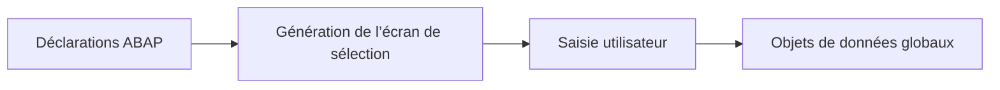

# 🌸 ÉCRAN DE SÉLECTION STANDARD

## 🌺 OBJECTIFS

- Comprendre la génération automatique de l’écran 1000
- Identifier les instructions de définition
- Distinguer écran de sélection et dynpro classique
- Structurer les déclarations dans la partie globale
- Comprendre le transfert des valeurs vers le programme

## 🌺 GÉNÉRATION AUTOMATIQUE

Dans un programme exécutable, les instructions suivantes définissent automatiquement l’écran de sélection standard :

- `PARAMETERS` ;
- `SELECT-OPTIONS` ;
- `SELECTION-SCREEN`.

```abap
REPORT zdev_selection_demo.

PARAMETERS p_carr TYPE scarr-carrid.
SELECT-OPTIONS s_conn FOR spfli-connid.
```

Le runtime génère l’écran standard, généralement associé au numéro `1000`, sans utilisation du Screen Painter.



## 🌺 ÉCRAN DE SÉLECTION ET DYNPRO

| Écran de sélection                        | Dynpro classique                   |
| ----------------------------------------- | ---------------------------------- |
| Défini par instructions ABAP              | Conçu avec le Screen Painter       |
| Gestion standard des sélections multiples | Flux PBO et PAI explicite          |
| Adapté aux programmes exécutables         | Adapté aux applications dialoguées |
| Mise en page volontairement limitée       | Mise en page plus libre            |

Les dynpros seront traités dans un dossier distinct.

## 🌺 POSITION DES DÉCLARATIONS

Les éléments de sélection sont déclarés dans la partie globale du programme.

```abap
REPORT zdev_selection_demo.

TABLES scarr.

PARAMETERS p_carr TYPE scarr-carrid.
SELECT-OPTIONS s_name FOR scarr-carrname.

START-OF-SELECTION.
  " Traitement
```

`TABLES` peut encore être rencontré dans les programmes historiques. Pour un typage simple, préférer une référence directe aux composants DDIC lorsque cela suffit.

## 🌺 TRANSFERT DES VALEURS

Quand l’utilisateur valide l’écran :

1. le runtime contrôle les formats techniques ;
2. les valeurs sont transférées dans les objets ABAP ;
3. les événements `AT SELECTION-SCREEN` sont déclenchés ;
4. le traitement principal commence si aucune erreur n’est levée.

Les règles métier doivent être validées explicitement dans les événements appropriés.

## 🌺 ÉCRANS DE SÉLECTION SUPPLÉMENTAIRES

ABAP permet de définir d’autres écrans ou sous-écrans de sélection avec `SELECTION-SCREEN BEGIN OF SCREEN`. Ce besoin est plus avancé et doit rester justifié.

L’écran standard suffit à la majorité des programmes exécutables.

## 🌺 RÉFÉRENCES OFFICIELLES SAP

- [Selection Screens — Overview — ABAP Keyword Documentation](https://help.sap.com/doc/abapdocu_latest_index_htm/latest/en-US/ABENSELECTION_SCREEN_OVERVIEW.html)
- [Defining Selection Screens — SAP Help Portal](https://help.sap.com/docs/PRODUCT_ID/6f3e0bea6c4b101484fcf5305b4d624b/4a43c2a55a503f04e10000000a421937.html)
- [SELECTION-SCREEN — ABAP Keyword Documentation](https://help.sap.com/doc/abapdocu_latest_index_htm/latest/en-US/ABAPSELECTION-SCREEN.html)

---

➡️ [Chapitre suivant — PARAMETRES AVEC PARAMETERS](<./05 - 🍧 PARAMETRES AVEC PARAMETERS.md>)
