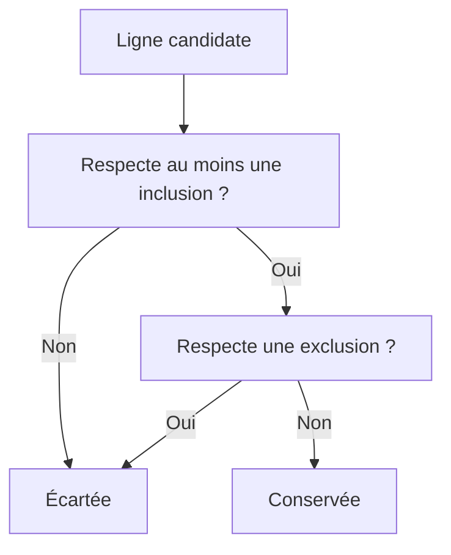

# 🌸 STRUCTURE ET SÉMANTIQUE DES TABLES DE SÉLECTION

## 🌺 OBJECTIFS

- Comprendre les quatre colonnes d’une table de sélection
- Construire des critères par code
- Interpréter inclusion et exclusion
- Éviter les critères incohérents
- Réutiliser une table de sélection dans les traitements

## 🌺 STRUCTURE D’UNE LIGNE

Chaque ligne contient :

| Colonne  | Signification          | Exemples               |
| -------- | ---------------------- | ---------------------- |
| `SIGN`   | Inclusion ou exclusion | `I`, `E`               |
| `OPTION` | Opérateur              | `EQ`, `BT`, `CP`, `GE` |
| `LOW`    | Valeur ou borne basse  | `LH`                   |
| `HIGH`   | Borne haute            | `ZZ`                   |

## 🌺 OPTIONS COURANTES

| Option | Sens                          |
| ------ | ----------------------------- |
| `EQ`   | Égal                          |
| `NE`   | Différent                     |
| `BT`   | Compris entre `LOW` et `HIGH` |
| `NB`   | Non compris entre les bornes  |
| `GE`   | Supérieur ou égal             |
| `GT`   | Strictement supérieur         |
| `LE`   | Inférieur ou égal             |
| `LT`   | Strictement inférieur         |
| `CP`   | Correspond à un motif         |
| `NP`   | Ne correspond pas au motif    |

## 🌺 CONSTRUCTION AVEC VALUE

```abap
DATA lr_carr TYPE RANGE OF scarr-carrid.

lr_carr = VALUE #(
  ( sign = 'I' option = 'EQ' low = 'LH' )
  ( sign = 'I' option = 'EQ' low = 'AA' )
  ( sign = 'E' option = 'EQ' low = 'XX' )
).
```

## 🌺 ALIMENTATION D’UN SELECT-OPTIONS

```abap
INITIALIZATION.
  APPEND VALUE #(
    sign   = 'I'
    option = 'BT'
    low    = '0010'
    high   = '0050'
  ) TO s_conn.
```

## 🌺 LOGIQUE D’ÉVALUATION



Un ensemble ne contenant que des exclusions est traité selon la sémantique des tables de sélection et du contexte utilisé. Tester les cas limites au lieu de reproduire une logique manuelle approximative.

## 🌺 CONTRÔLES À APPLIQUER

- `HIGH` doit être renseigné pour `BT` et `NB` ;
- les motifs `CP` et `NP` doivent être compatibles avec le type ;
- les valeurs doivent utiliser le format interne ABAP ;
- les lignes vides ou invalides doivent être éliminées avant un appel externe ;
- le volume d’une table de sélection doit rester raisonnable.

## 🌺 RÉFÉRENCES OFFICIELLES SAP

- [SELECT-OPTIONS — ABAP Keyword Documentation](https://help.sap.com/doc/abapdocu_816_index_htm/8.16/en-US/ABAPSELECT-OPTIONS.html)
- [SELECT-OPTIONS, Value Options — ABAP Keyword Documentation](https://help.sap.com/doc/abapdocu_latest_index_htm/latest/en-US/abapselect-options_value.htm)
- [SUBMIT, Selection Screen Interface — ABAP Keyword Documentation](https://help.sap.com/doc/abapdocu_latest_index_htm/latest/en-US/ABAPSUBMIT_INTERFACE.html)

---

➡️ [Chapitre suivant — OPTIONS D AFFICHAGE ET DE SAISIE](<./08 - 🍧 OPTIONS D AFFICHAGE ET DE SAISIE.md>)
