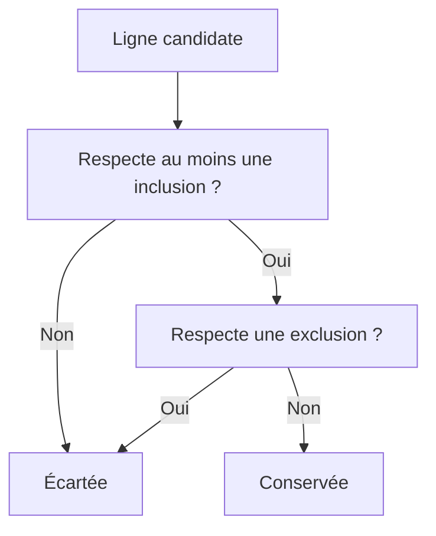

# 🌸 STRUCTURE ET SÉMANTIQUE DES TABLES DE SÉLECTION

## 🌺 OBJECTIFS

- Comprendre les quatre colonnes d’une table de sélection
- Construire des critères par code
- Interpréter inclusion et exclusion
- Éviter les critères incohérents
- Réutiliser une table de sélection dans les traitements

## 🌺 STRUCTURE D’UNE LIGNE

Chaque ligne contient :

| Colonne  | Signification          | Exemples               |
| -------- | ---------------------- | ---------------------- |
| `SIGN`   | Inclusion ou exclusion | `I`, `E`               |
| `OPTION` | Opérateur              | `EQ`, `BT`, `CP`, `GE` |
| `LOW`    | Valeur ou borne basse  | `LH`                   |
| `HIGH`   | Borne haute            | `ZZ`                   |

## 🌺 OPTIONS COURANTES

| Option | Sens                          |
| ------ | ----------------------------- |
| `EQ`   | Égal                          |
| `NE`   | Différent                     |
| `BT`   | Compris entre `LOW` et `HIGH` |
| `NB`   | Non compris entre les bornes  |
| `GE`   | Supérieur ou égal             |
| `GT`   | Strictement supérieur         |
| `LE`   | Inférieur ou égal             |
| `LT`   | Strictement inférieur         |
| `CP`   | Correspond à un motif         |
| `NP`   | Ne correspond pas au motif    |

## 🌺 CONSTRUCTION AVEC VALUE

```abap
DATA lr_carr TYPE RANGE OF scarr-carrid.

lr_carr = VALUE #(
  ( sign = 'I' option = 'EQ' low = 'LH' )
  ( sign = 'I' option = 'EQ' low = 'AA' )
  ( sign = 'E' option = 'EQ' low = 'XX' )
).
```

## 🌺 ALIMENTATION D’UN SELECT-OPTIONS

```abap
INITIALIZATION.
  APPEND VALUE #(
    sign   = 'I'
    option = 'BT'
    low    = '0010'
    high   = '0050'
  ) TO s_conn.
```

## 🌺 LOGIQUE D’ÉVALUATION



Un ensemble ne contenant que des exclusions est traité selon la sémantique des tables de sélection et du contexte utilisé. Tester les cas limites au lieu de reproduire une logique manuelle approximative.

## 🌺 CONTRÔLES À APPLIQUER

- `HIGH` doit être renseigné pour `BT` et `NB` ;
- les motifs `CP` et `NP` doivent être compatibles avec le type ;
- les valeurs doivent utiliser le format interne ABAP ;
- les lignes vides ou invalides doivent être éliminées avant un appel externe ;
- le volume d’une table de sélection doit rester raisonnable.

## 🌺 CAS D’USAGE

Dans un contexte où un utilisateur doit exécuter un report paramétrable, valider ses critères et réutiliser des variantes, le besoin consiste à **configurer structure et sémantique des tables de sélection dans un programme exécutable et vérifier le comportement de l’écran de sélection**. Cette notion est pertinente lorsque le lecteur doit pouvoir relier la syntaxe ou l’outil à une situation professionnelle concrète.

## 🌺 PROCÉDURE PAS À PAS

1. Saisir `/nSE38` dans le champ de commande.
2. Entrer le nom d’un programme Z de test, par exemple `ZREF_DEMO`, puis choisir **Créer** ou **Modifier** selon le cas.
3. Pour un exercice local uniquement, affecter `$TMP` ; pour un développement livrable, utiliser le package et l’ordre fournis par le projet.
4. Coller ou adapter le snippet du chapitre.
5. Exécuter le contrôle syntaxique avec `Ctrl+F2`.
6. Activer avec `Ctrl+F3`.
7. Exécuter avec `F8` et comparer le résultat avec la section **Vérification**.

## 🌺 VÉRIFICATION

- Le contrôle syntaxique réussit.
- La version active correspond au code sauvegardé.
- L’exécution produit le résultat décrit dans le chapitre.
- Les cas vide, limite et erreur sont testés séparément lorsque la syntaxe le permet.

## 🌺 ERREURS FRÉQUENTES

- Copier un exemple sans adapter les types, noms d’objets et données disponibles dans le système.
- Tester uniquement le cas nominal et ignorer les valeurs initiales, absentes ou invalides.
- Mettre une logique lourde dans les événements de validation de l’écran.
- Créer une variante contenant des valeurs obsolètes ou sensibles.

## 🌺 SNIPPET À RÉUTILISER

> [!NOTE]
> Adapter les noms `Z*`, les types DDIC, les données et les autorisations au système cible. Effectuer un contrôle syntaxique avant activation.

```abap
DATA lr_carr TYPE RANGE OF scarr-carrid.

lr_carr = VALUE #(
  ( sign = 'I' option = 'EQ' low = 'LH' )
  ( sign = 'I' option = 'EQ' low = 'AA' )
  ( sign = 'E' option = 'EQ' low = 'XX' )
).
```

## 🌺 TERMES DU LEXIQUE

- [Structure](<../└─ 🧩 00 - LEXIQUE SAP ET ABAP/04 - 🍧 LANGAGE ET DEVELOPPEMENT ABAP.md#structure-abap>)
- [Programme exécutable](<../└─ 🧩 00 - LEXIQUE SAP ET ABAP/06 - 🍧 PROGRAMMES CLASSES ET OBJETS TECHNIQUES.md#programme-executable>)
- [Variante](<../└─ 🧩 00 - LEXIQUE SAP ET ABAP/06 - 🍧 PROGRAMMES CLASSES ET OBJETS TECHNIQUES.md#variante>)
- [Transaction](<../└─ 🧩 00 - LEXIQUE SAP ET ABAP/02 - 🍧 SAP GUI NAVIGATION ET TRANSACTIONS.md#transaction>)
- [Dynpro](<../└─ 🧩 00 - LEXIQUE SAP ET ABAP/02 - 🍧 SAP GUI NAVIGATION ET TRANSACTIONS.md#dynpro>)

## 🌺 À RETENIR

- À l’issue du chapitre, le lecteur sait **configurer structure et sémantique des tables de sélection dans un programme exécutable et vérifier le comportement de l’écran de sélection**.
- Toujours tester sur un objet Z ou un jeu de données sans impact avant d’intervenir sur un traitement réel.
- La documentation `F1` du système reste la référence pour la syntaxe disponible dans sa release.

## 🌺 MODÈLE DE DÉMONSTRATION SFLIGHT

> [!NOTE]
> Les tables `SCARR`, `SPFLI` et `SFLIGHT` appartiennent au modèle de démonstration SAP et peuvent être absentes ou non alimentées dans certains systèmes. Dans ce cas, remplacer les exemples par une table Z de démonstration ou par une source en lecture seule autorisée, sans modifier une table applicative standard.

## 🌺 RÉFÉRENCES OFFICIELLES SAP

- [SELECT-OPTIONS — ABAP Keyword Documentation](https://help.sap.com/doc/abapdocu_816_index_htm/8.16/en-US/ABAPSELECT-OPTIONS.html)
- [SELECT-OPTIONS, Value Options — ABAP Keyword Documentation](https://help.sap.com/doc/abapdocu_latest_index_htm/latest/en-US/abapselect-options_value.htm)
- [SUBMIT, Selection Screen Interface — ABAP Keyword Documentation](https://help.sap.com/doc/abapdocu_latest_index_htm/latest/en-US/ABAPSUBMIT_INTERFACE.html)


---

➡️ [Chapitre suivant — OPTIONS D’AFFICHAGE ET DE SAISIE](<./08 - 🍧 OPTIONS D AFFICHAGE ET DE SAISIE.md>)
