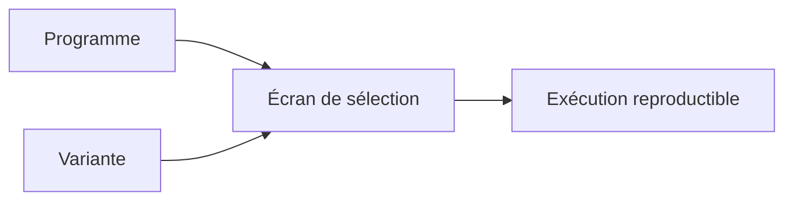

# 🌸 VARIANTES DE SÉLECTION

## 🌺 OBJECTIFS

- Comprendre le rôle d’une variante
- Enregistrer un jeu de valeurs réutilisable
- Distinguer variante et variante d’affichage ALV
- Préparer une exécution récurrente ou en arrière-plan
- Gérer l’évolution du programme sans casser les variantes

## 🌺 DÉFINITION

Une variante de sélection enregistre des valeurs et propriétés de l’écran de sélection d’un programme exécutable.

Une variante de sélection ne doit pas être confondue avec une variante de mise en page ALV.

## 🌺 CRÉATION

Depuis l’écran de sélection :

1. saisir les valeurs ;
2. choisir la fonction d’enregistrement de variante ;
3. renseigner le nom et la description ;
4. définir les attributs adaptés ;
5. sauvegarder.

La maintenance est également accessible depuis les fonctions de variantes de `SE38` ou `SA38`.

## 🌺 USAGES

- exécutions manuelles répétitives ;
- jobs d’arrière-plan ;
- transactions associées à une variante ;
- appels `SUBMIT USING SELECTION-SET` ;
- jeux de test reproductibles.

## 🌺 VALEURS DYNAMIQUES

Selon les possibilités du système et les attributs de variante, certaines valeurs peuvent être calculées dynamiquement, notamment des dates.

Ne pas remplacer une règle métier complexe par une configuration de variante incompréhensible. Documenter les variables utilisées.

## 🌺 ÉVOLUTION DU PROGRAMME

Une modification de l’écran peut affecter les variantes existantes :

- renommage d’un paramètre ;
- changement de type ;
- suppression d’un champ ;
- ajout d’un champ obligatoire ;
- modification des règles de validation.

Prévoir la compatibilité lors des évolutions productives.

## 🌺 SÉCURITÉ

Ne jamais enregistrer dans une variante :

- mot de passe ;
- jeton ;
- secret technique ;
- donnée sensible sans justification et protection appropriée.

Une variante facilite l’entrée de valeurs ; elle ne crée aucune autorisation.

## 🌺 TRANSPORT

Les possibilités de transport des variantes dépendent du type de variante, de son propriétaire et des procédures du système. Utiliser les fonctions standard de maintenance et l’ordre de transport prévu par le projet.

## 🌺 RÉFÉRENCES OFFICIELLES SAP

- [Variant Maintenance — SAP Help Portal](https://help.sap.com/saphelp_ewm900/helpdata/en/c0/980374e58611d194cc00a0c94260a5/content.htm)
- [Understanding the Concept of Background Processing — SAP Learning](https://learning.sap.com/courses/technical-implementation-and-operation-ii-of-sap-s-4hana-and-sap-business-suite/understanding-the-concept-of-background-processing-1)
- [SUBMIT — ABAP Keyword Documentation](https://help.sap.com/doc/abapdocu_latest_index_htm/latest/en-US/ABAPSUBMIT_SHORTREF.html)

---

➡️ [Chapitre suivant — APPEL D UN RAPPORT AVEC SUBMIT](<./15 - 🍧 APPEL D UN RAPPORT AVEC SUBMIT.md>)
