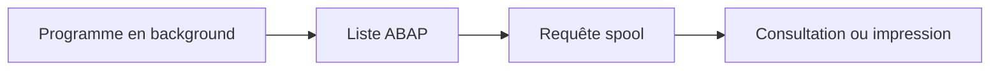

# 🌸 SORTIE D’UN PROGRAMME EXÉCUTABLE

## 🌺 OBJECTIFS

- Produire une sortie simple avec `WRITE`
- Comprendre la liste ABAP classique
- Distinguer sortie de démonstration et restitution professionnelle
- Anticiper le comportement en arrière-plan
- Choisir le bon mécanisme de sortie

## 🌺 SORTIE SIMPLE

```abap
START-OF-SELECTION.
  WRITE: / 'Compagnie :', p_carr.
```

`WRITE` crée une liste ABAP classique. Le caractère `/` commence une nouvelle ligne.

```abap
WRITE: / sy-uline,
       / 'Nombre de lignes :', lines( lt_result ).
```

## 🌺 EN-TÊTE DE PAGE

```abap
TOP-OF-PAGE.
  WRITE: / 'Rapport des vols'.
  ULINE.
```

Cet événement est déclenché lors de la création d’une nouvelle page de liste, selon le traitement de sortie.

## 🌺 LISTES INTERACTIVES CLASSIQUES

Des événements comme `AT LINE-SELECTION` permettent de créer des listes de détail. Cette technique est historique et ne doit pas être choisie par défaut pour une nouvelle restitution tabulaire.

Préférer :

- ALV pour une liste structurée dans SAP GUI ;
- journal applicatif pour un traitement technique ;
- spool pour un traitement de fond ;
- fichier ou interface lorsque le contrat l’exige.

## 🌺 EXÉCUTION EN ARRIÈRE-PLAN

Une sortie de liste produite en arrière-plan peut être enregistrée dans le spool.



Une boîte de dialogue SAP GUI ne peut pas remplacer une sortie de fond exploitable.

## 🌺 SÉPARER TRAITEMENT ET AFFICHAGE

```abap
START-OF-SELECTION.
  DATA(lt_result) = lcl_service=>read_data( p_carr ).
  lcl_output=>display( lt_result ).
```

Cette séparation facilite :

- les tests ;
- le remplacement de `WRITE` par un ALV ;
- l’exécution sans interface ;
- la réutilisation du traitement.

## 🌺 LIMITES DE WRITE

`WRITE` reste pertinent pour :

- démonstrations ;
- petits rapports techniques ;
- diagnostics temporaires ;
- sorties spool simples.

Il est insuffisant pour les besoins avancés de tri, filtre, export, variantes d’affichage et colonnes dynamiques.

## 🌺 CAS D’USAGE

Dans un contexte où un utilisateur doit exécuter un report paramétrable, valider ses critères et réutiliser des variantes, le besoin consiste à **configurer sortie d’un programme exécutable dans un programme exécutable et vérifier le comportement de l’écran de sélection**. Cette notion est pertinente lorsque le lecteur doit pouvoir relier la syntaxe ou l’outil à une situation professionnelle concrète.

## 🌺 PROCÉDURE PAS À PAS

1. Saisir `/nSE38` dans le champ de commande.
2. Entrer le nom d’un programme Z de test, par exemple `ZREF_DEMO`, puis choisir **Créer** ou **Modifier** selon le cas.
3. Pour un exercice local uniquement, affecter `$TMP` ; pour un développement livrable, utiliser le package et l’ordre fournis par le projet.
4. Coller ou adapter le snippet du chapitre.
5. Exécuter le contrôle syntaxique avec `Ctrl+F2`.
6. Activer avec `Ctrl+F3`.
7. Exécuter avec `F8` et comparer le résultat avec la section **Vérification**.

## 🌺 VÉRIFICATION

- Le contrôle syntaxique réussit.
- La version active correspond au code sauvegardé.
- L’exécution produit le résultat décrit dans le chapitre.
- Les cas vide, limite et erreur sont testés séparément lorsque la syntaxe le permet.

## 🌺 ERREURS FRÉQUENTES

- Copier un exemple sans adapter les types, noms d’objets et données disponibles dans le système.
- Tester uniquement le cas nominal et ignorer les valeurs initiales, absentes ou invalides.
- Mettre une logique lourde dans les événements de validation de l’écran.
- Créer une variante contenant des valeurs obsolètes ou sensibles.

## 🌺 SNIPPET À RÉUTILISER

> [!NOTE]
> Adapter les noms `Z*`, les types DDIC, les données et les autorisations au système cible. Effectuer un contrôle syntaxique avant activation.

```abap
START-OF-SELECTION.
  DATA(lt_result) = lcl_service=>read_data( p_carr ).
  lcl_output=>display( lt_result ).
```

## 🌺 TERMES DU LEXIQUE

- [Programme exécutable](<../└─ 🧩 00 - LEXIQUE SAP ET ABAP/06 - 🍧 PROGRAMMES CLASSES ET OBJETS TECHNIQUES.md#programme-executable>)
- [Variante](<../└─ 🧩 00 - LEXIQUE SAP ET ABAP/06 - 🍧 PROGRAMMES CLASSES ET OBJETS TECHNIQUES.md#variante>)
- [Transaction](<../└─ 🧩 00 - LEXIQUE SAP ET ABAP/02 - 🍧 SAP GUI NAVIGATION ET TRANSACTIONS.md#transaction>)
- [Dynpro](<../└─ 🧩 00 - LEXIQUE SAP ET ABAP/02 - 🍧 SAP GUI NAVIGATION ET TRANSACTIONS.md#dynpro>)

## 🌺 À RETENIR

- À l’issue du chapitre, le lecteur sait **configurer sortie d’un programme exécutable dans un programme exécutable et vérifier le comportement de l’écran de sélection**.
- Toujours tester sur un objet Z ou un jeu de données sans impact avant d’intervenir sur un traitement réel.
- La documentation `F1` du système reste la référence pour la syntaxe disponible dans sa release.

## 🌺 RÉFÉRENCES OFFICIELLES SAP

- [Lists — Overview — ABAP Keyword Documentation](https://help.sap.com/doc/abapdocu_751_index_htm/7.51/en-US/ABENLIST_OVERVIEW.html)
- [WRITE — ABAP Keyword Documentation](https://help.sap.com/doc/abapdocu_latest_index_htm/latest/en-US/ABAPWRITE.html)
- [Understanding the Concept of Background Processing — SAP Learning](https://learning.sap.com/courses/technical-implementation-and-operation-ii-of-sap-s-4hana-and-sap-business-suite/understanding-the-concept-of-background-processing-1)


---

➡️ [Chapitre suivant — BONNES PRATIQUES ET CHECKLIST](<./17 - 🍧 BONNES PRATIQUES ET CHECKLIST.md>)
