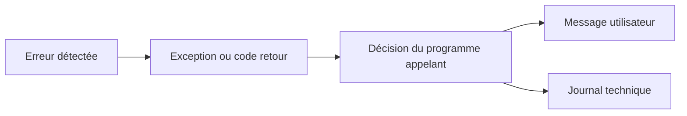

# 🌸 PRINCIPES DE GESTION DES ERREURS

## 🌺 OBJECTIFS

- Distinguer message, code retour, exception et erreur d’exécution
- Choisir un mécanisme adapté au contexte
- Séparer détection, propagation et présentation
- Éviter les erreurs silencieuses
- Construire un traitement exploitable en dialogue et en arrière-plan

## 🌺 QUATRE MÉCANISMES À NE PAS CONFONDRE

| Mécanisme              | Usage principal                                       |
| ---------------------- | ----------------------------------------------------- |
| Message `MESSAGE`      | Informer l’utilisateur ou piloter un écran SAP GUI    |
| Code retour `sy-subrc` | Contrôler immédiatement le résultat d’une instruction |
| Exception de classe    | Signaler et propager une erreur entre procédures      |
| Erreur d’exécution     | Arrêt non géré analysable notamment dans `ST22`       |

Un même incident peut traverser plusieurs couches. Une méthode peut lever une exception, le programme appelant peut l’intercepter, puis convertir son texte en message utilisateur.



## 🌺 DÉTECTION

Une erreur doit être détectée au plus près de sa cause :

- contrôle d’une donnée d’entrée ;
- absence d’un enregistrement attendu ;
- conversion impossible ;
- autorisation refusée ;
- incohérence d’un état interne ;
- échec d’une opération technique.

La détection ne doit pas être retardée jusqu’à une ligne de code qui ne connaît plus la cause réelle.

## 🌺 PROPAGATION

La couche qui détecte l’erreur ne sait pas toujours comment la présenter. Elle doit alors transmettre une information structurée au niveau supérieur.

```abap
METHOD read_product.
  IF iv_matnr IS INITIAL.
    RAISE EXCEPTION TYPE zcx_dev_invalid_input.
  ENDIF.
ENDMETHOD.
```

L’appelant décide ensuite de poursuivre, corriger, annuler ou présenter un message.

## 🌺 PRÉSENTATION

Une couche métier réutilisable ne doit pas dépendre inutilement d’un écran SAP GUI. Éviter d’y placer directement des messages modaux ou des interactions utilisateur.

```abap
TRY.
    lo_service->process( iv_matnr = p_matnr ).
  CATCH zcx_dev_error INTO DATA(lx_error).
    MESSAGE lx_error->get_text( ) TYPE 'E'.
ENDTRY.
```

La classe métier fournit l’erreur. Le programme exécutable choisit le type de message adapté à son contexte.

## 🌺 ERREUR ATTENDUE ET DÉFAUT DE PROGRAMMATION

| Situation                            | Traitement adapté                                            |
| ------------------------------------ | ------------------------------------------------------------ |
| Donnée saisie invalide               | Message contrôlé ou exception métier                         |
| Enregistrement absent                | Code retour ou exception selon l’interface                   |
| Division par zéro imprévue           | Exception système à intercepter si une réaction est possible |
| État interne impossible              | Assertion ou exception technique                             |
| Corruption empêchant toute poursuite | Arrêt contrôlé et analyse technique                          |

Ne pas utiliser un dump pour une erreur fonctionnelle prévisible. Ne pas masquer un défaut de programmation sous un message générique.

## 🌺 RÈGLE DE BASE

Une erreur doit toujours produire au moins un résultat exploitable :

- réaction immédiate ;
- exception propagée ;
- message utilisateur ;
- trace technique ;
- arrêt explicite.

Une instruction échouée suivie d’une poursuite silencieuse est généralement plus dangereuse qu’un arrêt clair.

## 🌺 RÉFÉRENCES OFFICIELLES SAP

- [MESSAGE — ABAP Keyword Documentation](https://help.sap.com/doc/abapdocu_latest_index_htm/latest/en-US/ABAPMESSAGE_SHORTREF.html)
- [Return Code — ABAP Programming Guideline](https://help.sap.com/doc/abapdocu_latest_index_htm/latest/en-US/ABENRETURN_CODE_GUIDL.html)
- [System Response After a Class-Based Exception — ABAP Keyword Documentation](https://help.sap.com/doc/abapdocu_latest_index_htm/latest/en-US/ABENEXCEPTIONS_SYSTEM_RESPONSE.html)

---

➡️ [Chapitre suivant — CLASSES DE MESSAGES ET TRANSACTION SE91](<./02 - 🍧 CLASSES DE MESSAGES ET TRANSACTION SE91.md>)
