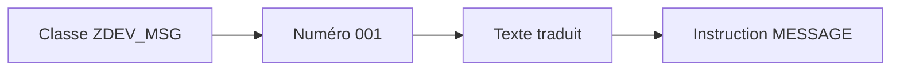

# 🌸 CLASSES DE MESSAGES ET TRANSACTION SE91

## 🌺 OBJECTIFS

- Comprendre le rôle d’une classe de messages
- Créer et maintenir des messages avec `SE91`
- Utiliser les numéros et variables de message
- Préparer les traductions
- Éviter les textes codés en dur

## 🌺 PRINCIPE

Les messages classiques ABAP sont stockés dans des **classes de messages**. Chaque entrée est identifiée par :

- une classe ;
- un numéro sur trois chiffres ;
- un texte dépendant de la langue de connexion.

Les messages sont enregistrés dans le référentiel de textes associé à la table `T100`.



## 🌺 CRÉATION AVEC SE91

Procédure générale :

1. ouvrir la transaction `SE91` ;
2. saisir un nom de classe client, par exemple `ZDEV_MSG` ;
3. choisir **Créer** ;
4. renseigner une description ;
5. maintenir les numéros et textes ;
6. enregistrer dans le bon package et ordre de transport ;
7. traduire les textes dans les langues requises.

La maintenance peut également être atteinte depuis les outils du Workbench ABAP selon la version du système.

## 🌺 NUMÉROS DE MESSAGE

Une classe peut contenir des numéros de `000` à `999`.

Exemple :

| Numéro | Texte                                  |
| ------ | -------------------------------------- |
| `001`  | Article & introuvable                  |
| `002`  | Quantité & invalide pour l’article &   |
| `003`  | Traitement terminé : & enregistrements |

Les `&` sont remplacés lors de l’appel du message. Un message T100 accepte jusqu’à quatre variables.

## 🌺 TEXTE COURT

Le texte doit être :

- compréhensible sans accès au code ;
- précis sur l’objet concerné ;
- neutre et exploitable ;
- compatible avec les traductions ;
- dépourvu de détails techniques inutiles pour l’utilisateur.

Mauvais :

```text
Erreur traitement
```

Meilleur :

```text
Article 000123 introuvable dans la division 1000
```

## 🌺 TEXTE LONG

Un message peut être associé à une documentation longue. Elle permet d’expliquer :

- la cause probable ;
- l’action attendue ;
- les données à vérifier ;
- les conséquences du problème.

Le texte court indique l’erreur. Le texte long aide à la résoudre.

## 🌺 TRANSPORT ET TRADUCTION

Une classe de messages est un objet du Repository. Sa création et ses modifications doivent suivre les règles de package et de transport du projet.

La traduction ne doit pas être remplacée par des textes assemblés manuellement dans le code. Les variables doivent contenir les données, pas la structure grammaticale complète du message.

## 🌺 CONVENTIONS CONSEILLÉES

- regrouper les messages par composant fonctionnel cohérent ;
- éviter une classe globale contenant des messages sans relation ;
- réserver des plages de numéros si l’équipe en a besoin ;
- ne pas réutiliser un numéro avec une nouvelle signification ;
- conserver les messages stables lorsqu’ils constituent un contrat d’interface.

## 🌺 CAS D’USAGE

Dans un contexte où un import doit signaler clairement les erreurs, permettre leur traitement et éviter les arrêts non maîtrisés, le besoin consiste à **créer un message traduisible puis l’utiliser dans le programme**. Cette notion est pertinente lorsque le lecteur doit pouvoir relier la syntaxe ou l’outil à une situation professionnelle concrète.

## 🌺 PROCÉDURE PAS À PAS

1. Saisir `/nSE91`.
2. Entrer une classe de messages Z puis choisir **Créer** ou **Modifier**.
3. Ajouter un numéro libre et un texte court ; utiliser `&1` à `&4` pour les variables.
4. Enregistrer dans le package et l’ordre appropriés.
5. Activer si le système le demande.
6. Appeler le message depuis un report de test et vérifier le texte dans la langue de connexion.

## 🌺 VÉRIFICATION

- Le lecteur peut expliquer la différence entre cette notion et les concepts proches.
- Le choix technique est justifié par un besoin concret, pas uniquement par habitude.
- Les limites liées à la release, aux autorisations et au contexte d’exécution sont identifiées.

## 🌺 ERREURS FRÉQUENTES

- Afficher un message technique incompréhensible à l’utilisateur.
- Attraper une exception sans action ni propagation.

## 🌺 FICHE DE CONTRÔLE À COPIER

```text
Système / SID       :
Mandant             :
Utilisateur         :
Transaction / outil :
Objet technique     :
Jeu de données      :
Résultat attendu    :
Résultat observé    :
Horodatage          :
Ordre de transport  :
```

## 🌺 TERMES DU LEXIQUE

- [Transaction](<../└─ 🧩 00 - LEXIQUE SAP ET ABAP/02 - 🍧 SAP GUI NAVIGATION ET TRANSACTIONS.md#transaction>)
- [Classe](<../└─ 🧩 00 - LEXIQUE SAP ET ABAP/04 - 🍧 LANGAGE ET DEVELOPPEMENT ABAP.md#classe>)
- [Exception](<../└─ 🧩 00 - LEXIQUE SAP ET ABAP/04 - 🍧 LANGAGE ET DEVELOPPEMENT ABAP.md#exception>)
- [Dump ABAP](<../└─ 🧩 00 - LEXIQUE SAP ET ABAP/08 - 🍧 EXECUTION EXPLOITATION ET ADMINISTRATION.md#dump-abap>)

## 🌺 À RETENIR

- À l’issue du chapitre, le lecteur sait **créer un message traduisible puis l’utiliser dans le programme**.
- Toujours tester sur un objet Z ou un jeu de données sans impact avant d’intervenir sur un traitement réel.
- La documentation `F1` du système reste la référence pour la syntaxe disponible dans sa release.

## 🌺 RÉFÉRENCES OFFICIELLES SAP

- [Messages and Message Classes — SAP Help Portal](https://help.sap.com/docs/ABAP_PLATFORM_NEW/c238d694b825421f940829321ffa326a/4ec242f66e391014adc9fffe4e204223.html)
- [Maintaining Messages — SAP Help Portal](https://help.sap.com/docs/SAP_NETWEAVER_AS_ABAP_752/bd833c8355f34e96a6e83096b38bf192/d1801b3e454211d189710000e8322d00.html)
- [MESSAGE — ABAP Keyword Documentation](https://help.sap.com/doc/abapdocu_latest_index_htm/latest/en-US/ABAPMESSAGE_SHORTREF.html)


---

➡️ [Chapitre suivant — INSTRUCTION MESSAGE](<./03 - 🍧 INSTRUCTION MESSAGE.md>)
