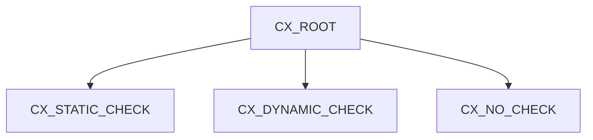

# 🌸 CLASSES D’EXCEPTION ET CATÉGORIES

## 🌺 OBJECTIFS

- Comprendre les exceptions basées sur des classes
- Identifier la hiérarchie issue de `CX_ROOT`
- Distinguer `CX_STATIC_CHECK`, `CX_DYNAMIC_CHECK` et `CX_NO_CHECK`
- Choisir une catégorie cohérente
- Préparer la création d’une exception client

## 🌺 PRINCIPE

Une exception de classe est un objet qui représente une situation d’erreur. Elle peut contenir :

- un type précis ;
- un texte ;
- des attributs de contexte ;
- une référence vers une exception précédente ;
- des informations utilisables par le programme appelant.

Une classe d’exception client commence généralement par `ZCX_` ou `YCX_` selon les conventions du système.

## 🌺 CX_STATIC_CHECK

Une exception héritant de `CX_STATIC_CHECK` force le développeur à la traiter ou à la déclarer explicitement dans les interfaces concernées. Le contrôle syntaxique vérifie cette obligation.

Elle convient lorsque le contrat doit imposer une décision explicite à l’appelant.

## 🌺 CX_DYNAMIC_CHECK

Une exception héritant de `CX_DYNAMIC_CHECK` doit être déclarée lorsqu’elle est propagée par une procédure. Le contrôle statique aux différents niveaux d’appel est moins strict que pour `CX_STATIC_CHECK`.

Elle convient à certaines situations dont l’occurrence dépend fortement des données ou de l’environnement d’exécution.

## 🌺 CX_NO_CHECK

Une exception héritant de `CX_NO_CHECK` peut être propagée sans déclaration explicite dans l’interface.

Elle convient aux erreurs qu’il serait excessif de déclarer dans chaque niveau d’appel, notamment certains défauts de programmation ou erreurs techniques imprévisibles.

L’absence d’obligation de déclaration ne signifie pas que l’exception doit être ignorée.

## 🌺 CHOIX DE LA CATÉGORIE

| Besoin                                                         | Catégorie possible |
| -------------------------------------------------------------- | ------------------ |
| Forcer le traitement par l’appelant direct                     | `CX_STATIC_CHECK`  |
| Erreur dépendante de l’exécution avec déclaration à la source  | `CX_DYNAMIC_CHECK` |
| Erreur technique ou de programmation traversant les interfaces | `CX_NO_CHECK`      |

Le choix doit être effectué selon le contrat attendu, pas selon la volonté d’éviter une erreur de syntaxe.

## 🌺 CLASSES STANDARD CX_SY

Le runtime ABAP utilise de nombreuses classes prédéfinies commençant par `CX_SY_`, par exemple pour :

- conversions ;
- calculs arithmétiques ;
- accès hors limites ;
- références initiales ;
- erreurs Open SQL interceptables.

La documentation de chaque instruction indique les exceptions pouvant être levées.

## 🌺 CRÉATION DANS SAP GUI

Une classe d’exception peut être créée avec les outils du Workbench, notamment `SE24` ou `SE80` selon l’organisation du projet.

La création détaillée des classes sera approfondie dans le dossier ABAP Objects. Dans ce dossier, l’objectif est d’utiliser correctement leur contrat d’erreur.

## 🌺 RÉFÉRENCES OFFICIELLES SAP

- [Exception Categories — ABAP Keyword Documentation](https://help.sap.com/doc/abapdocu_latest_index_htm/latest/en-US/ABENEXCEPTION_CATEGORIES.html)
- [Exception Classes for ABAP Statements — ABAP Keyword Documentation](https://help.sap.com/doc/abapdocu_latest_index_htm/latest/en-US/ABENABAP_EXCEPTION_CLASSES.html)
- [Creating an Exception Class — SAP Help Portal](https://help.sap.com/docs/ABAP_PLATFORM_NEW/bd833c8355f34e96a6e83096b38bf192/92823e6017aa11d5969b00a0c94260a5.html)

---

➡️ [Chapitre suivant — TRY CATCH ET ENDTRY](<./09 - 🍧 TRY CATCH ET ENDTRY.md>)
