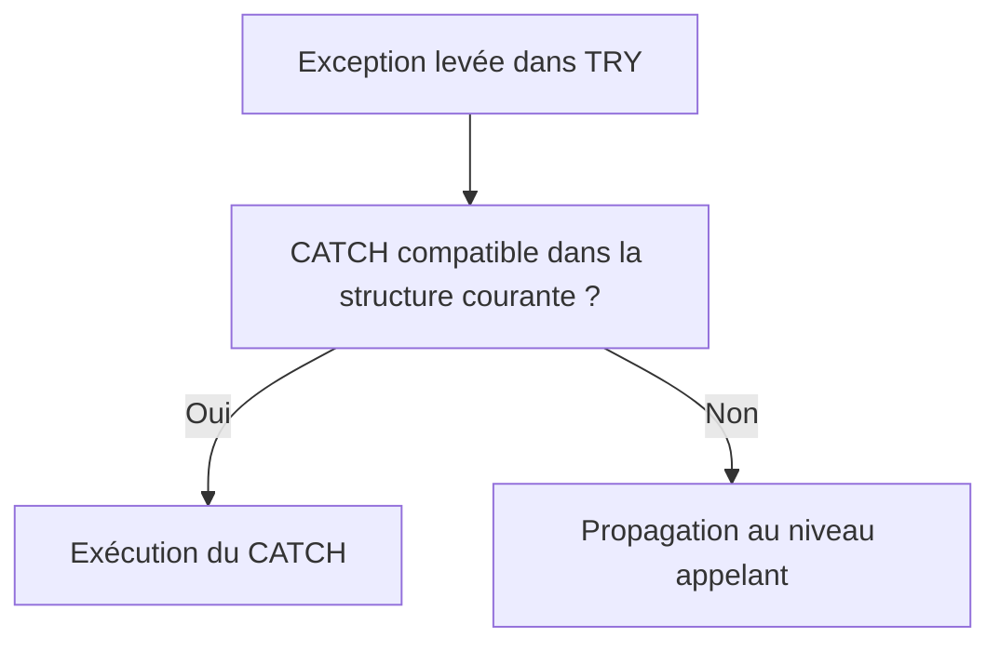

# 🌸 TRY, CATCH ET ENDTRY

## 🌺 OBJECTIFS

- Intercepter une exception de classe
- Délimiter précisément la zone protégée
- Récupérer l’objet d’exception
- Ordonner les blocs `CATCH`
- Éviter les interceptions trop générales

## 🌺 STRUCTURE DE BASE

```abap
TRY.
    lv_result = lv_amount / lv_quantity.
  CATCH cx_sy_zerodivide INTO DATA(lx_zerodivide).
    MESSAGE lx_zerodivide->get_text( ) TYPE 'E'.
ENDTRY.
```

Le bloc `TRY` contient les instructions susceptibles de lever une exception. Le bloc `CATCH` définit la réaction.

## 🌺 RECHERCHE D’UN GESTIONNAIRE



Lorsqu’une exception est levée, le traitement séquentiel du bloc courant est interrompu. Le runtime recherche un gestionnaire compatible.

## 🌺 RÉCUPÉRER L’OBJET

```abap
CATCH cx_sy_conversion_error INTO DATA(lx_conversion).
  DATA(lv_text) = lx_conversion->get_text( ).
```

La référence permet d’accéder :

- au texte court ;
- au texte long selon la classe ;
- aux attributs spécifiques ;
- à l’exception précédente.

## 🌺 PLUSIEURS CATCH

```abap
TRY.
    lo_service->execute( ).
  CATCH zcx_dev_invalid_input INTO DATA(lx_input).
    MESSAGE lx_input->get_text( ) TYPE 'E'.
  CATCH zcx_dev_not_found INTO DATA(lx_not_found).
    MESSAGE lx_not_found->get_text( ) TYPE 'S' DISPLAY LIKE 'W'.
ENDTRY.
```

Les gestionnaires spécifiques doivent être placés avant un gestionnaire plus général compatible.

## 🌺 CATCH MULTIPLE

Selon la syntaxe et les besoins, plusieurs classes compatibles peuvent être indiquées dans un même `CATCH` lorsqu’elles déclenchent exactement la même réaction.

Ne pas fusionner des erreurs différentes si l’utilisateur ou l’appelant doit recevoir une réponse différente.

## 🌺 ÉVITER CATCH CX_ROOT PAR DÉFAUT

```abap
CATCH cx_root INTO DATA(lx_root).
```

Cette interception capture un ensemble très large d’exceptions. Elle peut masquer un défaut de programmation ou empêcher la production d’un dump utile.

Elle est acceptable à une frontière technique contrôlée lorsqu’une trace complète est produite et que la stratégie de poursuite est explicite.

## 🌺 LIMITER LE BLOC TRY

Mauvais : un bloc `TRY` contenant plusieurs traitements indépendants.

Meilleur : protéger uniquement l’instruction ou l’appel dont l’exception est réellement traitée.

Un bloc court permet d’identifier clairement la cause et évite d’intercepter une exception inattendue provenant d’une autre opération.

## 🌺 RÉFÉRENCES OFFICIELLES SAP

- [TRY — ABAP Keyword Documentation](https://help.sap.com/doc/abapdocu_latest_index_htm/latest/en-US/ABAPTRY.html)
- [System Response After a Class-Based Exception — ABAP Keyword Documentation](https://help.sap.com/doc/abapdocu_latest_index_htm/latest/en-US/ABENEXCEPTIONS_SYSTEM_RESPONSE.html)
- [Handling and Propagating Exceptions — ABAP Programming Guideline](https://help.sap.com/doc/abapdocu_latest_index_htm/latest/en-US/ABENHANDL_PROP_EXCEPT_GUIDL.html)

---

➡️ [Chapitre suivant — LEVER UNE EXCEPTION AVEC RAISE EXCEPTION](<./10 - 🍧 LEVER UNE EXCEPTION AVEC RAISE EXCEPTION.md>)
