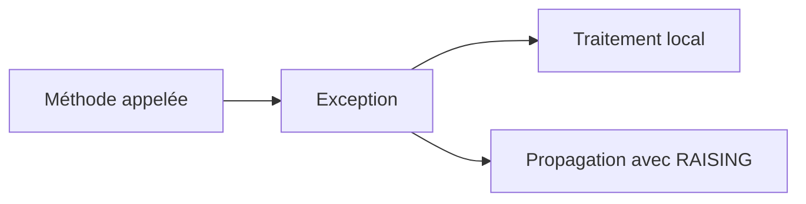

# 🌸 PROPAGER UNE EXCEPTION AVEC RAISING

## 🌺 OBJECTIFS

- Déclarer les exceptions d’une procédure
- Comprendre la propagation
- Choisir entre interception locale et transmission
- Préserver le contrat d’une méthode
- Éviter les interfaces trop générales

## 🌺 PRINCIPE

Une procédure peut traiter l’exception elle-même ou la transmettre à son appelant.



## 🌺 DÉCLARATION DANS UNE MÉTHODE

```abap
METHODS read_product
  IMPORTING
    iv_matnr TYPE matnr
  RETURNING
    VALUE(rs_product) TYPE zdev_product
  RAISING
    zcx_dev_product_not_found.
```

L’implémentation peut lever l’exception déclarée.

```abap
METHOD read_product.
  SELECT SINGLE *
    FROM zdev_product
    WHERE matnr = @iv_matnr
    INTO @rs_product.

  IF sy-subrc <> 0.
    RAISE EXCEPTION TYPE zcx_dev_product_not_found
      EXPORTING
        matnr = iv_matnr.
  ENDIF.
ENDMETHOD.
```

## 🌺 TRAITER OU PROPAGER

Traiter localement lorsque la procédure sait :

- corriger la situation ;
- appliquer une valeur de remplacement valide ;
- répéter l’opération de manière sûre ;
- convertir l’erreur vers un contrat plus pertinent.

Propager lorsque la décision appartient au niveau appelant.

## 🌺 CATÉGORIE ET DÉCLARATION

Les exceptions issues de `CX_STATIC_CHECK` et `CX_DYNAMIC_CHECK` doivent être déclarées lorsqu’elles sont propagées par une procédure. Les exceptions issues de `CX_NO_CHECK` peuvent traverser une interface sans déclaration explicite.

La catégorie `CX_STATIC_CHECK` impose en plus des contrôles syntaxiques destinés à forcer la prise en compte de l’exception.

## 🌺 CONVERTIR UNE EXCEPTION

```abap
TRY.
    ro_reader->read( ).
  CATCH cx_sy_open_sql_db INTO DATA(lx_sql).
    RAISE EXCEPTION TYPE zcx_dev_persistence_error
      EXPORTING
        previous = lx_sql.
ENDTRY.
```

La couche supérieure ne dépend plus directement d’une exception technique SQL. La cause reste accessible via `PREVIOUS`.

## 🌺 ÉVITER UNE INTERFACE TROP GÉNÉRALE

```abap
RAISING cx_root.
```

Une déclaration aussi large ne décrit pas le contrat réel. Elle oblige l’appelant à gérer un ensemble indéterminé de situations.

Déclarer les classes pertinentes ou une superclasse applicative maîtrisée, par exemple `ZCX_DEV_ERROR`.

## 🌺 FRONTIÈRE DE PRÉSENTATION

Une méthode métier ne doit pas transformer systématiquement ses exceptions en `MESSAGE`. Le programme appelant peut être :

- un report SAP GUI ;
- un job ;
- une BAPI ;
- un service OData ;
- un test automatisé.

La propagation préserve la réutilisabilité.

## 🌺 CAS D’USAGE

Dans un contexte où un import doit signaler clairement les erreurs, permettre leur traitement et éviter les arrêts non maîtrisés, le besoin consiste à **gérer une situation d’erreur avec propager une exception avec raising et produire une information exploitable par l’appelant ou l’utilisateur**. Cette notion est pertinente lorsque le lecteur doit pouvoir relier la syntaxe ou l’outil à une situation professionnelle concrète.

## 🌺 PROCÉDURE PAS À PAS

1. Saisir `/nSE38` dans le champ de commande.
2. Entrer le nom d’un programme Z de test, par exemple `ZREF_DEMO`, puis choisir **Créer** ou **Modifier** selon le cas.
3. Pour un exercice local uniquement, affecter `$TMP` ; pour un développement livrable, utiliser le package et l’ordre fournis par le projet.
4. Coller ou adapter le snippet du chapitre.
5. Exécuter le contrôle syntaxique avec `Ctrl+F2`.
6. Activer avec `Ctrl+F3`.
7. Exécuter avec `F8` et comparer le résultat avec la section **Vérification**.

## 🌺 VÉRIFICATION

- Le contrôle syntaxique réussit.
- La version active correspond au code sauvegardé.
- L’exécution produit le résultat décrit dans le chapitre.
- Les cas vide, limite et erreur sont testés séparément lorsque la syntaxe le permet.

## 🌺 ERREURS FRÉQUENTES

- Copier un exemple sans adapter les types, noms d’objets et données disponibles dans le système.
- Tester uniquement le cas nominal et ignorer les valeurs initiales, absentes ou invalides.
- Afficher un message technique incompréhensible à l’utilisateur.
- Attraper une exception sans action ni propagation.

## 🌺 SNIPPET À RÉUTILISER

> [!NOTE]
> Adapter les noms `Z*`, les types DDIC, les données et les autorisations au système cible. Effectuer un contrôle syntaxique avant activation.

```abap
METHOD read_product.
  SELECT SINGLE *
    FROM zdev_product
    WHERE matnr = @iv_matnr
    INTO @rs_product.

  IF sy-subrc <> 0.
    RAISE EXCEPTION TYPE zcx_dev_product_not_found
      EXPORTING
        matnr = iv_matnr.
  ENDIF.
ENDMETHOD.
```

## 🌺 TERMES DU LEXIQUE

- [Exception](<../└─ 🧩 00 - LEXIQUE SAP ET ABAP/04 - 🍧 LANGAGE ET DEVELOPPEMENT ABAP.md#exception>)
- [Dump ABAP](<../└─ 🧩 00 - LEXIQUE SAP ET ABAP/08 - 🍧 EXECUTION EXPLOITATION ET ADMINISTRATION.md#dump-abap>)

## 🌺 À RETENIR

- À l’issue du chapitre, le lecteur sait **gérer une situation d’erreur avec propager une exception avec raising et produire une information exploitable par l’appelant ou l’utilisateur**.
- Toujours tester sur un objet Z ou un jeu de données sans impact avant d’intervenir sur un traitement réel.
- La documentation `F1` du système reste la référence pour la syntaxe disponible dans sa release.

## 🌺 RÉFÉRENCES OFFICIELLES SAP

- [Handling and Propagating Exceptions — ABAP Programming Guideline](https://help.sap.com/doc/abapdocu_latest_index_htm/latest/en-US/ABENHANDL_PROP_EXCEPT_GUIDL.html)
- [Exception Categories — ABAP Keyword Documentation](https://help.sap.com/doc/abapdocu_latest_index_htm/latest/en-US/ABENEXCEPTION_CATEGORIES.html)
- [Exception Handling — SAP Help Portal](https://help.sap.com/docs/ABAP_PLATFORM_NEW/c238d694b825421f940829321ffa326a/4defead30d6c43ddac8acb50fb5b78f2.html)


---

➡️ [Chapitre suivant — TEXTES D’EXCEPTION ET INTERFACES T100](<./12 - 🍧 TEXTES D EXCEPTION ET INTERFACES T100.md>)
